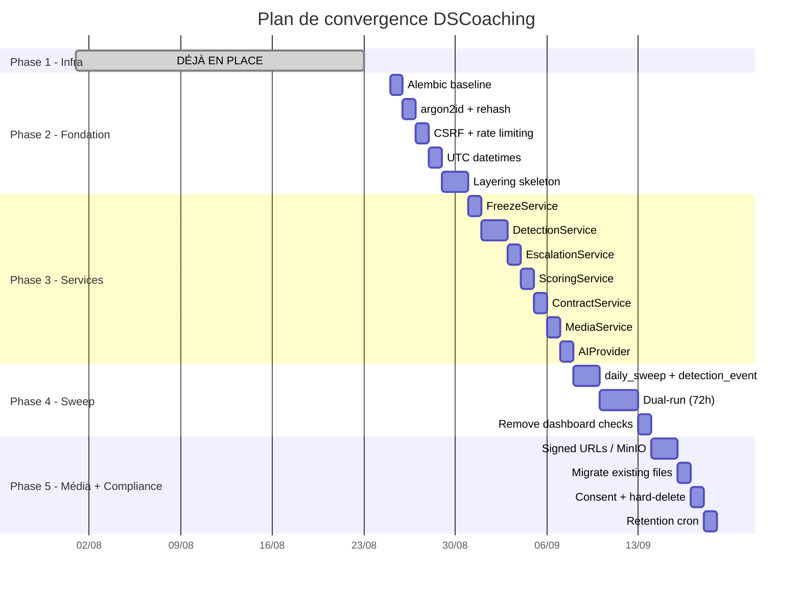

# DSCoaching — Architecture v2 (Hardened Modular Monolith)

> Ce document remplace `architecture.md` comme référence architecturale cible.
> Il définit la topologie, le layering, et le plan de convergence depuis la production actuelle.

---

## Principes directeurs

1. **Monolithe modulaire.** Flask + SQLAlchemy + Jinja reste le stack. Pas de microservices.
2. **Postgres committed.** Un seul dialecte, utilisé correctement. Fin de la fiction multi-DB.
3. **Logique métier hors des routes.** Les routes parsent, vérifient l'auth, appellent un service, rendent. Rien d'autre.
4. **Détection par sweep, pas par page-load.** Les vérifications de conformité (rituels manqués, retards, écriture, contrats expirés) tournent dans un job cron idempotent, pas au chargement du dashboard.
5. **Médias hors du volume applicatif.** Stockage objet chiffré, URLs signées temporaires.
6. **Compliance dès le départ.** Art. 9 RGPD, données de catégorie spéciale. Consentement versionné, hard-delete, chiffrement at-rest.
7. **Les features d'autorité sont de la config, pas du hardcode.** Lecture secrète, réserves indiscernables, suppression de read-receipts = paramètres de consentement par dyade, avec defaults disclosed.

---

## Topologie cible

```
┌─────────────────────────────────────────────────────────┐
│                     ecb.pm (Hetzner VPS)                 │
│                                                         │
│   Caddy (TLS, reverse proxy)                            │
│       │                                                 │
│       ▼                                                 │
│   Container `coaching` (Flask app, gunicorn)             │
│       │                       │                         │
│       ▼                       ▼                         │
│   PostgreSQL 16            MinIO (S3-compatible)         │
│   (container `postgres`,   (médias chiffrés,            │
│    DB `coaching`,           signed URLs)                 │
│    réseau `db`)            [Phase 5 — optionnel MVP]    │
│                                                         │
│   cron: daily_sweep (1x/heure, filtre par timezone)     │
│   cron: media_retention (1x/nuit)                       │
└─────────────────────────────────────────────────────────┘
```

### Pourquoi ces composants

| Composant | Justification |
|-----------|---------------|
| PostgreSQL 16 | Déjà en place. Seul dialecte. `ON CONFLICT`, `INTERVAL`, `jsonb`, `pg_trgm`. Alembic migrations. |
| MinIO (Phase 5) | Médias hors du volume app. Chiffré at-rest. URLs pré-signées. Pour le MVP avec 2 users, le filesystem local + route sécurisée suffit temporairement. |
| cron + management commands | Plus robuste qu'APScheduler in-process. Idempotent : unique constraint `(coachee_id, category, date)`. |
| **Redis** | **Non requis pour le MVP.** Sessions = cookie signé Flask. Rate limiting = compteur mémoire ou table PG. À ajouter si >20 users concurrents. |

---

## Layering (la correction structurelle)

```
┌─────────────────────────────────────────┐
│             ROUTES (blueprints)          │  ← Parse request, check auth,
│   auth.py, routes_coach.py,             │     call service, render template.
│   routes_coachee.py, routes_admin.py    │     AUCUNE logique métier.
├─────────────────────────────────────────┤
│             SERVICES (domain)           │  ← Logique métier pure.
│   services/freeze.py                    │     Appelable depuis une route
│   services/escalation.py               │     ET depuis un job cron.
│   services/scoring.py                  │
│   services/contract.py                 │
│   services/detection.py               │
│   services/media.py                   │
│   services/ai_provider.py            │
├─────────────────────────────────────────┤
│             PERSISTENCE (repos)         │  ← Requêtes SQL brutes, wrappées.
│   repos/coachee_repo.py               │     Un seul endroit pour les queries.
│   repos/task_repo.py                  │     Testable unitairement.
│   repos/ritual_repo.py               │
│   repos/consequence_repo.py          │
└─────────────────────────────────────────┘
```

### Règles strictes

- Une route ne fait JAMAIS de `c.execute(...)` directement.
- Un service ne fait JAMAIS de `request.form.get(...)`.
- Un repo ne fait JAMAIS de décision métier (if/else sur des statuts).
- Les jobs cron appellent les services, jamais les routes.

---

## Le Daily Sweep — Correction architecturale majeure

### Problème actuel

La détection (rituels manqués, écriture, retards, expiration contrat, streak reset) vit dans `coachee_dashboard()`. Conséquences :
- Si un coachee ne se connecte pas → rien ne se déclenche.
- Dedup par `LIKE '%...'` → fragile, non-indexé.
- Logique non-testable unitairement (couplée à Flask request context).

### Solution

Un management command `python -m dscoaching.jobs.daily_sweep` exécuté par cron, une fois par heure (pour couvrir tous les fuseaux) :

```python
# dscoaching/jobs/daily_sweep.py
"""Idempotent daily sweep: detection + escalation + housekeeping."""

def sweep_coachee(coachee_id: int, today: date) -> None:
    """Run all detections for one coachee for one date. Idempotent."""
    # Guard: frozen, unavailable, stopped → skip
    # 1. Detect missed rituals (yesterday)
    # 2. Detect missed writing (if writing_mode != null)
    # 3. Detect missed checkins (if checkin_mode == 'required')
    # 4. Detect overdue tasks → mark missed, break streak
    # 5. Run escalation ladder (keyed on coachee_id + category + date)
    # 6. Update streaks (task, writing, ritual)
    # 7. Generate due reviews (if review_cadence set)
    # 8. Warn/expire contracts (7-day warning, auto-pause on expiry)
    # 9. Clean expired media (retention policy)

def main():
    """Entry point: iterate all active coachees in their timezone window."""
    now_utc = datetime.now(timezone.utc)
    for coachee in get_active_coachees():
        tz = ZoneInfo(coachee["timezone"] or "Europe/London")
        local_now = now_utc.astimezone(tz)
        # Run sweep if local time is in the [06:00-07:00] window
        # (ensures we process "yesterday" after it's fully over)
        if 6 <= local_now.hour < 7:
            today = local_now.date()
            sweep_coachee(coachee["id"], today)
```

### Idempotence

Chaque détection insère avec une contrainte unique :
```sql
CREATE UNIQUE INDEX uq_detection ON detection_event (coachee_id, category, event_date);
-- INSERT ... ON CONFLICT DO NOTHING
```

Résultat : exécuter le sweep 5 fois = même effet qu'une seule fois.

---

## Corrections fondamentales (Milestone 0)

Ces changements sont des **pré-requis** avant toute nouvelle feature.

| # | Fix | Actuel | Cible | Risque si ignoré |
|---|-----|--------|-------|------------------|
| F1 | PostgreSQL unique | ✅ PG 16 en prod, SQLite en tests | PG partout (tests inclus ou SQLite accepté pour unit tests) | Différences de comportement tests/prod |
| F2 | Alembic migrations | `init_db()` auto-create | Alembic `upgrade head` | Impossible d'évoluer la DB live sans perte de données |
| F3 | argon2id hashing | SHA-256 hex | argon2id (via `argon2-cffi`) | Mots de passe brute-forcables. Données Art. 9. |
| F4 | Datetimes aware UTC | Mix naive/aware, `datetime.now()` | Tout en UTC (`TIMESTAMPTZ`), conversion au rendu | Bugs timezone, `_compute_lateness` cassé |
| F5 | CSRF protection | Aucune | Token maison (stdlib, pas de dep) | Attaque CSRF triviale sur tous les POST |
| F6 | Rate limiting auth | Aucun | Compteur mémoire ou table PG `login_attempts` | Brute-force trivial |
| F7 | Signed media URLs | `/attachment/<path>` route | HMAC-signed URLs avec TTL (stdlib `hmac`) | Énumération de fichiers intimes |
| F8 | Daily sweep | Logique dans `coachee_dashboard()` | Cron job idempotent | Enforcement silencieusement absent si pas de login |

---

## Plan de convergence (production actuelle → architecture cible)

### État actuel de la production

| Aspect | Détail |
|--------|--------|
| Hébergement | Hetzner VPS (ecb.pm), Docker |
| DB | PostgreSQL 16 (container `postgres`, DB `coaching`, 27 tables) |
| App | Container `coaching` (Flask, port 8000) |
| Proxy | Caddy (TLS, `coaching.ecb.pm`) |
| Stockage | Filesystem local dans le container (à migrer) |
| Sessions | Cookie Flask (SameSite=Lax, HttpOnly) |
| Hashing | SHA-256 hex |
| Migrations | Aucune (auto-create via `init_db()`) |
| Deploy | `scp` + `docker cp` + `docker restart` |
| Utilisateurs | 1 coach, 1-2 coachees (usage réel) |
| Tests | 81 pytest, SQLite in-memory (local) |

### Stratégie de convergence : progressive, sans downtime

La Phase 1 (infrastructure) est déjà réalisée. La convergence se fait en **4 phases restantes**, chacune déployable indépendamment. Aucune phase ne casse la production existante — chaque étape est réversible.

---

### Phase 1 — Infrastructure ✅ DÉJÀ EN PLACE

**État constaté** : Wasmer est out. L'app tourne déjà sur ecb.pm.

| Composant | Status |
|-----------|--------|
| Hetzner VPS (ecb.pm) | ✅ En place |
| PostgreSQL 16 (container `postgres`, réseau `db`) | ✅ En place |
| DB `coaching` (27 tables, user `coaching`) | ✅ Données live |
| Container `coaching` (port 8000) | ✅ En place |
| Caddy reverse proxy | ✅ En place (`coaching.ecb.pm` → container) |
| Redis | ❌ Non nécessaire (2 users) |
| MinIO | 📋 Phase 5 (filesystem local suffit pour le MVP) |

**Aucune action requise sur Phase 1.** On passe directement à Phase 2.

---

### Phase 2 — Fondation code (semaine 1-2)

**Objectif** : Alembic, argon2, CSRF, layering initial. La prod tourne déjà sur Hetzner/PG.

| Étape | Action | Impact production |
|-------|--------|-------------------|
| 2.1 | Initialiser Alembic. Snapshot actuel comme migration "baseline" (`alembic stamp head`). | Zero downtime. |
| 2.2 | Ajouter argon2id. Double-check au login : si le hash est SHA-256, rehash en argon2 transparently. | Zero downtime, migration progressive des passwords. |
| 2.3 | Ajouter CSRF token (champ hidden dans chaque form). | Déploiement unique, toutes les forms mises à jour en un commit. |
| 2.4 | Rate limiting sur `/login` : compteur en mémoire (dict avec TTL) ou table PG `login_attempts`. 5 tentatives/15min par IP. | Zero downtime. |
| 2.5 | Convertir tous les `datetime.now()` en `datetime.now(timezone.utc)`. Colonnes DB en `TIMESTAMPTZ`. Migration Alembic. | Alembic `ALTER COLUMN ... TYPE TIMESTAMPTZ`. |
| 2.6 | Créer le squelette du layering : `src/services/`, `src/repos/`. Extraire UN service (`FreezeService`) comme proof-of-concept. Le reste des routes continue à fonctionner tel quel. | Zero downtime. Refactoring progressif. |

**Règle** : chaque étape = un commit déployable. Les tests passent à chaque étape.

---

### Phase 3 — Extraction des services (semaine 3-5)

**Objectif** : Toute la logique métier vit dans `src/services/`. Les routes sont des passeurs.

| Service | Extrait de | Fonctions principales |
|---------|-----------|----------------------|
| `FreezeService` | `routes_coachee.py` (pause), `routes_coach.py` (unfreeze) | `activate(coachee_id, initiated_by)`, `deactivate(coachee_id, pending_action)`, `is_frozen(coachee_id)` |
| `DetectionService` | `routes_coachee.py` (dashboard checks) | `check_missed_rituals(cid, date)`, `check_missed_writing(cid, date)`, `check_overdue_tasks(cid, date)` |
| `EscalationService` | `automation.py` (_run_auto_rules) | `escalate(cid, category, date)`, `reset_counter(cid, category)` |
| `ScoringService` | `routes_coach.py` (engagement), `tasks.py` (streak) | `update_streak(cid)`, `compute_urgency(cid)`, `compute_points(cid)` |
| `ContractService` | `routes_coach.py` + `routes_coachee.py` | `propose(cid, text)`, `sign(cid, role)`, `check_expiry(cid)` |
| `MediaService` | routes (upload/serve) | `upload(file, coachee_id)` → MinIO + DB path, `get_signed_url(path)`, `cleanup_expired(cid)` |
| `AIProvider` | `ai.py` | `complete(prompt, max_tokens)`, `grade(task, response)`, `vision(image_url, prompt)` |

**Méthode** : un service par PR. Les routes appellent le service au lieu de faire le travail elles-mêmes. Les anciens tests sont adaptés (mock le service OU test d'intégration).

---

### Phase 4 — Daily Sweep (semaine 5-6)

**Objectif** : Le sweep remplace les vérifications au chargement de page.

| Étape | Action |
|-------|--------|
| 4.1 | Créer `src/jobs/daily_sweep.py`. Appelle `DetectionService` + `EscalationService` + `ScoringService` + `ContractService`. |
| 4.2 | Créer table `detection_event` (coachee_id, category, event_date, action_taken, created_at) avec unique constraint. |
| 4.3 | Ajouter le cron : `0 * * * * cd /app && python -m dscoaching.jobs.daily_sweep` (toutes les heures, le code filtre par timezone). |
| 4.4 | Retirer les appels à `_freeze_overdue()`, `_check_ritual_misses()`, `_check_writing_compliance()` depuis `coachee_dashboard()`. |
| 4.5 | Tests : time-travel tests simulant le passage des jours, vérification d'idempotence. |
| 4.6 | Monitoring : log chaque sweep run avec résumé (N coachees traités, N détections, N escalades). |

**Point critique** : Ne retirer les vérifications des routes (4.4) qu'APRÈS avoir confirmé que le sweep fonctionne en prod pendant 72h en parallèle (dual-run).

---

### Phase 5 — Média + Compliance (semaine 6-7)

**Objectif** : URLs signées, compliance RGPD formalisée. MinIO optionnel — on peut commencer avec des HMAC-signed URLs sur le filesystem local.

| Étape | Action |
|-------|--------|
| 5.1 | `MediaService.upload()` écrit dans un répertoire hors du volume web (ex: `/data/media/`). |
| 5.2 | `MediaService.get_signed_url(path, ttl=300)` : URL avec HMAC signature + timestamp. La route vérifie la signature avant de servir le fichier. Stdlib `hmac` + `hashlib`. |
| 5.3 | Supprimer l'ancienne route `/attachment/<path>` directe. |
| 5.4 | Ajouter table `consent_record` (coachee_id, consent_type, version, granted_at, revoked_at). |
| 5.5 | Route `DELETE /me/account` : hard-delete (données + médias + audit anonymisé). |
| 5.6 | Rétention médias : `MediaService.cleanup_expired()` dans le cron nocturne. |
| 5.7 | **Optionnel (quand >10 users)** : migrer vers MinIO/S3 pour séparation storage/compute. |

---

## Après Phase 5 : prêt pour les nouvelles features

À ce stade, l'architecture est :
- **Layered** : routes → services → repos
- **Schedulable** : detection via cron, pas page-load
- **Sécurisée** : argon2, CSRF, signed URLs, chiffrement at-rest
- **Migratable** : Alembic gère le schema
- **Testable** : services testables unitairement, mocked DB

Les nouvelles features (conséquences, escalade, rewards, chasteté, positions, stages, évaluations) s'ajoutent comme des **modules** : un service + un repo + des routes + une migration Alembic + un feature flag. Chaque module a sa propre surface de consentement.

---

## Diagramme de séquence — Convergence



---

## AI Provider — Interface unifiée

```python
# src/services/ai_provider.py
class AIProvider:
    """Unified AI interface. Backend: Hetzner Inference or Cloudflare."""

    def complete(self, prompt: str, max_tokens: int = 1024, system: str = None) -> str: ...
    def grade(self, task_title: str, response: str) -> tuple[str, str]: ...  # (grade, comment)
    def vision(self, image_url: str, prompt: str) -> str: ...
    def suggest_tasks(self, theme: str, context: str = "") -> list[dict]: ...
```

**Règles** :
- Retry + exponential backoff (Hetzner : 10 req/60s).
- Pour le sweep AI : appels séquentiels avec sleep inter-requête (suffisant pour 2 coachees).
- **Jamais** de données intimes (photos Art. 9) vers un endpoint tiers sans DPA signé. La photo validation reste on-box si pas de DPA.

---

## Compliance RGPD — Composant de première classe

| Obligation | Implémentation |
|------------|----------------|
| Base légale | Consentement explicite (Art. 6.1.a) — enregistré, versionné, révocable |
| Catégories spéciales (Art. 9) | Consentement explicite séparé pour données intimes/sexuelles |
| Droit à l'effacement (Art. 17) | `DELETE /me/account` : hard-delete données + médias + anonymisation audit |
| Droit à la portabilité (Art. 20) | `/me/export` (déjà existant, à étendre) |
| Minimisation | Feature flags : seules les données des modules activés sont collectées |
| Chiffrement | At-rest (filesystem chiffré ou MinIO SSE à terme), in-transit (TLS), sessions (cookie signé) |
| Registre des traitements | Table `processing_register` documentant chaque catégorie de données |
| Rétention | `media_retention_days` configurable + cron de nettoyage |

### Table `consent_record`

```python
consent_record = Table(
    "consent_record", metadata,
    Column("id", Integer, primary_key=True),
    Column("coachee_id", Integer, ForeignKey("coachee.id"), nullable=False),
    Column("consent_type", String(50), nullable=False),  # 'terms', 'intimate_data', 'ai_processing', 'photo_sharing'
    Column("version", Integer, nullable=False),
    Column("granted_at", DateTime(timezone=True), nullable=False),
    Column("revoked_at", DateTime(timezone=True)),
    Column("ip", String(45)),
    Column("user_agent", String(500)),
)
```

---

## Les features "d'autorité" = config de consentement

Les mécanismes suivants sont **légitimes quand consentis** mais **coercitifs quand imposés sans accord** :

| Feature | Default | Configurable par |
|---------|---------|-----------------|
| Lecture secrète du journal (pas de "vu") | Désactivé | Accord dans le contrat (§2) |
| Réserves indiscernables | Activé (design) | Non-togglable (pas de fuite d'info, c'est du UX) |
| Notifications supprimables par le coachee | Activé | Coachee (souveraineté sur sa discrétion) |
| Ajustements auto de chasteté | Désactivé | Coach active, coachee consent dans le contrat |
| Mode protocole formal | Formal par défaut | Coach toggle, règles dans le contrat |

Chaque activation est tracée dans `consent_record` si elle touche à des données Art. 9.

---

## Structure de fichiers cible

```
src/
├── app.py                  # Factory, middleware, error handlers (THIN)
├── models.py               # SQLAlchemy table definitions + Alembic
├── config.py               # Env vars, feature flags, constants
├── server.py               # Entrypoint: gunicorn config
│
├── routes/                 # Blueprints (THIN: parse, auth, call service, render)
│   ├── auth.py
│   ├── coach.py
│   ├── coachee.py
│   └── admin.py
│
├── services/               # Business logic (PURE: no request, no template)
│   ├── freeze.py
│   ├── detection.py
│   ├── escalation.py
│   ├── scoring.py
│   ├── contract.py
│   ├── media.py
│   ├── ai_provider.py
│   └── merge.py
│
├── repos/                  # SQL queries wrapped (ONE PLACE for all queries)
│   ├── coachee_repo.py
│   ├── task_repo.py
│   ├── ritual_repo.py
│   ├── consequence_repo.py
│   └── media_repo.py
│
├── jobs/                   # Management commands (cron-callable)
│   ├── daily_sweep.py
│   ├── media_retention.py
│   └── ai_batch.py
│
├── templates/              # Jinja2 (inchangé)
└── static/                 # CSS (inchangé)

migrations/                 # Alembic
├── alembic.ini
├── env.py
└── versions/

tests/
├── unit/                   # Services mockés
├── integration/            # DB réelle (PG test)
└── e2e/                    # Routes + rendu
```

---

## Ce qui ne change PAS

- Flask comme framework web
- Jinja2 server-rendered (pas de SPA)
- Feature flags per-coach / per-coachee
- Single shared CSS
- Les 81 tests existants (adaptés progressivement)
- Le flow Git → CI → deploy (cible adaptée : push → CI → `docker compose pull && restart`)
- La structure multi-coachee par coach

---

## Métriques de succès (fin Phase 5)

| Métrique | Seuil |
|----------|-------|
| Tests passants | ≥ 95% (actuellement 100% sur 81) |
| Couverture | ≥ 85% sur services + repos |
| Sweep idempotent | 3 runs consécutifs = même état DB |
| Latence dashboard | < 200ms (p95) |
| Upload média | < 5s pour 30MB |
| Signed URL TTL | 5 minutes max |
| Password hash | argon2id (time_cost=3, memory_cost=65536) |
| CSRF | Présent sur 100% des forms POST |
| Migrations | Aucune modification de schema sans Alembic |
| Zero-downtime deploy | Confirmé (gunicorn graceful reload) |

---

## Décisions explicitement rejetées

| Option | Raison du rejet |
|--------|----------------|
| Microservices | Un seul dev. Latence inter-service injustifiée. |
| SPA frontend (React/Vue) | Complexité build, pas de valeur ajoutée pour le use-case. |
| Multi-DB portabilité | Fiction coûteuse. ON CONFLICT, INTERVAL, jsonb sont nécessaires. |
| APScheduler in-process | Double-fire multi-worker. Pas de persistance. |
| E2E encryption (Signal protocol) | Overkill pour un seul serveur. Chiffrement at-rest + TLS suffit. |
| Celery | Trop lourd pour le volume actuel. Cron + management commands suffit. |
| GraphQL | REST + Jinja suffit. Pas d'app mobile native prévue. |
