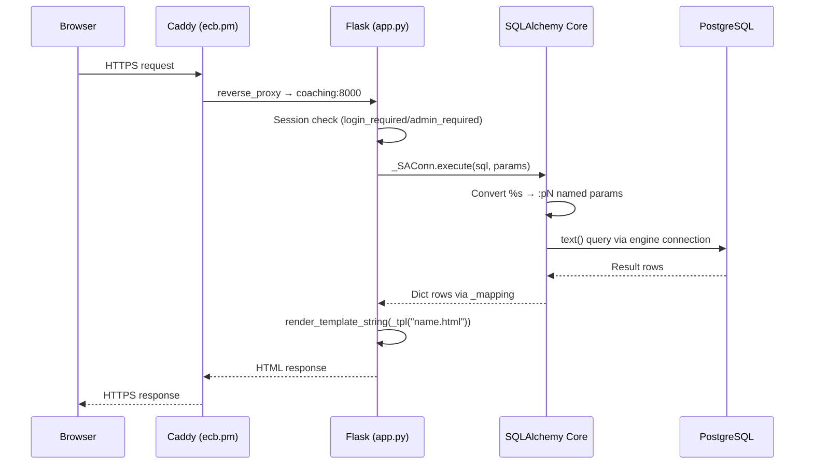
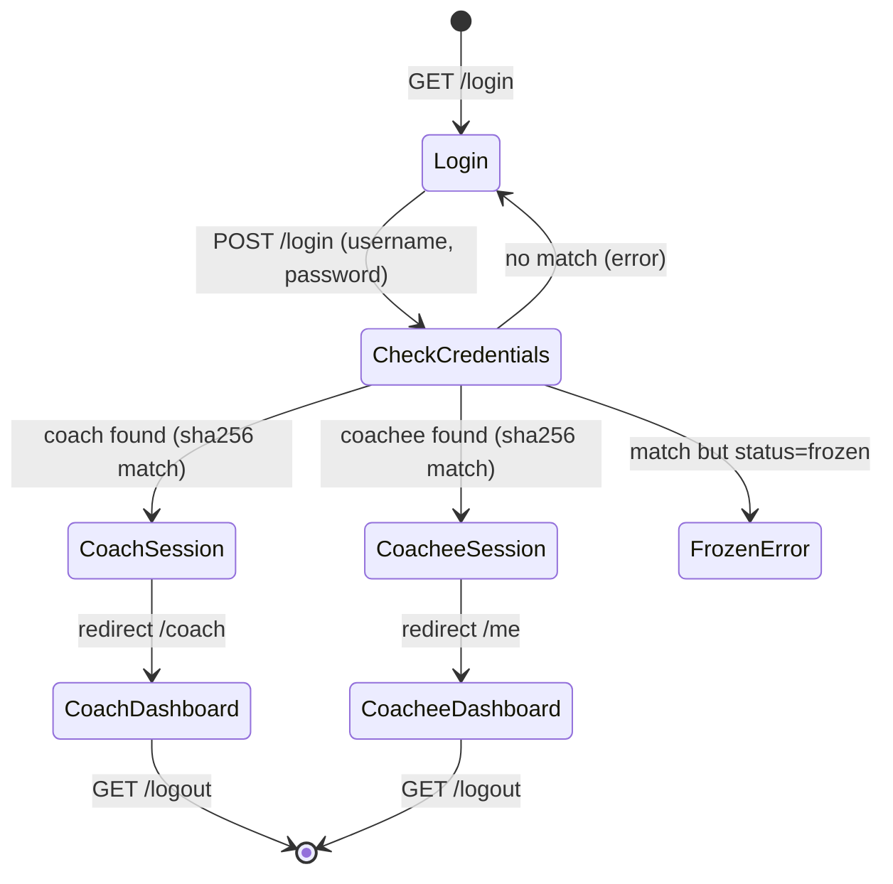
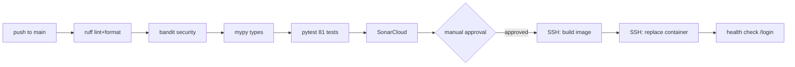

# architecture.md — DSCoaching System

## Stack

- Python 3.12, Flask 3.1.3
- SQLAlchemy 2.0 Core (dialect-transparent: PostgreSQL, SQLite)
- psycopg2-binary (PostgreSQL driver, production)
- Jinja2 templates (server-rendered), single shared CSS file
- Vanilla HTML forms (no JS framework), minimal inline `<style>` per page
- No build step, no bundler, no node_modules

## Numbers

| Metric | Count |
|--------|-------|
| Database tables | 30 |
| Routes | 91 |
| Templates | 36 Jinja2 files |
| Python source files | 17 (app, models, database, server, helpers, auth, routes_coach, routes_coachee, routes_admin, ai, automation, tasks, merge, i18n, csrf, rate_limit, photo_validation) |
| Tests | 81 (pytest, ~35s) |
| Vendored deps | 10 packages in lib/ |
| Feature flags | 11 toggleable features |
| Languages | EN, FR (session-based) |

## Directory Layout

```
esc_site/
├── src/
│   ├── app.py              # Application factory, error handlers
│   ├── models.py           # SQLAlchemy Core table definitions (30 tables)
│   ├── database.py         # Engine factory, get_db(), init_db(), seed users
│   ├── server.py           # Entry point: imports app, runs on :80
│   ├── helpers.py          # DB wrapper, hashing, template loading, audit, i18n injection
│   ├── auth.py             # Login, logout, register, setup, language toggle
│   ├── routes_coach.py     # All /coach/* routes
│   ├── routes_coachee.py   # All /me/* routes
│   ├── routes_admin.py     # All /admin/* routes
│   ├── ai.py               # AI integration, profile generation
│   ├── automation.py       # Auto-rules, badges, engagement, weekly reports
│   ├── tasks.py            # Task management: reserves, freeze, streak, visibility, features
│   ├── merge.py            # Mail-merge variable substitution engine
│   ├── i18n.py             # Internationalization: EN/FR translations, t() helper
│   ├── csrf.py             # CSRF token protection
│   ├── rate_limit.py       # Login rate limiting
│   ├── photo_validation.py # LLM photo proof validation
│   ├── db.py               # LEGACY: old MySQL raw schema (unused, kept for reference)
│   ├── db_pg.py            # LEGACY: old PostgreSQL variant (unused)
│   └── templates/          # 36 Jinja2 HTML templates
│       ├── login.html
│       ├── coach_dashboard.html
│       ├── coachee_dashboard.html
│       ├── error.html
│       └── ... (32 more)
├── static/
│   └── style.css           # Shared dark-theme stylesheet
├── lib/                    # Vendored runtime dependencies
│   ├── flask/
│   ├── sqlalchemy/         # Core only, ORM removed (~4.2MB)
│   ├── pymysql/
│   ├── typing_extensions.py
│   └── ... (werkzeug, jinja2, click, etc.)
├── tests/                  # pytest suite (81 tests)
│   ├── conftest.py         # SQLite in-memory fixtures
│   ├── test_smoke.py       # Basic page loads (13 tests)
│   ├── test_routes.py      # All routes + auth checks (47 tests)
│   ├── test_streaks.py     # Streak logic (6 tests)
│   ├── test_reserves.py    # Reserve auto-assign (4 tests)
│   ├── test_freeze.py      # Task freeze/miss (4 tests)
│   ├── test_features.py    # Feature flag resolution (4 tests)
│   └── test_admin_delete.py # Cascade delete verification (3 tests)
├── .github/workflows/ci.yml # CI: ruff, bandit, mypy, pytest, SonarCloud, SSH deploy
├── Dockerfile              # python:3.12-slim + psycopg2-binary + argon2-cffi
├── docker-compose.yml      # Local dev: app + postgres
├── pyproject.toml          # pytest, ruff, mypy config
├── BUGS.md                 # Known defects tracker
└── sonar-project.properties
```

## Request Lifecycle



## Database Layer (SQLAlchemy Core)

The app uses SQLAlchemy Core (not ORM) for dialect transparency across PostgreSQL and SQLite.

**Key files:**
- `src/models.py` — 30 `Table()` definitions with portable types (no ENUMs, no dialect-specific features)
- `src/database.py` — Engine factory reading `DATABASE_URL` or `DB_ENGINE`+`DB_HOST`+etc env vars

**Connection model:**
- `get_engine()` creates a singleton engine with `isolation_level="AUTOCOMMIT"`
- `get_db()` returns a raw SQLAlchemy connection
- `db()` in helpers.py wraps it in `_SAConn` — a compatibility layer that:
  - Accepts `%s` placeholder SQL (converts to `:pN` named params for SQLAlchemy `text()`)
  - Returns `fetchone()`/`fetchall()` as plain dicts
  - Exposes `.lastrowid` with fallback to `inserted_primary_key`
- Connection stored in Flask's `g`, closed on request teardown
- No explicit `commit()` needed (AUTOCOMMIT)

**Dialect-specific handling:**
- `_rand_func()` → `RANDOM()` on PG/SQLite
- `_now_func()` → `NOW()` on PG, `CURRENT_TIMESTAMP` on SQLite
- `GREATEST()` replaced with `CASE WHEN` (SQLite compat)
- `IF()` replaced with `CASE WHEN` (PG compat)
- `INTERVAL N DAY` replaced with Python `timedelta` arithmetic
- `ON DUPLICATE KEY` replaced with select-then-insert/update
- Time columns handled polymorphically (str/timedelta/time object)

## Authentication Flow



- Passwords: `sha256(plaintext).hexdigest()` — no salt (acceptable for personal-scale; migration to argon2id planned in Phase 2)
- Session: signed Flask cookie (`SESSION_COOKIE_SAMESITE=Lax`, `SESSION_COOKIE_HTTPONLY=True`)
- CSRF: token-based protection via `csrf.py`
- Admin: coach with `is_admin=1` — `@admin_required` decorator
- First-time setup: `/setup` creates initial admin (disabled after first coach exists)

## Feature Flag System

10 features can be toggled per-coach and overridden per-coachee:

| Key | Label | Controls |
|-----|-------|----------|
| `tasks` | Tasks & Grading | Task assignment, completion, grading UI |
| `checkins` | Check-ins | Morning/evening/weekly check-in forms |
| `tracking` | Tracking | Food, hydration, alcohol, exercise, emotional log |
| `conditioning` | Mental Conditioning | Daily prompts and responses |
| `notes` | Notes & Voice | Bidirectional text and audio notes |
| `goals` | Goal Setting | Coachee-proposed goals with approval |
| `journal` | Journaling | Private/shared journal entries |
| `photos` | Progress Photos | Before/after photo uploads |
| `ai_profile` | AI Profile | LLM-generated psychological profile |
| `telegram` | Telegram Notifications | Bot token + chat ID integration |

Resolution: `effective[feature] = coach_enabled[feature] AND coachee_enabled[feature]`

## Auto-Behaviors (triggered on coachee dashboard GET)

1. **Reserve Task Assignment** (`_auto_assign_reserves`): If no task today and past unveil time → assign one random reserve template
2. **Recurring Task Assignment**: If recur_days elapsed since last assignment → assign today
3. **Freeze Overdue** (`_freeze_overdue`): Mark pending tasks as missed if past frozen_after → add strikes, reset streak
4. **Update Streak** (`_update_streak`): If all yesterday's tasks completed → increment streak; any missed → reset to 0
5. **Mark Notes Read**: Coach notes marked as read on dashboard load

## Error Handling

- `@app.errorhandler(404/403/500)` → styled `error.html` template
- Flash messages via `flash()` + context processor `inject_helpers()` pre-renders HTML
- `{{ flash_block }}` in templates shows success/error messages after actions
- `_audit()` logs all actions to `audit_log` table (best-effort, swallows errors)

## Deployment Model

### Production: Docker on ecb.pm

Docker container on ecb.pm (Hetzner VPS) behind Caddy reverse proxy:
- Container: `coaching` (image `coaching-coaching:latest`)
- Database: shared `postgres` container (PostgreSQL 16) on `db` Docker network
- Networks: `db` (postgres access) + `web` (Caddy access)
- URL: `https://dscoaching.ecb.pm/`
- Env: `DB_ENGINE=postgresql`, `DB_HOST=postgres`, `DB_NAME=coaching`
- Seeded accounts: `ecb/ecbF3T` (admin), `Kitsune/Goddess` (coach), `severin/ecbS3V` (coachee)
- Auto-deploy: push to main → CI quality gates → manual approval → SSH deploy → health check
- Rebuild: tar codebase → scp → `docker build` → `docker stop/rm` → `docker run` → `docker network connect web`

### Local Development

- SQLite in-memory for tests (`DB_ENGINE=sqlite`)
- PostgreSQL via Docker Compose for local dev (`docker-compose up`)
- `flask --app src/app run --debug` for interactive development

## CI/CD Pipeline



- Environment protection: `production` environment requires reviewer approval
- Rollback: `git revert HEAD && git push` (triggers full CI) or quick-patch via `docker cp`

## Why Certain Decisions Exist

| Decision | Reason |
|----------|--------|
| SQLAlchemy Core (not ORM) | Dialect transparency without ORM ceremony; stays close to SQL |
| Vendored libs in lib/ | Consistent dependency set across all environments; no pip surprises |
| psycopg2-binary in Dockerfile | Compiled C driver for PostgreSQL performance; installed at image build time |
| sha256 passwords (no bcrypt) | Historical; migration to argon2id planned (Phase 2 of architecture-v2) |
| SameSite=Lax + CSRF tokens | Defense in depth: SameSite blocks cross-origin POSTs, tokens protect same-origin |
| render_template_string over render_template | Explicit file reading via `_tpl(name)` — predictable template loading |
| Autocommit | Simpler mental model, no transaction management needed for simple CRUDs |
| _SAConn wrapper (not raw SQLAlchemy) | Minimal migration surface — routes keep %s SQL syntax, wrapper handles conversion |
| Dark theme | Target audience preference (fitness/lifestyle coaching aesthetic) |
| No staging environment | Personal-scale tool; environment protection gate + rollback is sufficient |
| Docker on ecb.pm | Shared postgres already running; Caddy provides TLS; full control over the runtime |
