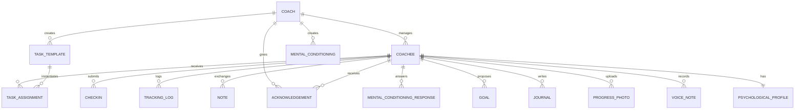

# data-model.md — Database Schema (30 tables, SQLAlchemy Core)

## Schema Management

All schema lives in `src/models.py` as SQLAlchemy Core `Table()` definitions. Schema creation is handled by `metadata.create_all(engine)` in `database.py → init_db()`. This is idempotent — safe to call on every startup.

`init_db()` also seeds accounts via `_seed_admin()` and `_seed_demo_users()`:

| Username | Password | Role | Notes |
|----------|----------|------|-------|
| `ecb` | `ecbF3T` | Admin + Coach | Created/updated on every startup |
| `Kitsune` | `Goddess` | Coach | Demo coach account |
| `severin` | `ecbS3V` | Coachee | Linked to Kitsune |

Password storage: `sha256(plaintext.encode()).hexdigest()` — no salt (historical; migration to argon2id planned in Phase 2).

**Legacy files:** `src/db.py` (MySQL raw DDL) and `src/db_pg.py` (PG raw DDL) are kept for reference but unused. The app imports only from `database` and `models`.

**Migration strategy:** SQLAlchemy's `create_all()` only creates missing tables — it won't ALTER existing ones. For column additions on production, either:
1. Add the column manually via `psql` on ecb.pm before deploy
2. Or use a one-off migration script

## Portable Types

No ENUMs (not portable across dialects). Status fields use `String(20)` with application-level validation.

| SQLAlchemy Type | MySQL | PostgreSQL | SQLite |
|----------------|-------|------------|--------|
| `Integer` | INT | INTEGER | INTEGER |
| `String(N)` | VARCHAR(N) | VARCHAR(N) | TEXT (no enforcement) |
| `Text` | TEXT | TEXT | TEXT |
| `DateTime` | DATETIME | TIMESTAMP | TEXT |
| `Date` | DATE | DATE | TEXT |
| `Time` | TIME | TIME | TEXT |
| `SmallInteger` | SMALLINT | SMALLINT | INTEGER |
| `JSON` | JSON | JSON | TEXT |

## Entity Relationships

## Tables

### coach

| Column | Type | Notes |
|--------|------|-------|
| id | Integer PK | Auto-increment |
| username | String(100) UNIQUE | Login identifier |
| password_hash | String(255) | sha256 hex digest |
| name | String(200) | Display name |
| timezone | String(64) | Default 'Europe/London' |
| logo_path | String(500) | Path to uploaded logo file |
| accent_color | String(20) | UI branding, default '#e94560' |
| bg_color | String(20) | UI branding, default '#1a1a2e' |
| card_color | String(20) | UI branding, default '#16213e' |
| telegram_bot_token | String(200) | For Telegram notifications |
| is_admin | SmallInteger | 0 or 1 |
| status | String(20) | 'active' or 'frozen' |
| email | String(200) | Contact email |
| features | JSON | Feature flag overrides |
| created_at | DateTime | Auto-set |

### coachee

| Column | Type | Notes |
|--------|------|-------|
| id | Integer PK | Auto-increment |
| username | String(100) UNIQUE | Login identifier |
| password_hash | String(255) | sha256 hex digest |
| name | String(200) | Display name |
| coach_id | Integer FK→coach | Which coach owns this coachee |
| contract_text | Text | Current active contract |
| safe_word | String(100) | Default 'RED' — triggers full stop |
| status | String(20) | 'active', 'paused', or 'stopped' |
| task_unveil_time | Time | When tasks become visible (default 08:00) |
| task_freeze_time | Time | When tasks auto-miss (default 22:00) |
| timezone | String(64) | For correct date handling |
| context_text | Text | Coach's private notes about coachee |
| strikes | Integer | Accumulated strikes |
| avatar | String(50) | Emoji avatar (default '🐕') |
| color_scheme | String(20) | UI accent color |
| telegram_chat_id | String(100) | For push notifications |
| features | JSON | Per-coachee feature overrides |
| current_streak | Integer | Consecutive completion days |
| best_streak | Integer | All-time best streak |
| last_streak_date | Date | Last date streak was updated |
| login_count | Integer | For onboarding banner (shows first 3 logins) |
| created_at | DateTime | Auto-set |

### task_template

| Column | Type | Notes |
|--------|------|-------|
| id | Integer PK | |
| coach_id | Integer FK→coach | |
| title | String(300) | |
| description | Text | |
| recurrence | String(20) | 'once', 'daily', 'weekly' |
| category | String(20) | 'mental', 'physical', 'emotional', 'admin' |
| difficulty | String(20) | 'easy', 'medium', 'hard' |
| is_reserve | SmallInteger | Auto-assigned when no manual task |
| recur_days | Integer | Recurs every N days |
| recur_approx | SmallInteger | Fuzzy recurrence (±25% randomization) |
| in_library | SmallInteger | Appears in task library search |
| created_at | DateTime | |

### task_assignment

| Column | Type | Notes |
|--------|------|-------|
| id | Integer PK | |
| template_id | Integer FK→task_template | |
| coachee_id | Integer FK→coachee | |
| due_date | Date | |
| status | String(20) | 'pending', 'completed', 'partial', 'missed', 'excused' |
| visible_after | DateTime | Task becomes visible at this time |
| frozen_after | DateTime | Task auto-misses after this time |
| response | Text | Coachee's completion response |
| responded_at | DateTime | When coachee submitted |
| grade | String(1) | A-F from coach |
| coach_comment | Text | Feedback |
| attachment_path | String(500) | Photo attachment |
| reflection_rating | SmallInteger | 1-5 self-assessment |
| reflection_text | Text | Self-reflection |
| depends_on | Integer | Task ID that must complete first |
| created_at | DateTime | |

### checkin, tracking_log, note, acknowledgement, mental_conditioning, mental_conditioning_response, psychological_profile, contract_history, audit_log, weekly_summary, voice_note, goal, journal, progress_photo, support_message

All follow the same pattern: Integer PK, coachee_id FK, content fields, created_at. See `src/models.py` for exact definitions.

## Cascade Delete Order

When a coach is deleted (`admin_delete_coach`), cleanup happens in this order:
1. For each coachee: delete from checkin, tracking_log, note, acknowledgement, mental_conditioning_response, task_assignment, psychological_profile, contract_history, goal, journal, voice_note, progress_photo, weekly_summary
2. Delete from coachee
3. Delete from task_template, mental_conditioning (coach-level)
4. Delete from coach

This is tested in `tests/test_admin_delete.py` — verifies all 14 tables emptied, no FK violations.

## Extended Tables (gamification, rituals, automation, scheduling, payments, creative archive)

These 11 tables were added after the initial 19 and support later features.

### badge

Gamification awards earned by a coachee.

| Column | Type | Notes |
|--------|------|-------|
| id | Integer PK | Auto-increment |
| coachee_id | Integer FK coachee.id | Owner |
| badge_type | String(50) | Category of badge |
| badge_name | String(200) | Display name |
| description | String(500) | What it was earned for |
| icon | String(50) | Emoji or icon key |
| created_at | DateTime | Awarded timestamp |

### ritual

Recurring ritual definitions (shared or per-coachee).

| Column | Type | Notes |
|--------|------|-------|
| id | Integer PK | Auto-increment |
| coach_id | Integer FK coach.id | Author |
| coachee_id | Integer FK coachee.id | NULL = shared with all coachees |
| name | String(200) | Ritual name |
| description | Text | Instructions |
| schedule | String(50) | Default 'daily' |
| schedule_days | String(50) | Specific days if not daily |
| active | SmallInteger | 0 or 1 |
| created_at | DateTime | Auto-set |

### ritual_log

Completion records for rituals. Unique on `(ritual_id, coachee_id, completed_date)` for idempotency.

| Column | Type | Notes |
|--------|------|-------|
| id | Integer PK | Auto-increment |
| ritual_id | Integer FK ritual.id | Which ritual |
| coachee_id | Integer FK coachee.id | Who completed it |
| completed_date | Date | Day of completion |
| created_at | DateTime | Auto-set |

### auto_rule

Coach-defined automation rules (trigger → condition → action).

| Column | Type | Notes |
|--------|------|-------|
| id | Integer PK | Auto-increment |
| coach_id | Integer FK coach.id | Owner |
| name | String(200) | Rule name |
| trigger | String(50) | Event that fires the rule |
| condition_field | String(50) | Field to test |
| condition_op | String(10) | Comparison operator |
| condition_value | String(100) | Value to compare against |
| action_type | String(50) | What to do |
| action_template | Text | Action payload (mail-merge template) |
| active | SmallInteger | 0 or 1 |
| created_at | DateTime | Auto-set |

### week_plan

Weekly recurring task schedule (day-of-week → template).

| Column | Type | Notes |
|--------|------|-------|
| id | Integer PK | Auto-increment |
| coach_id | Integer FK coach.id | Owner |
| day_of_week | SmallInteger | 0-6 |
| template_id | Integer FK task_template.id | Task to assign |
| coachee_id | Integer FK coachee.id | NULL = all coachees |
| created_at | DateTime | Auto-set |

### onboarding_step

Scripted onboarding sequence (day offset → template or note).

| Column | Type | Notes |
|--------|------|-------|
| id | Integer PK | Auto-increment |
| coach_id | Integer FK coach.id | Owner |
| day_offset | SmallInteger | Days after coachee creation |
| template_id | Integer FK task_template.id | Optional task to assign |
| note_text | Text | Optional welcome note |
| created_at | DateTime | Auto-set |

### payment_plan

Recurring payment configuration per coachee. Unique on `coachee_id` (one plan each).

| Column | Type | Notes |
|--------|------|-------|
| id | Integer PK | Auto-increment |
| coachee_id | Integer FK coachee.id UNIQUE | One plan per coachee |
| frequency | String(20) | e.g. monthly |
| amount | String(50) | Amount as string |
| currency | String(10) | Default 'EUR' |
| start_date | Date | Plan start |
| active | SmallInteger | 0 or 1 |
| created_at | DateTime | Auto-set |

### payment_log

Confirmed payment records.

| Column | Type | Notes |
|--------|------|-------|
| id | Integer PK | Auto-increment |
| coachee_id | Integer FK coachee.id | Payer |
| amount | String(50) | Amount as string |
| currency | String(10) | Default 'EUR' |
| period_start | Date | Billing period start |
| period_end | Date | Billing period end |
| confirmed_at | DateTime | When confirmed |
| notes | String(500) | Optional |
| created_at | DateTime | Auto-set |

### creative_collection

A themed collection of creative works by a coachee.

| Column | Type | Notes |
|--------|------|-------|
| id | Integer PK | Auto-increment |
| coachee_id | Integer FK coachee.id | Author |
| title | String(300) | Collection title |
| description | Text | Optional |
| status | String(20) | Default 'active' |
| created_at | DateTime | Auto-set |

### creative_constraint

A creative prompt/constraint assigned by the coach.

| Column | Type | Notes |
|--------|------|-------|
| id | Integer PK | Auto-increment |
| coach_id | Integer FK coach.id | Author |
| coachee_id | Integer FK coachee.id | Target |
| constraint_type | String(30) | Kind of constraint |
| constraint_value | Text | The constraint content |
| active_date | Date | When it applies |
| used | SmallInteger | 0 or 1 |
| created_at | DateTime | Auto-set |

### creative_work

A single creative work (poem, prose, etc.), optionally tied to a collection and constraint.

| Column | Type | Notes |
|--------|------|-------|
| id | Integer PK | Auto-increment |
| coachee_id | Integer FK coachee.id | Author |
| collection_id | Integer FK creative_collection.id | Optional grouping |
| constraint_id | Integer FK creative_constraint.id | Prompt that inspired it |
| title | String(300) | Optional |
| content | Text | The work itself |
| work_type | String(30) | Default 'poem' |
| tags | String(500) | Comma-separated |
| coach_notes | Text | Coach feedback |
| selected_for_final | SmallInteger | 0 or 1 |
| created_at | DateTime | Auto-set |

> Note: the cascade-delete routine in `admin_delete_coach` predates these 11 tables and does not yet clean all of them. Tracked as future work; see BUGS.md.
