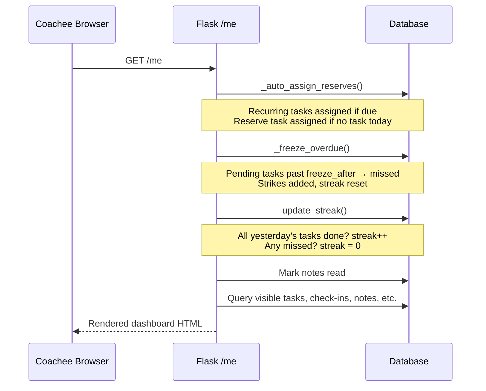
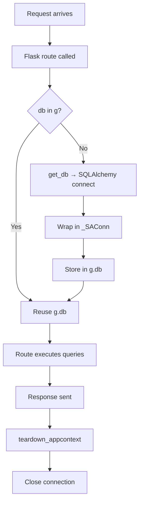

# deep-dive.md — How DSCoaching Actually Works

_A Karpathy-style explanation of the system internals, written for someone who wants to understand not just what the code does, but why it's shaped the way it is._

---

## The Core Idea

DSCoaching is a 1-to-many coaching relationship management system. One coach manages multiple coachees. Tasks get assigned, completed, graded. Check-ins happen daily. The system tracks streaks, strikes, and compliance over time. There's an admin layer on top for managing coaches themselves.

The system runs as a Docker container on ecb.pm (Hetzner VPS) behind Caddy, backed by PostgreSQL 16. Dependencies are vendored in `lib/` for deployment consistency, and the SQL layer stays portable across PostgreSQL and SQLite (for tests). The codebase has been refactored from a single 1873-line `app.py` into Flask blueprints, but the philosophy remains: every route is self-contained, talks to the database, and renders a template.

This is not accidental complexity — it's the natural shape of a personal-scale tool that needs to be cheap to host, easy to deploy, and trivial to reason about.

---

## The Blueprint Evolution

The app started as a single file but has since been split into Flask blueprints: `auth.py`, `routes_coach.py`, `routes_coachee.py`, `routes_admin.py`, plus supporting modules (`helpers.py`, `tasks.py`, `automation.py`, `ai.py`, `i18n.py`, `merge.py`, `photo_validation.py`, `csrf.py`, `rate_limit.py`). The split follows role boundaries, not arbitrary file-size limits.

Every route is still self-contained: it gets a DB connection, runs queries, and returns rendered HTML. There's no service layer, no interactor pattern, no middleware chain. A route is a function that talks to the database and renders a template. That's it.

The cost: you can't unit-test a route without the full Flask context and a live database connection. The benefit: there's exactly one blueprint to look in for any behavior, and you can read the route top-to-bottom to understand what it does.

---

## The _SAConn Trick

Here's the most interesting internal detail. The app was originally written with raw SQL and `%s` placeholders (MySQL style). When it migrated to SQLAlchemy Core for dialect transparency, rewriting 200+ SQL queries to use `:param` style would be a massive, error-prone refactor.

Instead, there's `_SAConn` — a 40-line wrapper that:
1. Accepts `%s` placeholder SQL (the original style)
2. Converts it to `:p0, :p1, :p2...` named params via `_convert_placeholders()`
3. Wraps the positional tuple into a `{p0: val, p1: val}` dict via `_params_to_dict()`
4. Passes the result to SQLAlchemy's `text()` for execution
5. Returns rows as plain dicts (via `._mapping`)

This means routes keep their familiar `c.execute("SELECT * FROM foo WHERE id=%s", (id,))` syntax while SQLAlchemy handles the dialect translation underneath. The migration surface was minimal: swap the connection factory, keep the SQL.

```python
class _SAConn:
    def execute(self, query, params=None):
        if isinstance(query, str):
            self._result = self._conn.execute(
                text(_convert_placeholders(query)),
                _params_to_dict(query, params)
            )
        else:
            self._result = self._conn.execute(query, params or {})
        return self
```

The `else` branch handles SQLAlchemy expression objects directly (used in `init_db()` for table operations). The string branch handles raw SQL (used in all routes).

---

## Dialect Portability

Two databases, two behaviors. Here's what's actually different:

| Problem | PostgreSQL | SQLite |
|---------|------------|--------|
| Random ordering | `RANDOM()` | `RANDOM()` |
| Current timestamp | `NOW()` | `CURRENT_TIMESTAMP` |
| Greatest of two | `GREATEST(a,b)` | Not available |
| Conditional | `CASE WHEN` | `CASE WHEN` |
| Interval | `INTERVAL '7 days'` | Not available |
| Upsert | `ON CONFLICT` | `ON CONFLICT` |

The solution: use portable constructs everywhere. Use `_rand_func()` and `_now_func()` helpers. Replace `GREATEST()` with `CASE WHEN`. Replace `INTERVAL` with Python `timedelta` arithmetic (compute the date in Python, pass it as a param). Replace upserts with select-then-insert/update.

This is slightly less efficient than dialect-native SQL, but the code runs identically across both backends with zero conditional branches in the routes.

---

## The Auto-Behavior System

The coachee dashboard (`GET /me`) is not a simple page render. Loading it triggers four side effects:

1. **`_auto_assign_reserves(coachee_id, coach_id)`** — If no task exists for today and it's past the coachee's unveil time, pick a random reserve template and assign it. Also handles recurring task re-assignment.

2. **`_freeze_overdue(coachee_id, tz)`** — Find any pending tasks whose `frozen_after` timestamp has passed. Mark them missed. Add strikes. Reset streak to 0.

3. **`_update_streak(coachee_id, tz)`** — Check yesterday's tasks. If all completed → streak++. If any missed → streak = 0. Idempotent via `last_streak_date` guard.

4. **Mark notes read** — All unread coach notes get `read_at` set.

Why do these happen on page load instead of a background scheduler? This is a historical design choice from when the app ran on a serverless platform with no persistent process. The current Docker deployment could support a cron job (and `architecture-v2.md` plans a daily sweep), but for now the page-load trigger works: with single-digit users, the coachee loading their dashboard IS the trigger for time-based behaviors.

This has an interesting implication: if a coachee doesn't log in for 3 days, their freeze/streak logic only runs when they come back. All 3 days of missed tasks get frozen in one shot. Strikes accumulate retroactively. The streak resets. The system is eventually consistent — not real-time.



---

## The Task Visibility Model

A task isn't simply "assigned" and "visible." There's a time window:

- **`visible_after`** = coachee's `task_unveil_time` on the due date (e.g., 2026-07-22 08:00)
- **`frozen_after`** = coachee's `task_freeze_time` on the due date (e.g., 2026-07-22 22:00)

Between these two timestamps, the task is visible and completable. Before `visible_after`, it exists but is hidden. After `frozen_after`, it auto-misses.

There's also `depends_on` — a task can depend on another task being completed first. This creates a simple DAG of task ordering within a day.

The query for visible tasks (`_visible_tasks`) is a single SQL statement with four conditions:
```sql
WHERE status IN ('pending','partial')
  AND (visible_after IS NULL OR visible_after <= now)
  AND (frozen_after IS NULL OR frozen_after > now)
  AND (depends_on IS NULL OR depends_on IN (SELECT id FROM task_assignment WHERE status='completed'))
```

---

## The Reserve Task Algorithm

Reserve tasks are the system's way of ensuring a coachee always has something to do, even if the coach forgets to assign manually.

The algorithm (in `_auto_assign_reserves`):

1. First, handle **recurring tasks**: for each recurring template, check when it was last assigned to this coachee. If `recur_days` have elapsed (with optional ±25% fuzzy randomization), assign it today.

2. Then check: does any task already exist for today (including ones we just auto-assigned in step 1)?

3. If yes → done. If no → pick one random reserve template that has **never** been assigned to this coachee before, and assign it.

The "never assigned before" constraint means the reserve pool eventually depletes. When it does, the coachee gets no auto-task. The coach needs to either create more reserves or assign manually.

The randomization on recurring tasks (`recur_approx`) prevents predictability. A "every 3 days" task might fire on day 2, 3, or 4. This is intentional — it keeps the coachee from gaming the schedule.

---

## The Streak/Strike Tension

Streaks reward consistency. Strikes punish failure. They're tracked independently:

- **Streak**: consecutive days where ALL tasks were completed. Resets to 0 on any miss.
- **Strikes**: cumulative count of missed tasks. Never resets (except manually by coach).
- **Best streak**: all-time high water mark. Never decreases.

The tension: a coachee with a 30-day streak who misses one task loses the streak AND gets a strike. The system is deliberately punitive — this is by design for the D/s coaching context where consequences matter.

The `_update_streak` function is idempotent: it records `last_streak_date` and won't re-process the same day. This prevents the dashboard-load trigger from double-counting.

---

## Authentication: Intentionally Simple

Passwords are `sha256(plaintext).hexdigest()`. No salt, no bcrypt, no Argon2. This is a historical choice — the app originally ran on a WASI runtime where bcrypt's C extensions weren't available. Now that production runs on standard CPython in Docker, migration to argon2id is planned (Phase 2 of architecture-v2).

The threat model accepts the current state: it's a personal-scale tool, not a bank. The session is a signed Flask cookie with `SameSite=Lax` and `HttpOnly=True`. CSRF protection is handled by token-based `csrf.py`. All destructive actions are POST-only.

Login checks both the `coach` and `coachee` tables sequentially. If a username exists in both (shouldn't happen due to UNIQUE constraints on each table, but could across tables), the coach match wins. The coachee login also inherits the coach's branding (colors) for visual consistency.

A frozen coach blocks all their coachees from logging in too — the system checks the coach's status during coachee login.

---

## The Feature Flag System

10 boolean flags control which UI sections are available. Resolution is AND-based:

```
effective[feature] = coach.features[feature] AND coachee.features[feature]
```

This means a coach can enable "goals" globally, but disable it for a specific coachee who isn't ready. Or a coachee can opt out of "photos" even if the coach has it enabled.

The flags are stored as JSON columns. On each dashboard render, the effective set is computed and passed to the template. Tabs that are disabled simply don't render.

The 10 flags: `tasks`, `checkins`, `tracking`, `conditioning`, `notes`, `goals`, `journal`, `photos`, `ai_profile`, `telegram`.

---

## The LLM Profile Generation

The AI psychological profile feature works client-side to avoid server-side API costs and latency:

1. Coach clicks "Generate Profile" for a coachee
2. Server builds a prompt from the last 50 check-ins, 30 tasks, 30 tracking logs, 20 notes, and 20 acknowledgements via `_build_profile_prompt()`
3. Server returns the prompt text to the browser (GET endpoint)
4. Browser-side JavaScript calls the Mistral API directly (the API key is configured in coach settings)
5. LLM response is sent back to the server via POST to save

This architecture means the LLM call happens in the user's browser, not on the server. The server never sees the Mistral API key in transit (it's stored in the coach's session/settings). This is unusual but intentional: it avoids server-side API costs and keeps the server stateless.

---

## Cascade Delete: The Nuclear Option

When an admin deletes a coach, it's a true cascade — 14 tables are cleaned in dependency order:

```
For each coachee of the coach:
  → checkin, tracking_log, note, acknowledgement,
    mental_conditioning_response, task_assignment,
    psychological_profile, contract_history, goal,
    journal, voice_note, progress_photo, weekly_summary
  → coachee row itself
Then for the coach:
  → task_template, mental_conditioning
  → coach row itself
```

This is done in application code (not database-level CASCADE) because SQLite's FK support is unreliable in tests. The delete is tested in `test_admin_delete.py` which verifies all 14 tables are empty after deletion.

---

## Template Rendering: Why render_template_string?

Flask's `render_template()` uses Jinja2's file loader. The app uses `render_template_string()` with explicit file reading via `_tpl(name)` instead — a historical choice from when the app ran on a WASI runtime where filesystem assumptions didn't always hold. It still works fine and keeps template loading explicit:

```python
def _tpl(name):
    with open(os.path.join(TEMPLATES_DIR, name)) as f:
        return f.read()
```

This reads the template file at request time (no caching). With small templates and low traffic, this is negligible overhead.

---

## The Deployment Model

The app runs as a Docker container on ecb.pm (Hetzner VPS):

- Standard Python 3.12 (CPython)
- PostgreSQL 16 database (shared `postgres` container)
- `psycopg2-binary` installed via pip in the Dockerfile (compiled C driver)
- Always-on container behind Caddy reverse proxy
- Dependencies vendored in `lib/`, plus psycopg2 from pip
- `server.py` adds `/app/lib` and `/app/src` to `sys.path`
- URL: `https://dscoaching.ecb.pm/`

The `database.py` engine factory selects the backend via env vars (`DATABASE_URL` or `DB_ENGINE`). The `_SAConn` wrapper and dialect helpers ensure SQL works identically on PostgreSQL (production) and SQLite (tests).

---

## What's NOT Here

Things this system deliberately does not have:

- **No WebSocket/real-time**: All interactions are request/response. Coach sends a note; coachee sees it on next page load.
- **No background jobs**: No celery, no cron, no scheduler. Time-based logic runs on page load (daily sweep cron planned in architecture-v2).
- **No email**: No password reset emails, no notification emails. Telegram is the push channel (client-side).
- **No API**: No REST API, no GraphQL. Everything is server-rendered HTML forms.
- **No file storage service**: Attachments are base64-encoded in form fields, decoded on the server, written to a volume. No S3, no CDN.
- **No rate limiting**: Rate limiting exists on login (`rate_limit.py`) but not on general routes. Acceptable for personal use.
- **No pagination**: Lists show all items. With single-digit coachees and weeks of history, this is fine.
- **No caching**: Every request hits the database. With single-concurrency and small data, this is fine.

Each of these is a conscious tradeoff for simplicity at personal scale. If the system grew to 100 coaches with 1000 coachees, most of these would need to change.

---

## The Connection Lifecycle



Every request gets at most one database connection, stored in Flask's `g` context. The connection is opened lazily (only when `db()` is first called in the route). It's closed in `teardown_appcontext` regardless of success or failure.

With `AUTOCOMMIT` isolation level, there's no explicit transaction management. Each SQL statement commits immediately. This means a route that does 5 writes will commit 5 times — there's no atomicity across the route. For a personal coaching tool, this is acceptable. A half-written state (e.g., task assigned but freeze time not set) would self-heal on the next request.

---

## The Audit Trail

Every significant action logs to `audit_log`:

```python
def _audit(action, user_id=None, role=None):
    try:
        conn = db()
        conn.execute(al_t.insert().values(
            user_id=user_id or session.get("user_id", 0),
            role=role or session.get("role", ""),
            action=action,
            ip=request.remote_addr,
            user_agent=str(request.user_agent)[:500],
        ))
        conn.commit()
    except Exception:
        pass
```

The `try/except: pass` is deliberate — audit logging must never break the primary operation. If the audit table is full, locked, or missing, the user's action still succeeds. This is "best-effort" logging: useful for forensics, not relied upon for correctness.

The `ip` field captures `request.remote_addr` which, behind Caddy, is the proxy IP unless `X-Forwarded-For` is set. Not perfectly accurate for abuse detection, but useful for "was this the same session" analysis.

---

## Why It Works

This system works because it respects its constraints:

1. **Personal scale** — Single developer, single-digit users, weeks of data. No need for horizontal scaling, caching, or async.
2. **Simple infrastructure** — One Docker container, one PostgreSQL database, one reverse proxy. Vendored deps for consistent deploys, page-load-triggered logic for time-based behaviors.
3. **Deployment simplicity** — Push to main, CI runs quality gates, SSH deploys to ecb.pm. Rollback via git revert or docker cp.
4. **Dialect transparency** — Same code, two databases. Tests run on SQLite (fast), production on PostgreSQL (full-featured).

The complexity budget is spent on the domain (task scheduling, streak logic, feature flags, branding) rather than on infrastructure (frameworks, queues, caches, APIs). For a tool that manages 3-5 coaching relationships, this is the right allocation.
