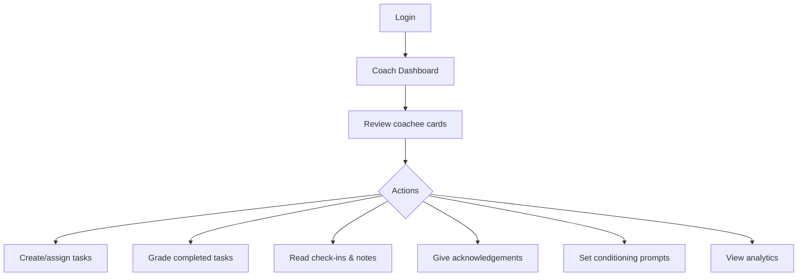
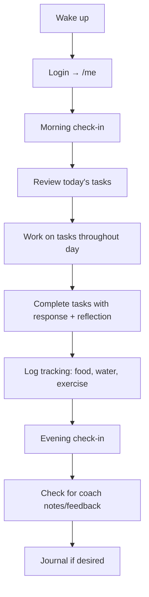

# onboarding.md — User Guides (Admin, Coach, Coachee)

## System Access

| Instance | URL | Purpose |
|----------|-----|---------|
| Production | `https://dscoaching.ecb.pm/` | Live system |

Login at the root URL — the system auto-detects your role (admin, coach, or coachee) and redirects to the appropriate dashboard.

---

## Admin Onboarding

### What is an admin?

An admin is a coach with elevated privileges. They can manage all coaches in the system, freeze/delete accounts, and handle support tickets. The first account created via `/setup` is automatically admin.

### First-time setup

1. Navigate to the app URL
2. If no coaches exist, you'll see `/setup` — create the initial admin account
3. After setup, log in at `/login`
4. You land on the **Coach Dashboard** (admins are also coaches)

### Admin capabilities

| Action | Path | What it does |
|--------|------|--------------|
| View all coaches | `/admin` | Lists all coaches with 7-day activity stats, status |
| Add a coach | `/admin/coach/add` | Create new coach account (username, password, name) |
| Freeze a coach | `/admin/coach/<id>/freeze` | Toggle freeze — blocks their login and all coachees |
| Delete a coach | `/admin/coach/<id>/delete` | CASCADE delete: removes coach + all their coachees + all data |
| Reset coach password | `/admin/coach/<id>/reset-password` | Set a new password for a coach |
| View support tickets | `/admin/support` | Read and reply to coach support messages |
| Reply to ticket | `/admin/support/<id>/reply` | Send admin response |

### Admin constraints

- Cannot delete yourself
- Cannot delete other admins
- Cannot freeze yourself
- Deleting a coach removes ALL associated data (coachees, tasks, check-ins, notes, photos, journals, goals, voice notes, profiles, contracts, tracking logs, acknowledgements, conditioning responses, weekly summaries)

### Admin workflow (typical)

```mermaid
graph TD
    A[Login as admin] --> B[/admin dashboard]
    B --> C{Need new coach?}
    C -->|Yes| D[Add coach]
    C -->|No| E{Support ticket?}
    E -->|Yes| F[Reply to ticket]
    E -->|No| G[Switch to coach view /coach]
    G --> H[Manage own coachees]
```

---

## Coach Onboarding

### What is a coach?

A coach manages one or more coachees. They create tasks, review check-ins, give feedback, set mental conditioning prompts, and configure their coaching brand (colors, logo).

### Getting started

1. Log in at `/login` with credentials provided by admin
2. You land on the **Coach Dashboard** — a grid of coachee cards
3. If you have no coachees yet, add one via "Add Coachee" button

### Core workflow



### Coach capabilities (complete list)

| Action | Path | Description |
|--------|------|-------------|
| Dashboard | `/coach` | Overview cards for all coachees with filters (all, ungraded, no check-in, has strikes) |
| Add coachee | `/coach/coachee/add` | Create new coachee with username, password, name, timezone |
| View coachee | `/coach/coachee/<id>` | Full detail view: profile, tasks, check-ins, notes, tracking |
| Edit coachee | `/coach/coachee/<id>/edit` | Update settings, contract, feature flags, safe word, schedule |
| Save context | `/coach/coachee/<id>/context` | Private coach notes about the coachee (not visible to coachee) |
| Reset password | `/coach/coachee/<id>/reset-password` | Reset a coachee's password |
| Compliance heatmap | `/coach/coachee/<id>/heatmap` | 90-day color-coded task compliance visualization |
| Category breakdown | `/coach/coachee/<id>/categories` | Task statistics by category (mental, physical, emotional, admin) |
| Weekly summary | `/coach/coachee/<id>/summary` | Auto-generated weekly overview stats |
| Contract history | `/coach/coachee/<id>/contracts` | Version history of contract text |
| Manage tasks | `/coach/tasks` | Create templates, assign to coachees, set due dates |
| Edit template | `/coach/template/<id>/edit` | Modify existing task template |
| Delete template | `/coach/template/<id>/delete` | Remove a task template |
| Library search | `/coach/library-search` | Search task templates shared by other coaches |
| Bulk grading | `/coach/grading` | Grade multiple completed tasks at once (A-F + comment) |
| Conditioning | `/coach/conditioning` | Create daily mental prompts (all coachees or specific) |
| Acknowledgement | `/coach/ack/<id>` | Give positive or negative acknowledgement |
| Review task | `/coach/task/<id>/review` | Grade a specific completed task |
| Send note | `/coach/note/<id>` | Send text note (optional scheduled delivery) |
| Pin note | `/coach/note/<id>/pin` | Pin/unpin an important note |
| Quick note | `/coach/quick-note/<id>` | Send note from dashboard card |
| Quick ack | `/coach/quick-ack/<id>` | Give ack from dashboard card |
| Review goal | `/coach/goal/<id>` | Approve or reject coachee-proposed goal |
| Voice note | `/coach/voice/<id>` | Upload audio message to coachee |
| Settings | `/coach/settings` | Change password, name, toggle feature flags |
| Branding | `/coach/branding` | Set accent color, background, card color, logo, Telegram bot token |
| Audit log | `/coach/audit` | View all logged actions |
| AI analysis | `/coach/analyze` | LLM text analysis tool |
| Support | `/coach/support` | Send support ticket to admin |

### Task template types

| Type | Behavior |
|------|----------|
| **One-off** | Assigned once, done |
| **Reserve** (`is_reserve=1`) | Auto-assigned when no manual task exists for the day |
| **Recurring** (`recur_days=N`) | Auto-reassigned every N days after last assignment |
| **Fuzzy recurring** (`recur_approx=1`) | Recurring with ±25% randomization on interval |
| **Library** (`in_library=1`) | Visible to other coaches in search |

> **Planned (2026-09-30 batch — see `plan-proof-and-scoring.md`):**
>
> | Option | Behavior | Roadmap |
> |--------|----------|---------|
> | **Proof demand %** (`proof_pct`) | Chance (0–100) that a given occurrence demands a photo. Rolled once at assignment and persisted; when required, completing without a photo is rejected. Distinct from AI validation below. | R48 |
> | **Points** (`points`) | Signed score value awarded on completion (and deducted on miss). Feeds the persisted daily score. | R49 |

### Task categories

- `mental` — mindset, reflection, meditation
- `physical` — exercise, movement, body
- `emotional` — relationship, empathy, gratitude
- `admin` — logistics, organization, scheduling

### Grading scale

| Grade | Meaning |
|-------|---------|
| A | Exceptional — exceeded expectations |
| B | Good — solid completion |
| C | Adequate — minimum met |
| D | Below expectations |
| E | Poor effort |
| F | Failure / not attempted |

> **Known gap (H2, see roadmap):** the *automatic* grading heuristic
> (`auto_grade`) currently assigns only A–D based on response **length**, not
> the A–F rubric above, and length rewards verbosity over quality. Planned fix:
> fold auto-grading into LLM auto-rating (R6) or a proper rubric.

### Feature flags

Toggle features per-coach (affects all your coachees) or override per-coachee:

| Flag | Controls |
|------|----------|
| `tasks` | Task assignment, completion, grading UI |
| `checkins` | Morning/evening/weekly check-in forms |
| `tracking` | Food, hydration, alcohol, exercise, emotional log |
| `conditioning` | Daily mental prompts and responses |
| `notes` | Bidirectional text and audio notes |
| `goals` | Coachee-proposed goals with approval workflow |
| `journal` | Private/shared journal entries |
| `photos` | Before/after photo uploads |
| `ai_profile` | LLM-generated psychological profile |
| `telegram` | Telegram push notifications |

Resolution logic: a feature is active only if BOTH the coach AND the coachee have it enabled.

### Branding

Customize the look for your coachees:
- **Accent color** — buttons, links, highlights (default `#e94560`)
- **Background color** — page background (default `#1a1a2e`)
- **Card color** — content cards (default `#16213e`)
- **Logo** — uploaded image shown in nav
- **Telegram bot token** — for push notifications (token stays in browser, never hits the server)

---

## Coachee Onboarding

### What is a coachee?

A coachee is someone being coached. You receive tasks, submit check-ins, track habits, communicate with your coach via notes, and work toward goals. Your coach sets the pace and rules.

### Getting started

1. Your coach creates your account and gives you credentials
2. Log in at `/login`
3. You land on **My Dashboard** — a tabbed interface with everything you need
4. On your first 3 logins, you'll see a welcome banner explaining the system

### Dashboard tabs

| Tab | What's there |
|-----|--------------|
| **Rules** | Your contract, safe word, current streak, strikes |
| **Morning** | Morning check-in form |
| **Evening** | Evening check-in form |
| **Tasks** | Today's assigned tasks (with completion forms) |
| **Mind** | Mental conditioning prompts to respond to |
| **Tracking** | Log food, hydration, alcohol, exercise, emotional state |
| **Notes** | Bidirectional messaging with your coach |
| **Boundaries** | Pause/stop coaching (safe word activation) |
| **Goals** | Propose goals for coach approval |
| **Journal** | Private or shared journal entries |
| **Photos** | Progress photo uploads |

### Coachee capabilities (complete list)

| Action | Path | Description |
|--------|------|-------------|
| Dashboard | `/me` | Full tabbed interface (triggers auto-behaviors on load) |
| Submit check-in | `/me/checkin` | Morning, evening, or weekly check-in |
| Complete task | `/me/task/<id>` | Submit response + optional photo + self-reflection |
| Respond to conditioning | `/me/conditioning/<id>` | Answer daily mental prompt |
| Submit tracking | `/me/tracking` | Log food/hydration/alcohol/exercise/emotional |
| Send note | `/me/note` | Message to your coach |
| Pause coaching | `/me/pause` | Activate safe word — pause or stop coaching |
| View history | `/me/history` | Past check-ins, logs, notes |
| Export data | `/me/export` | Download all personal data as JSON |
| Propose goal | `/me/goal` | Suggest a goal for coach approval |
| Add journal | `/me/journal` | Write journal entry (optionally shared with coach) |
| Upload photo | `/me/progress-photo` | Upload progress photo |
| Send voice | `/me/voice` | Upload voice note to coach |

### Daily routine (typical)



### Task lifecycle (from coachee perspective)

1. Task appears on your dashboard after your **unveil time** (default 08:00)
2. You see the title, description, category, difficulty
3. Submit your response (text is required, photo and reflection are optional)
4. If you don't complete before **freeze time** (default 22:00), it's marked **missed** and you get a strike
5. Coach grades your completed tasks (A-F) with optional feedback
6. Grades appear in your "Recent Grades & Feedback" section

### Streaks

- Complete ALL tasks in a day → streak increments
- Miss ANY task → streak resets to 0
- Your best streak is tracked forever
- Streaks display with a fire emoji on the dashboard

### Score (planned — R49, see `plan-proof-and-scoring.md`)

- Each task can carry **points**; completing it adds them, missing subtracts a
  penalty.
- Your score is persisted per day (in your own timezone) and can be viewed as:
  today's total, this week (Sunday–Saturday **or** Monday–Sunday, per
  preference), this month, all-time, and your best week.
- A task that demanded proof and you provided it can earn a small **proof bonus**.

### Proof on tasks (planned — R48)

- Some recurring tasks will only *sometimes* ask for a photo (a configurable
  chance per task). When a task shows **📷 Proof required**, you must attach a
  photo to complete it. When it doesn't, a text response is enough.
- Because you can't predict which day proof is asked, the expectation is to treat
  every occurrence as if it might be checked.

### Safe word

Your safe word (default "RED") is a circuit breaker. Using `/me/pause`:
- **Pause** — temporarily suspends all tasks and obligations
- **Stop** — ends the coaching relationship

This is always available and requires no explanation to your coach.

### Data ownership

You can export ALL your data at any time via `/me/export` — returns a JSON file with every check-in, task, note, tracking log, goal, journal entry, and photo reference.

---

## Quick Reference Card

### Login URLs

| Role | After login lands at |
|------|---------------------|
| Admin | `/coach` (coach dashboard, with admin menu link) |
| Coach | `/coach` |
| Coachee | `/me` |

### Password rules

- Minimum: none enforced (personal-scale system)
- Storage: sha256 hex digest (no salt)
- Reset: coach resets coachee password; admin resets coach password

### Timezone handling

- Each coachee has a configured timezone
- Task unveil/freeze times use the coachee's timezone
- Check-in timestamps are server time (UTC in Docker container)

### Auto-behaviors (triggered on coachee dashboard load)

| Behavior | What happens |
|----------|--------------|
| Reserve assignment | If no task today and past unveil time → assign random reserve |
| Recurring assignment | If recur_days elapsed → assign today |
| Freeze overdue | Pending tasks past freeze time → marked missed, strikes added, streak reset |
| Update streak | If all yesterday's tasks completed → streak++; any missed → streak = 0 |
| Mark notes read | Coach's notes marked as read |
