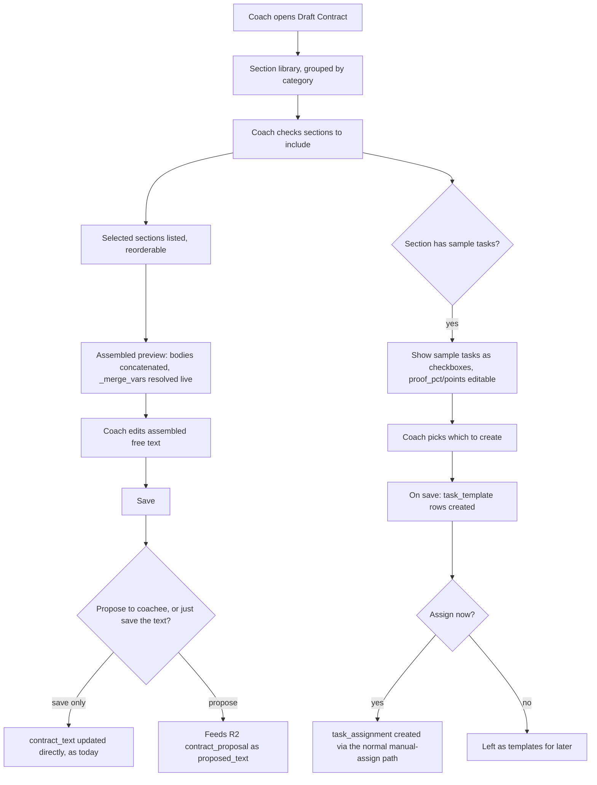
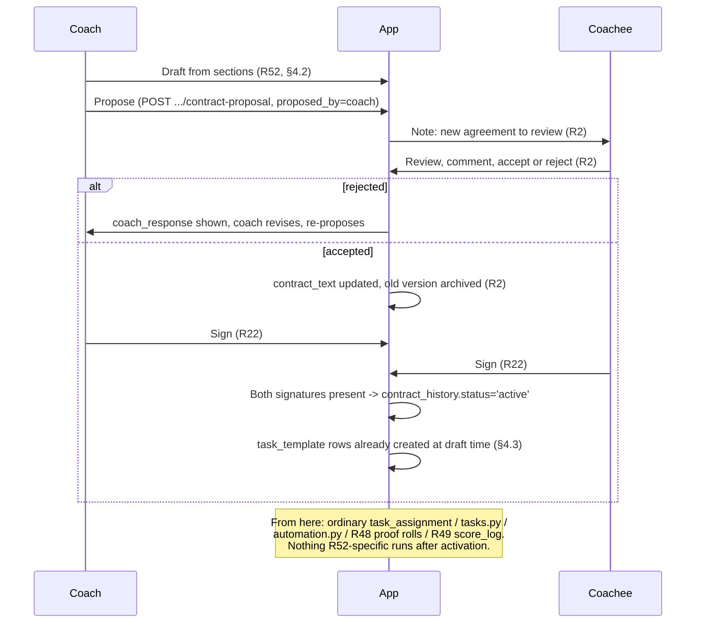

# Plan — Section-Based Contract Drafting (R52)

Status: **Proposed / reconciled** (for review) — 2026-09-30
Roadmap ID: **R52** (Contract section library + sample-task association)
Related: R2 (bilateral editing), R3 (contract-based task filters), R22 (digital
signatures), R23 (renewal/expiry), R48 (proof), R49 (points).

This doc reconciles two independently-drafted versions of the same idea,
produced in parallel the same day (one grounded in the actual uploaded
contract data, one drafted without access to it). Where they agreed, that's
the design below with no further comment. Where they differed, §7 records
which side won and why.

## 1. The idea (the "vibe")

Today a contract is a single free-text blob (`coachee.contract_text`,
versioned in `contract_history`). Writing one from scratch is intimidating
and inconsistent, and the contract is disconnected from the actual tasks the
coachee will do.

The proposal: give the coach a **library of pre-written contract sections**.
The coach drafts a contract by **picking and arranging sections** (building
blocks), editing the wording, and the assembled text becomes the contract.
Each section can carry **associated sample task templates** — including R48
`proof_pct` and R49 `points` hints — so the agreement and the day-to-day work
are authored together, not separately.

## 2. The seed library is real, not invented

The starter library is extracted and name-genericized from an actual,
currently-used 20-chapter contract and its 23 real tasks (see
[`contract-library-seed.json`](contract-library-seed.json) for the full
data). `Madame V`/`Mme V` → `{{coach_name}}`, `eddy` → `{{coachee_name}}`,
`(the overthinker)` → `({{coachee_archetype}})`; verified zero leftover real
names in the output. This matters for two reasons beyond "it's more
authentic than an invented example set":

- **The default `proof_pct`/`points` values aren't guesses.** The real task
  data splits roughly 2-required/15-optional on proof demand — i.e. the
  coach's own actual practice, before this feature existed, was already
  "most days a text confirmation is enough, a specific few things always
  need proof." That's exactly R48's thesis, recovered from real behavior
  rather than assumed. Seed mapping: `proofMode="required"` → `proof_pct`
  100, `proofMode="optional"` → `proof_pct` 35 (both editable per task, per
  coach discretion — no recurring task is forced to 100%; unpredictability
  is the point, but it's always the coach's call).
- **One sample task — "Bending & Mending Exercise"** (one-off,
  `proofMode=required`, asymmetric reward/penalty) is almost certainly the
  real-world basis for the existing roadmap's **R45 "Compound/multi-phase
  tasks"** worked example, which already names "Breaking & Mending"
  verbatim. Confirms R45 was scoped against real material.

**Not all 20 sections are equally reusable.** Two — "Wife & Family Protocol"
and "Alcohol Protocol" — are tied to this specific relationship's real
circumstances (marriage, specific triggers) rather than generically
transferable, and retain fixed gendered pronouns throughout (name-only
genericization, not a pronoun rewrite — see `contract-library-seed.json`'s
`_meta` note). These are tagged `reusability: adapt_heavily` in the schema
below, versus `reusable_boilerplate` for the other 18, and the section-picker
UI must surface that distinction rather than let a coach silently import
marriage-specific clauses into an unrelated dynamic.

## 3. Requirements

- **REQ-52.1** The system MUST provide a library of reusable contract
  sections. Each has: title, category, body text (may contain merge
  variables), and a **reusability tag** (`reusable_boilerplate` |
  `adapt_heavily` | `custom`).
- **REQ-52.2** Sections MUST be seedable as system defaults (`coach_id`
  NULL, the real extracted library) AND creatable/editable by a coach
  (private). A coach MUST be able to clone a default to customize it.
- **REQ-52.3** A section MAY be associated with zero or more sample task
  templates (title, description, category, difficulty, recurrence,
  `proof_pct`, `points`).
- **REQ-52.4** The coach MUST be able to draft a contract for a coachee by
  selecting sections, reordering, and editing the assembled text before
  saving.
- **REQ-52.5** The assembled text is written to `coachee.contract_text` /
  `contract_history` **exactly as today** — no change to existing storage.
  (This is what lets R2/R22/R23 layer on top unchanged — see §5.)
- **REQ-52.6** Including a section with sample tasks MUST offer them to the
  coach (accept/edit/skip per task). Nothing is created without explicit
  coach action (charter principle: authority features are config, never
  automatic).
- **REQ-52.7** Library scope: system defaults visible to all coaches
  (read-only, cloneable); a coach's own sections are private to that coach.
  No cross-coach sharing in v1 (deferred, §8).
- **REQ-52.8** Selecting sections MUST NOT lock the contract to them — after
  assembly the text is fully free-editable. Sections are a **scaffold, not a
  schema**; the contract remains one plain document. (This is the load-bearing
  simplicity decision — see §7.)
- **REQ-52.9** `adapt_heavily`-tagged sections MUST render a visible warning
  in the picker/editor ("drawn from a real personal example — read and
  rewrite before using") rather than being presented identically to
  general-purpose boilerplate.
- **REQ-52.10** All new tables/queries MUST use portable SQL, matching
  `models.py` conventions.

## 4. Design

### 4.1 Schema

Two tables (plus the reusability tag on the first). Portable types only.

```
contract_section
  id            Integer PK
  coach_id      Integer FK coach.id   NULL   # NULL = system default (shared, read-only)
  title         String(200)  NOT NULL
  category      String(40)           # 'foundation' | 'roles' | 'consent' | 'time' |
                                     # 'ritual' | 'service' | 'rewards' | 'physical' |
                                     # 'evaluation' | 'dissolution' | 'custom'
  body          Text          NOT NULL       # clause text, may contain {{coach_name}} /
                                              # {{coachee_name}} / {{coachee_archetype}} /
                                              # existing merge.py vars ({{name}}, {{safe_word}}, ...)
  reusability   String(20)   default 'custom' # reusable_boilerplate | adapt_heavily | custom
  sort_hint     SmallInteger default 0
  active        SmallInteger default 1
  created_at    DateTime     server_default now()

contract_section_task
  id            Integer PK
  section_id    Integer FK contract_section.id  NOT NULL
  title         String(300)  NOT NULL
  description   Text
  category      String(20)   default 'mental'
  difficulty    String(20)   default 'medium'
  recurrence    String(20)   default 'once'
  recur_days    Integer      NULL
  is_reserve    SmallInteger default 0
  proof_pct     SmallInteger default 0        # R48 — see §2 for the 100/35 seed mapping
  points        SmallInteger default 0        # R49
  tags          String(500)
  created_at    DateTime     server_default now()
```

No change to `coachee.contract_text` or `contract_history` (REQ-52.5).

### 4.2 Coach screens

**Section library** (`GET/POST /coach/contract-sections`): browse by
category; system defaults show a "Clone" button, own sections show
edit/delete. `adapt_heavily` sections carry the warning banner (REQ-52.9)
wherever they appear — library browse, picker, and editor alike. A
**"✨ Draft with AI"** action on the add/edit form lets the coach type rough
notes and get a drafted section back via the existing
`ai.py::_cf_ai_complete()` backend (already live for R6/R7/psychological
profiles) — no new AI integration, just a new call site.

**Draft a contract** (`GET/POST /coach/coachee/<cid>/contract/draft`):



Assembly is deterministic: selected sections in chosen order, bodies joined
with a blank line, run through the existing `_merge_vars(text, coachee_id)`
— reusing `merge.py`, no new templating mechanism. (`{{coach_name}}` is a
small addition needed to that engine's context dict, since today it only
carries coachee-side vars — see §6 step 1.)

### 4.3 Sample-task creation

On save, for each checked sample task: insert a `task_template` (coach-owned,
copying the section-task's fields including `proof_pct`/`points`), and if
"assign now" is checked, insert a `task_assignment` via the same path the
existing manual-assign handler uses — so the R48 proof roll and visibility
rules apply uniformly, not a parallel code path.

## 5. Composing with propose/negotiate/sign — reuse R2 and R22, don't reinvent them

The full loop you described — draft, propose to the coachee, they comment,
reach agreement, it enters into force — is real and belongs in this
project. It is **already fully specified**, just not yet built:
`requirements-complete.md` §2.2 (`contract_proposal` table: `proposed_text`,
`status` pending/accepted/rejected, `coach_response`) is R2, and §2.3
(`contract_signature` table + `contract_history.status`
draft/active/expired/superseded) is R22. Building a second, parallel
negotiation/signature system for R52 specifically would duplicate that
spec for no reason — the assembled section-based text is just
*a particular good way to produce* a `proposed_text`, and R2/R22 already
define everything after that point: review, per-field response, accept/
reject, dual signature, activation.

One small extension to R2's existing spec is worth making now rather than
discovering it's needed later: `contract_proposal` as specced is
coachee-initiated (`POST /me/contract-propose`). R52's use case is
coach-initiated (the coach drafts and proposes a *new* contract to the
coachee, not an amendment the coachee suggests). Add one column:

```python
# Addition to R2's existing contract_proposal spec:
Column("proposed_by", String(20), nullable=False, server_default="coachee"),  # 'coach' | 'coachee'
```

and a coach-side route, `POST /coach/coachee/<cid>/contract-proposal`, that
inserts with `proposed_by='coach'` and the section-assembled text. Everything
downstream — the coachee's review screen, comment/accept/reject, and R22's
signature flow once accepted — is unchanged and shared between both
directions. This is the reconciliation of the two original drafts' biggest
disagreement (§7): a full negotiation UI is real scope, but it's R2+R22's
scope, extended by one column, not R52's.

### Full lifecycle (informative)



## 6. Build steps

1. Add `{{coach_name}}` to `merge.py::_get_merge_context()` (small addition —
   join to `coach` via `coachee.coach_id`). Needed before any section
   referencing the coach by name can render correctly.
2. Schema: `contract_section`, `contract_section_task` in `models.py`;
   Alembic migration after R48/R49's `003` → `004`.
3. Seed the real starter library (from `contract-library-seed.json`) in
   `database.py`, idempotent, `coach_id NULL`, tagging `reusable_boilerplate`
   vs `adapt_heavily` per §2.
4. Coach routes + templates: `/coach/contract-sections` (manage),
   `/coach/coachee/<cid>/contract/draft` (assemble + save, §4.2).
5. Sample-task creation via the existing template/assignment insert path
   (§4.3), so R48's proof-roll applies uniformly.
6. Tests: section CRUD, clone-default, assemble → `contract_history` version,
   sample-task creation (created only when checked; assign-now path),
   `adapt_heavily` warning renders, portable SQL on SQLite.
7. **Separately** (R2/R22's own build, not blocked on R52): `proposed_by`
   column + coach-side proposal route (§5).
8. Docs: `data-model.md`, `roadmap.md` (mark R52), `user-journeys.md`
   (already has Journey 2b), `onboarding.md`.

## 7. Where the two original drafts disagreed, and why this version resolved it that way

| Question | Draft A (grounded in real data) | Draft B (invented seed) | Resolution |
|---|---|---|---|
| Seed content | Extracted from the real 20-chapter contract + 23 tasks | Plausible but invented categories | **A** — real defaults aren't guesses (§2); B's categories folded in as the `category` enum values, which were good |
| Schema size | 6 tables (draft/section/comment/task/signature as new, parallel entities) | 2 tables (section, section_task); scaffold-not-schema | **B** — REQ-52.8's "sections are a scaffold" is the right call; a parallel negotiation system duplicates R2/R22 for no benefit (§5) |
| Propose/negotiate/sign | Fully specified inline, new tables | Deferred entirely to unbuilt R2/R22, not designed | **Reconciled** — real requirement (was explicitly asked for), but it's R2/R22's spec plus one column, not new R52-owned tables (§5) |
| AI-assisted section drafting | Yes, a screen action | Not present | **A** — kept, small addition, reuses existing `ai.py` backend |
| `adapt_heavily` flagging | Yes | No (didn't have the real data to know it was needed) | **A** — required once real seed content is used |
| Draft-time fill-in params (`{{param:label}}`) | Not present | Yes, flagged as open question | **B** — carried into §8 below |
| Localization (EN/FR seed) | Not addressed | Flagged as open question | **B** — carried into §8 below |

## 8. Open questions

1. **Draft-time fill-in placeholders** beyond existing merge vars (e.g.
   "response window: ___ hours") — a light `{{param:label}}` prompt-on-draft
   mechanism. Useful, not required for v1.
2. Should the **coachee** see which sections composed their contract, or
   only the final text? Leaning final-text-only (keeps the contract a single
   document per REQ-52.8); a coach-side "which sections" audit trail could
   help without exposing it to the coachee.
3. Cross-coach section sharing/marketplace — deferred to v2.
4. Should a section with sample tasks also be able to propose **rituals**
   (R38) or **week-plan** entries, not just one-off task templates? Natural
   extension once R38 lands.
5. **Localization**: seed sections in EN + FR since the app is bilingual
   (`i18n.py`). The real extracted library is English-only; a French
   translation pass is separate follow-up work, not a blocker for v1.
6. Section-level accept/comment in the R2 negotiation screen (§5) — cosmetic
   granularity or a hard per-section gate before the coachee can sign? Leaning
   cosmetic (the charter's consent model is about the whole agreement being
   mutual, not a section-by-section veto that could turn negotiation into
   gridlock) — but this is a product call for the coach, not a technical one.
