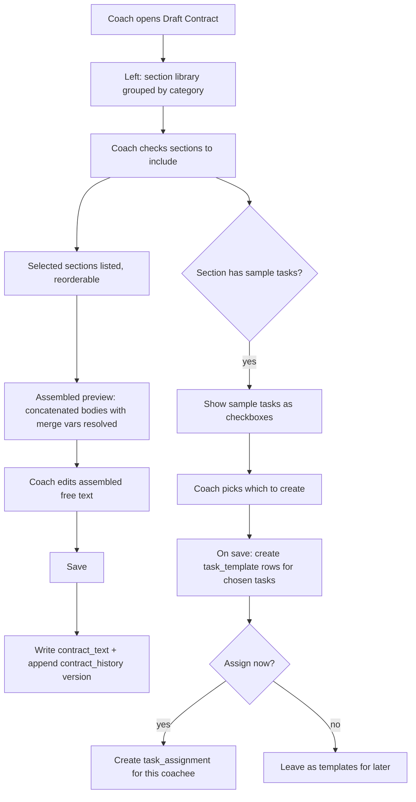

# Plan — Section-Based Contract Drafting

Status: **Proposed / ideation** (for review) — 2026-09-30
Roadmap ID: **R52** (Contract section library + sample-task association)
Related: R2 (bilateral editing), R3 (contract-based task filters), R22 (digital
signatures), R23 (renewal/expiry), R49 (points), R48 (proof).

## 1. The idea (the "vibe")

Today a contract is a single free-text blob (`coachee.contract_text`, versioned
in `contract_history`). Writing one from scratch is intimidating and
inconsistent, and the contract is disconnected from the actual tasks the
coachee will do.

The proposal: give the coach a **library of pre-written contract sections**.
The coach drafts a contract by **picking and arranging sections** (like building
blocks), editing the wording, and the assembled text becomes the contract.
Crucially, **each section is associated with sample task templates**, so
choosing a section can also seed the concrete tasks that operationalise it —
the contract and the day-to-day work are authored together, not separately.

Example: picking the section "Morning Ritual & Check-in" drops in the agreed
clause text *and* offers three sample tasks ("Send a good-morning message
before 08:00", "Log hydration on waking", "2-minute grounding practice") the
coach can accept, edit, or skip.

## 2. Requirements

- **REQ-52.1** The system MUST provide a library of reusable contract sections.
  Each section has: a title, a category, body text (the clause), and optional
  merge variables (e.g. `{{name}}`, `{{safe_word}}`).
- **REQ-52.2** Sections MUST be seedable as system defaults (a starter set
  shipped with the app) AND creatable/editable by a coach (their own private
  sections). A coach MUST be able to clone a default section to customise it.
- **REQ-52.3** A section MAY be associated with zero or more **sample task
  templates** (title, description, category, difficulty, recurrence hint, and
  the planned `proof_pct` / `points` from R48/R49).
- **REQ-52.4** The coach MUST be able to draft a contract for a coachee by
  selecting sections, reordering them, and editing the assembled text before
  saving.
- **REQ-52.5** On saving, the assembled text MUST be written to
  `coachee.contract_text` and versioned in `contract_history` exactly as today
  (no change to the existing contract storage/versioning contract).
- **REQ-52.6** When a section with sample tasks is included, the coach MUST be
  offered those tasks and be able to (a) create them as real `task_template`
  rows for this coach and optionally assign them to the coachee, (b) edit before
  creating, or (c) skip. Nothing is created without explicit coach action
  (consent/authority principle: config, not automatic).
- **REQ-52.7** The section library MUST be scoped: system defaults are visible
  to all coaches (read-only, cloneable); a coach's own sections are private to
  that coach. (Mirrors the existing `task_template.in_library` sharing idea but
  simpler — no cross-coach sharing in v1.)
- **REQ-52.8** Selecting/using a section MUST NOT lock the contract to it — the
  assembled text is fully editable free text after assembly (the sections are a
  scaffold, not a schema). The contract remains a plain document.
- **REQ-52.9** MUST compose with R2 (bilateral editing): a section-assembled
  draft is still just `contract_text`, so bilateral proposals/signatures layer
  on top unchanged.
- **REQ-52.10** All new tables/queries MUST use portable SQL (no dialect
  features), consistent with project conventions.

## 3. Design

### 3.1 Schema (link REQ-52.1, .3, .7)

Two new tables, plus a link table. Types portable (`Integer`, `String`, `Text`,
`SmallInteger`, `DateTime`), matching `models.py`.

```
contract_section
  id            Integer PK
  coach_id      Integer FK coach.id   NULL   # NULL = system default (shared, read-only)
  title         String(200)  NOT NULL
  category      String(40)           # 'protocol' | 'communication' | 'rituals' | 'wellness' |
                                     # 'discipline' | 'boundaries' | 'logistics' | 'aftercare' | ...
  body          Text          NOT NULL       # clause text, may contain merge vars
  sort_hint     SmallInteger  default 0      # suggested ordering within a category
  active        SmallInteger  default 1
  created_at    DateTime      server_default now()

contract_section_task            # sample tasks associated with a section
  id            Integer PK
  section_id    Integer FK contract_section.id  NOT NULL
  title         String(300)  NOT NULL
  description   Text
  category      String(20)   default 'mental'   # matches task_template.category
  difficulty    String(20)   default 'medium'
  recurrence    String(20)   default 'once'
  recur_days    Integer      NULL
  is_reserve    SmallInteger default 0
  proof_pct     SmallInteger default 0        # R48 hint
  points        SmallInteger default 0        # R49 hint
  tags          String(500)
  created_at    DateTime     server_default now()
```

No change to `coachee.contract_text` or `contract_history` — the assembled draft
flows into them unchanged (REQ-52.5).

### 3.2 Drafting flow (link REQ-52.4, .6)

New coach screen `GET /coach/coachee/<cid>/contract/draft` (template
`contract_draft.html`), and `POST` to assemble+save.



Assembly is deterministic: selected sections in chosen order, bodies joined with
a blank line, run through the existing `_merge_vars(text, coachee_id)` engine so
`{{name}}`, `{{safe_word}}`, etc. resolve — reusing `merge.py`, no new mechanism.

### 3.3 Sample-task creation (link REQ-52.6)

On save, for each checked sample task: insert a `task_template` (coach-owned,
copying the section-task's fields including R48/R49 hints), and if "assign now"
is checked, insert a `task_assignment` for the coachee via the same path the
manual-assign handler already uses (so proof roll / visibility all apply
uniformly). Nothing auto-creates without the coach's checkbox — authority stays
explicit (charter principle 4).

### 3.4 Section management (link REQ-52.2, .7)

New coach screen `GET/POST /coach/contract-sections` (template
`contract_sections.html`): list system defaults (read-only, "Clone" button) and
the coach's own sections (edit/delete), plus a form to add a section and attach
sample tasks. Cloning a default copies it to a `coach_id`-owned row.

### 3.5 Seed data (starter library)

Ship a system-default set (all `coach_id = NULL`), seeded in `database.py`
alongside the existing admin/demo seeding. A **non-exhaustive** starter set
(coach can edit/extend); final wording to be reviewed:

| Category | Section | Sample tasks (examples) |
|----------|---------|--------------------------|
| protocol | Forms of address & etiquette | "Use agreed address in all messages today" |
| communication | Daily check-in commitment | "Morning check-in before 08:00", "Evening reflection" |
| rituals | Morning ritual | "Good-morning message", "Hydration on waking" |
| wellness | Sleep & rest | "Log sleep hours", "Lights-out by agreed time" |
| discipline | Task completion standard | "Complete all assigned tasks before freeze time" |
| boundaries | Limits & safe word | (no tasks — informational clause) |
| boundaries | Consent & revocability | (no tasks) |
| logistics | Availability & response time | "Acknowledge messages within N hours" |
| aftercare | Check-out & care | "Weekly reflection on wellbeing" |
| review | Periodic review cadence | "Weekly review note" |

Every section is editable; the list is a scaffold, not a fixed taxonomy.

## 4. Why this is worth building

- **Lowers the activation barrier** — the hardest part of starting a dynamic is
  writing the contract; sections turn a blank page into a guided assembly.
- **Aligns contract with action** — the sample-task association is the real
  novelty: the agreement and the operational tasks are authored in one place,
  so the contract isn't aspirational text disconnected from daily practice.
- **Consistency + reuse** — a coach with several coachees ("stable") reuses and
  refines their section library over time.
- **Composability** — sits cleanly on top of existing `contract_history`,
  `_merge_vars`, `task_template`, and the planned R48/R49 without disturbing
  them; and under R2/R22/R23 (bilateral editing, signatures, renewal) which
  operate on the resulting `contract_text`.

## 5. Open questions (for the "more to come")

1. Should sections support **variables/placeholders the coach fills at draft
   time** (e.g. "response window: ___ hours") beyond the existing coachee merge
   vars? Likely yes — a light `{{param:label}}` prompt-on-draft mechanism.
2. Should the **coachee** see which sections composed their contract (transparency)
   or only the final text? Leaning: final text only, to keep the contract a
   single document (REQ-52.8), but a coach-side "which sections" audit could
   help.
3. Cross-coach section **sharing/marketplace** (like `task_template.in_library`)
   — deferred to v2; v1 is system-defaults + per-coach private only.
4. Should including a section with sample tasks also propose **rituals** (R38)
   or **week-plan** entries, not just one-off task templates? Natural extension
   once R38 lands.
5. Localisation: seed sections in EN + FR (i18n) since the app is bilingual.

## 6. Build steps (when approved)

1. Schema: add `contract_section` + `contract_section_task` to `models.py`;
   Alembic migration (after the R48/R49 `003` migration → `004`).
2. Seed the starter library in `database.py` (idempotent, `coach_id NULL`).
3. Coach routes + templates: `/coach/contract-sections` (manage),
   `/coach/coachee/<cid>/contract/draft` (assemble+save).
4. Assembly via `_merge_vars`; sample-task creation via the existing
   template/assignment insert path (so R48 proof-roll applies).
5. Tests: section CRUD, clone-default, assemble→contract_history version,
   sample-task creation (created only when checked; assign-now path), portable
   SQL on SQLite.
6. Docs: update `data-model.md`, `roadmap.md` (R52), `user-journeys.md`
   (new "Coach drafts a contract" journey), `onboarding.md`.
