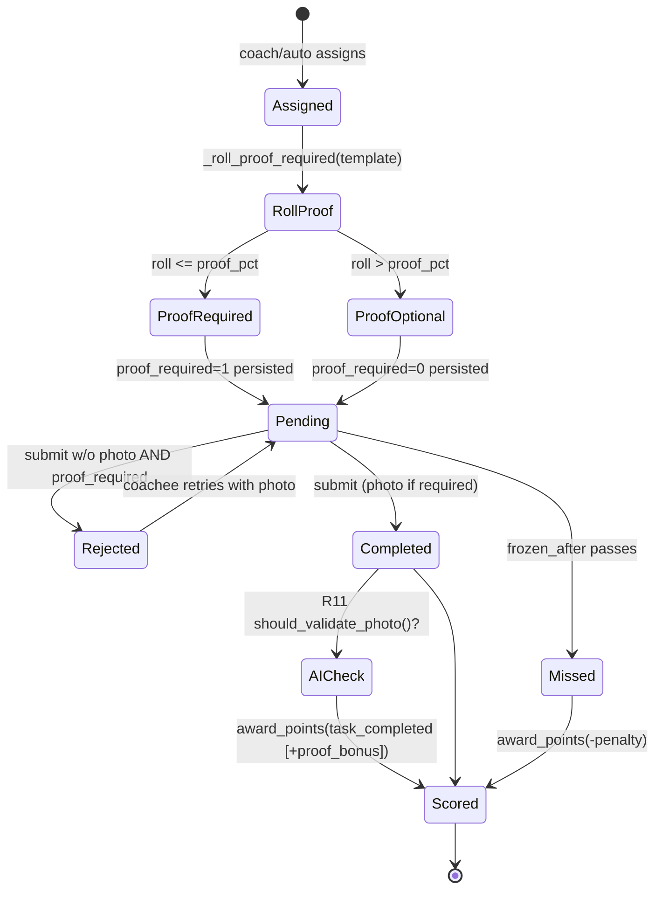
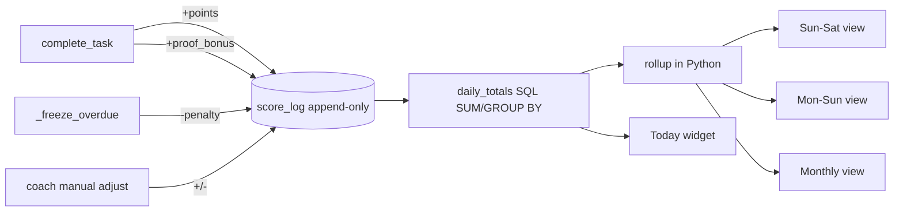

# Plan — Probabilistic Proof + Points & Daily Score

Status: **Proposed** (for review) — 2026-09-30
Author: Eddy Collart (drafted with Kiro)
Roadmap IDs: **R48** (Probabilistic proof), **R49** (Points & daily score)

This document is a full technical plan for two related features requested for
DSCoaching, written to be assessed before any code is merged. It follows the
project documentation standard: every design decision links back to a numbered
requirement, and state/flow diagrams are included.

---

## 1. Motivation

Two problems in the current product:

1. **Proof is all-or-nothing.** A task template either always demands a photo
   (`task_template.photo_validate=1`) or never does. For a *recurring* task
   (e.g. "10 minutes stretching, every day"), demanding a photo on every single
   occurrence is heavy for the coachee (friction, self-consciousness) and heavy
   for the coach (a photo to review every day). Skipping proof entirely removes
   accountability.

2. **Compliance has no running numeric expression.** Streaks exist
   (`coachee.current_streak`), and grades exist (A–F), but there is no single
   persisted "score" a coachee accrues day by day, nor any way to view it summed
   over a week or a month. The implicit grade-to-points idea was catalogued as
   **R24 (Points & rewards redemption)** but never built, and R24 is about a
   *reward catalog / redemption workflow*, not a *persisted daily score with
   calendar rollups*. That daily-score concept had slipped off the table; this
   plan makes it explicit as **R49**.

### 1.1 Why probabilistic proof works

Intermittent verification is a well-established behavioural mechanism (random
auditing, random drug testing, spot checks). If the coachee cannot predict
*which* occurrence of a recurring task will demand proof, the rational response
is to behave as though every occurrence might — so a 30 % proof rate yields most
of the accountability of 100 % proof at ~30 % of the reviewing workload for the
coach and far less friction for the coachee. It also makes the daily loop feel
like a game of chance rather than a chore, which is the "more enjoyable" quality
the feature is meant to add.

### 1.2 Relationship to existing R11 (Photo validation)

These are **distinct decisions that compose**:

| Decision | Owner | Question answered | Field |
|----------|-------|-------------------|-------|
| **Demand proof?** (R48, new) | task occurrence | "Does the coachee have to attach a photo for *this* instance?" | `task_template.proof_pct` → rolled into `task_assignment.proof_required` |
| **AI-validate the proof?** (R11, exists) | submission | "Given a photo was submitted, do we spend an AI call checking it?" | `coachee.features.photo_validation_pct` → `should_validate_photo()` |

They chain cleanly: demand proof 30 % of the time; of the proofs submitted,
AI-check 50 % of them. No conflict, no rework of R11.

---

## 2. Requirements

### 2.1 Feature R48 — Probabilistic proof demand

- **REQ-48.1** A task template MAY carry a proof-demand probability
  `proof_pct` in the range 0–100 (integer). `0` = never demand (current
  behaviour), `100` = always demand.
- **REQ-48.2** `proof_pct` MUST be settable in the task create/edit form and
  MUST be independent of the existing `photo_validate` (AI validation) flag.
- **REQ-48.3** The decision "is proof required for this occurrence?" MUST be
  made **once, at assignment-creation time**, and persisted on the assignment
  row. It MUST NOT be re-rolled on page load. (Rationale: re-rolling on display
  lets a coachee refresh until the roll says "no proof needed"; see DES-48.3.)
- **REQ-48.4** When an assignment has `proof_required=1`, the coachee dashboard
  MUST clearly indicate that a photo is required for that task.
- **REQ-48.5** When `proof_required=1`, the completion endpoint MUST reject a
  submission that has no photo attachment, with a user-facing message, and MUST
  NOT mark the task completed.
- **REQ-48.6** `proof_pct` MUST apply to any assignment path that reads the
  template: manual assignment, recurring auto-assignment, reserve
  auto-assignment, week-plan assignment, and onboarding-step assignment.
- **REQ-48.7** Existing templates with no `proof_pct` set MUST behave exactly as
  today (default `0`).
- **REQ-48.8** When proof is required and submitted, the completion MAY still be
  passed to the existing R11 AI-validation pipeline unchanged.
- **REQ-48.9** Disclosure (charter principle 4 — authority features are
  consent-driven and disclosed per-dyad): if a task type uses probabilistic
  proof, the coachee MUST be told *in advance* that this task type may randomly
  require photo proof (and at roughly what rate), via the task card and/or
  contract — not only via the after-the-roll "📷 Proof required" pill. This is
  the line between a disclosed, consented dynamic mechanic (legitimate) and
  silent surveillance (the charter's explicit failure mode).
- **REQ-48.10** Editing a template's `proof_pct` MUST NOT retroactively change
  `proof_required` on already-pending assignments — the roll already happened
  and is persisted (consistent with REQ-48.3). Must be tested, not assumed.
- **REQ-48.11 (implementation)** The roll MUST use a local `random.Random`
  instance, not the global `random` module, so `_roll_proof_required` is a pure
  function and tests seeding it are order-independent (avoids flaky CI from
  cross-test global-RNG sequence coupling).

### 2.2 Feature R49 — Points & persisted daily score

- **REQ-49.1** A task template MAY carry a `points` value (signed small integer,
  default 0). Negative values are permitted (a task you are meant to *avoid* /
  a penalty task).
- **REQ-49.2** Completing a task MUST append a positive score entry equal to the
  template's `points` (when non-zero). Marking a task `missed` MUST append a
  negative score entry equal to a configurable miss penalty (default: the
  template `points` value as a negative, or 0 if the template has no points).
- **REQ-49.2b** If a previously-scored `missed` task is later transitioned to
  `excused` by the coach (an existing status), the system MUST append a
  compensating reversal row (`+penalty`, `reason='miss_reversed'`) so the coach
  override does not leave a stale penalty on the ledger. (Charter principle 5 —
  consequences stay coach-overridable.)
- **REQ-49.3** All score changes MUST be recorded as **append-only** immutable
  rows (never an in-place counter), consistent with the `checkin` philosophy, so
  that any rollup can be recomputed and audited.
- **REQ-49.4** Each score row MUST carry a `score_date` computed in the
  **coachee's timezone** (not server UTC), so that daily/weekly/monthly buckets
  align with the coachee's real day.
- **REQ-49.5** The system MUST be able to present the score:
  - **REQ-49.5a** as today's running total,
  - **REQ-49.5b** summed per calendar week with a **Sunday–Saturday** boundary,
  - **REQ-49.5c** summed per calendar week with a **Monday–Sunday** boundary,
  - **REQ-49.5d** summed per calendar month,
  - **REQ-49.5e** as an all-time total and a best-week total.
- **REQ-49.6** The week-boundary convention (Sun–Sat vs Mon–Sun) MUST be a
  per-coach or per-coachee preference, defaulting to Monday–Sunday
  (`current_streak` and ISO conventions already assume Monday-first;
  `datetime.weekday()` returns 0=Monday).
- **REQ-49.7** All rollup queries MUST use portable SQL only (no dialect-specific
  week/date functions); week/month bucketing that depends on locale MUST be done
  in Python from raw daily sums. (Conforms to the project's
  dialect-transparent rule.)
- **REQ-49.8** The coachee MUST see their own score (today / this week / this
  month / best week) on their dashboard. The coach MUST see a per-coachee score
  history.
- **REQ-49.9** Awarding points MUST be idempotent per (task_assignment, reason):
  re-submitting or a double dashboard load MUST NOT double-count. Rows with
  `task_assignment_id = NULL` (manual/checkin awards) MUST be able to coexist
  (standard SQL: NULLs are not equal in a unique constraint) — this is required
  behaviour and MUST have an explicit test.
- **REQ-49.10** A bonus MAY be awarded when a completion satisfied a required
  proof (ties R48↔R49): configurable `proof_bonus` points, default 0.

---

## 3. Design

### 3.1 Schema changes (link: REQ-48.1, REQ-49.1, REQ-49.3)

Three new columns and one new table. All types are portable
(`SmallInteger`, `Integer`, `Date`, `String`, `DateTime`) — no ENUMs, no
dialect features, matching `src/models.py` conventions.

```
task_template:
  + proof_pct     SmallInteger  server_default "0"    # DES for REQ-48.1
  + points        SmallInteger  server_default "0"    # DES for REQ-49.1

task_assignment:
  + proof_required SmallInteger server_default "0"    # DES for REQ-48.3

NEW score_log:
  id                 Integer  PK autoincrement
  coachee_id         Integer  FK coachee.id  NOT NULL
  points             SmallInteger            NOT NULL   # signed
  reason             String(40)              NOT NULL   # 'task_completed' | 'task_missed' | 'proof_bonus' | 'manual' | 'checkin' ...
  task_assignment_id Integer  FK task_assignment.id  NULL
  score_date         Date                    NOT NULL   # coachee-local date (REQ-49.4)
  note               String(200)             NULL
  created_at         DateTime server_default func.now()
  UniqueConstraint(task_assignment_id, reason)          # idempotency (REQ-49.9)
```

Week-preference storage (REQ-49.6): add to the `features` JSON already present
on `coach`/`coachee` rather than a new column — key `week_start` with value
`"mon"` (default) or `"sun"`. This avoids a migration for a pure preference and
matches how `photo_validation_pct` is already stored in `features`.

### 3.2 Migration (Alembic `003`)

New file `migrations/versions/003_proof_and_scoring.py`, `down_revision =
'002'`. `upgrade()`:

1. `op.add_column('task_template', sa.Column('proof_pct', sa.SmallInteger(), server_default='0'))`
2. `op.add_column('task_template', sa.Column('points', sa.SmallInteger(), server_default='0'))`
3. `op.add_column('task_assignment', sa.Column('proof_required', sa.SmallInteger(), server_default='0'))`
4. `op.create_table('score_log', ...)` with the columns above and the unique
   constraint.
5. Index `ix_score_log_coachee_date` on `(coachee_id, score_date)` for fast
   rollups.

`downgrade()` drops the table, the index, then the three columns in reverse.
Because tests run on SQLite and prod on PostgreSQL, use
`batch_alter_table` for the `add_column` steps so SQLite can rebuild the table.

### 3.3 Proof decision point (link: REQ-48.3, REQ-48.6)

The single helper that rolls the dice, called by **every** assignment path:

```python
# src/tasks.py
import random

_RNG = random.Random()   # module-local; tests may pass a seeded Random (REQ-48.11)

def _roll_proof_required(template_row, rng=_RNG) -> int:
    pct = template_row.get("proof_pct") or 0
    if pct <= 0:
        return 0
    if pct >= 100:
        return 1
    return 1 if rng.randint(1, 100) <= pct else 0   # DES for REQ-48.1
```

Every `INSERT INTO task_assignment (...)` gains a `proof_required` column set
from `_roll_proof_required(tmpl)`. Insert sites to update (grep
`INSERT INTO task_assignment`):

1. `src/tasks.py` → `_auto_assign_reserves._assign()` (recurring + reserve +
   week-plan)  — REQ-48.6
2. `src/tasks.py` → `_run_onboarding()` (onboarding step)  — REQ-48.6
3. `src/routes_coach.py` → manual assignment handler(s) in the task-assign flow
   — REQ-48.6

**DES-48.3 (why roll at creation, not display):** rolling in `_visible_tasks()`
would re-evaluate on each `GET /me`, letting a coachee reload until the roll is
favourable. Persisting `proof_required` on the row makes the demand stable and
auditable. This mirrors how `_auto_assign_reserves` already rolls fuzzy
recurrence (`recur_approx`) once, at assignment.

### 3.4 Proof enforcement (link: REQ-48.5)

In `src/routes_coachee.py::complete_task`, after computing `att_path` and before
the `UPDATE`:

```python
c.execute("SELECT proof_required FROM task_assignment WHERE id=%s AND coachee_id=%s",
          (tid, session["user_id"]))
pr = c.fetchone()
if pr and pr["proof_required"] and not att_path and status == "completed":
    flash("This task requires a photo as proof.", "error")
    return redirect(url_for("coachee.coachee_dashboard"))
```

A `partial` submission is still allowed without a photo (the coachee is
signalling incomplete), preserving current partial semantics.

### 3.5 Scoring hooks (link: REQ-49.2, REQ-49.9, REQ-49.10)

New helper module `src/scoring.py`:

```python
def _coachee_local_date(coachee_id) -> date: ...        # reuse ZoneInfo pattern from tasks.py
def award_points(coachee_id, points, reason, task_assignment_id=None, note=None):
    """Append-only, idempotent per (task_assignment_id, reason)."""
    if not points:
        return
    c = db()
    # idempotency via unique constraint + guarded insert (REQ-49.9)
    if task_assignment_id is not None:
        c.execute("SELECT 1 FROM score_log WHERE task_assignment_id=%s AND reason=%s",
                  (task_assignment_id, reason))
        if c.fetchone():
            return
    c.execute(
        "INSERT INTO score_log (coachee_id, points, reason, task_assignment_id, score_date, note) "
        "VALUES (%s,%s,%s,%s,%s,%s)",
        (coachee_id, points, reason, task_assignment_id,
         _coachee_local_date(coachee_id).isoformat(), note),
    )
```

Call sites:

- **On completion** (`complete_task`, after the status UPDATE, when
  `status == "completed"`): look up `task_template.points`; `award_points(...,
  reason="task_completed", task_assignment_id=tid)`. If the task had
  `proof_required` and a photo was attached, also `award_points(...,
  reason="proof_bonus", ...)` using the coach's configured `proof_bonus`
  (REQ-49.10).
- **On miss** (`src/tasks.py::_freeze_overdue`, inside the `if missed:` block):
  for each newly-missed assignment, `award_points(..., points=-penalty,
  reason="task_missed", task_assignment_id=...)`. To get per-assignment ids,
  change the `UPDATE ... SET status='missed'` to first `SELECT` the affected ids
  (also needed for REQ-49.9 idempotency).

**DES-49.3 (append-only, not a counter):** storing each delta as a row means any
rollup (day/week/month/all-time/best-week) is a pure aggregation and can be
recomputed if scoring rules change. It also gives the coach a line-item history
("+5 stretching, −3 missed journaling") for free.

### 3.6 Rollups (link: REQ-49.5, REQ-49.7)

One base query returns **daily** sums; Python buckets them into weeks/months so
the Sun–Sat vs Mon–Sun choice never touches SQL:

```python
def daily_totals(coachee_id, since=None):
    c = db()
    q = ("SELECT score_date, SUM(points) AS pts FROM score_log "
         "WHERE coachee_id=%s" + (" AND score_date >= %s" if since else "") +
         " GROUP BY score_date ORDER BY score_date")
    c.execute(q, (coachee_id, since) if since else (coachee_id,))
    return {row["score_date"]: row["pts"] for row in c.fetchall()}

def week_key(d: date, week_start: str) -> date:
    # Monday-first: offset = weekday(); Sunday-first: offset = (weekday()+1) % 7
    offset = d.weekday() if week_start == "mon" else (d.weekday() + 1) % 7
    return d - timedelta(days=offset)         # DES for REQ-49.5b / REQ-49.5c

def rollup(daily: dict, mode: str, week_start="mon"):
    buckets = {}
    for d, pts in daily.items():
        if mode == "week":   key = week_key(d, week_start)
        elif mode == "month":key = d.replace(day=1)
        else:                key = d
        buckets[key] = buckets.get(key, 0) + pts
    return buckets
```

`SUM`, `GROUP BY`, `>=` on a `Date` are portable across SQLite and PostgreSQL.
The only locale-sensitive logic (week boundary) is pure Python. This satisfies
REQ-49.7 and keeps tests (SQLite) and prod (PostgreSQL) identical.

### 3.7 UI (link: REQ-48.4, REQ-49.8)

- **Coachee dashboard** (`coachee_dashboard.html`): a compact score widget —
  "Today: +12 · This week: +58 · This month: +205 · Best week: 71". Each task
  card with `proof_required` shows a "📷 Proof required" pill; the completion
  form makes the photo input mandatory (client-side `required` + server
  enforcement from DES-3.4).
- **Coach view** (`coach_view_coachee.html`): a "Score" section with the daily
  line-item history and the week/month rollups, plus a toggle for Sun–Sat vs
  Mon–Sun (writes `features.week_start`).
- **Task form** (`manage_tasks.html`): two new inputs — "Points (may be
  negative)" and "Proof demand chance %" (0–100 slider), next to the existing
  "📷 AI photo validation" checkbox, with helper text distinguishing the two.

### 3.8 State & flow diagrams

Proof decision across the task lifecycle (extends `task-system.md`):



Scoring data flow:



---

## 4. Concrete build steps

Ordered, each step independently testable. Steps 0 is a prerequisite hygiene
commit; the feature is steps 1–9.

- **Step 0 — Commit the existing refactor** as its own commit (working tree is a
  large untracked/modified refactor ahead of `origin/main 07d5a6b`; tests green,
  81 passing). This keeps the feature diff reviewable in isolation.
- **Step 1 — Schema:** add `proof_pct`, `points` to `task_template`,
  `proof_required` to `task_assignment`, and the `score_log` table in
  `src/models.py`. Fix the stale module docstring ("20 tables" → "31 tables").
- **Step 2 — Migration:** write `migrations/versions/003_proof_and_scoring.py`
  (§3.2), using `batch_alter_table` for SQLite compatibility. Verify
  `alembic upgrade head` on a scratch SQLite DB and on a scratch PostgreSQL DB.
- **Step 3 — Proof roll:** add `_roll_proof_required` and wire it into all five
  assignment insert sites (§3.3). Default behaviour unchanged for existing
  templates (REQ-48.7).
- **Step 4 — Proof enforcement:** add the guard in `complete_task` (§3.4).
- **Step 5 — Scoring module:** create `src/scoring.py` with `award_points`,
  `daily_totals`, `week_key`, `rollup` (§3.5, §3.6).
- **Step 6 — Scoring hooks:** call `award_points` on completion, proof bonus, and
  miss (§3.5). Refactor `_freeze_overdue` to select affected ids first.
- **Step 7 — UI:** task form inputs, coachee score widget + proof pill, coach
  score history/rollup section (§3.7).
- **Step 8 — Tests** (§5).
- **Step 9 — Docs:** update `data-model.md` (✅ planned-schema section added),
  `task-system.md` (✅ proof/scoring section added), `roadmap.md` (✅ R48/R49
  marked), `backlog.md` (✅), `onboarding.md` (✅), `user-journeys.md` (✅),
  `marketing.md` (✅). Remaining doc work happens alongside implementation.

---

## 5. Test plan (link: all REQs)

New files under `tests/`, SQLite, matching existing style
(`test_reserves.py`, `test_streaks.py`).

`tests/test_proof.py`:
- proof_pct=0 → `proof_required` always 0 (REQ-48.7).
- proof_pct=100 → `proof_required` always 1 (REQ-48.1).
- proof_pct=50 with seeded `random` → deterministic mix (REQ-48.1).
- decision persisted, stable across repeated `_visible_tasks` (REQ-48.3).
- complete without photo when `proof_required=1` → rejected, status stays
  pending (REQ-48.5).
- complete with photo when `proof_required=1` → completed (REQ-48.5).
- proof rolled on recurring, reserve, week-plan, onboarding paths (REQ-48.6).

`tests/test_scoring.py`:
- completing a task with points=5 appends one +5 row (REQ-49.2).
- missing a task appends the negative penalty row (REQ-49.2).
- double dashboard load / re-submit does not double-count (REQ-49.9).
- `score_date` uses coachee tz, not UTC, near midnight (REQ-49.4).
- `week_key` Mon-first vs Sun-first for a known date, e.g. a Sunday
  (REQ-49.5b/c, REQ-49.6).
- monthly rollup groups by first-of-month (REQ-49.5d).
- all-time and best-week totals (REQ-49.5e).
- proof_bonus awarded only when proof was required and attached (REQ-49.10).

Target: all existing 81 tests still pass + ~15 new. Run `pytest`, then
`ruff check`, `ruff format --check`, `mypy`, `bandit` (the CI gate set).

---

## 6. Risks & non-goals

- **Non-goal:** R48/R49 do not replace R11 (AI validation) or R24 (reward
  redemption). R24 can later *consume* the R49 score as its currency; that
  integration is out of scope here and noted in the backlog.
- **Risk — score inflation/negatives demotivating:** penalties are configurable
  and default to conservative values; coach can set miss penalty to 0 to run a
  purely positive score.
- **Risk — timezone edge cases:** mitigated by REQ-49.4 tests around midnight.
- **Risk — `random` in tests:** all probabilistic tests seed `random` for
  determinism.
- **Performance:** `score_log` grows ~1–5 rows/coachee/day; the
  `(coachee_id, score_date)` index keeps rollups cheap. Negligible at
  personal-coaching scale.

---

## 7. Traceability matrix

| Requirement | Design section | Test |
|-------------|----------------|------|
| REQ-48.1 | §3.1, §3.3 | test_proof: pct 0/50/100 |
| REQ-48.2 | §3.1, §3.7 | manual/UI |
| REQ-48.3 | §3.3 (DES-48.3) | test_proof: persisted/stable |
| REQ-48.4 | §3.7 | manual/UI |
| REQ-48.5 | §3.4 | test_proof: reject/accept |
| REQ-48.6 | §3.3 | test_proof: all paths |
| REQ-48.7 | §3.1, §3.3 | test_proof: pct 0 |
| REQ-48.8 | §3.5, §3.8 | existing R11 tests |
| REQ-48.9 | §3.7 (disclosure pill + advance notice) | test_proof: card shows advance notice |
| REQ-48.10 | §3.3 | test_proof: edit pct doesn't change pending |
| REQ-48.11 | §3.3 | test_proof: seeded local Random, order-independent |
| REQ-49.1 | §3.1 | test_scoring: points row |
| REQ-49.2 | §3.5 | test_scoring: complete/miss |
| REQ-49.2b | §3.5 | test_scoring: excuse reverses penalty |
| REQ-49.3 | §3.1, §3.5 (DES-49.3) | test_scoring: append-only |
| REQ-49.4 | §3.5 | test_scoring: tz midnight + immutable under tz edit |
| REQ-49.5a–e | §3.6 | test_scoring: rollups |
| REQ-49.6 | §3.1, §3.6 | test_scoring: week_key |
| REQ-49.7 | §3.6 | test_scoring runs on SQLite |
| REQ-49.8 | §3.7 | manual/UI |
| REQ-49.9 | §3.5 | test_scoring: no double-count + NULL awards coexist |
| REQ-49.10 | §3.5 | test_scoring: proof_bonus |
