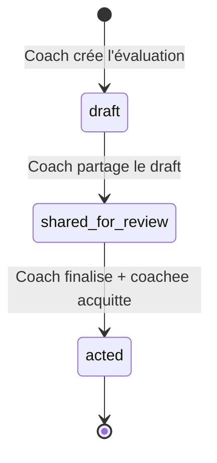

# DSCoaching — Spécification Fonctionnelle & Technique Complète

> Ce document est autosuffisant. Un développeur peut implémenter n'importe quelle section sans consulter d'autre source.

## Conventions du document

- **🟢** = Implémenté et en production
- **🔴** = À construire
- **Schema** = colonnes SQLAlchemy (type, nullable, default, FK)
- **Routes** = méthode HTTP, chemin, rôle requis, comportement
- **Templates** = fichiers HTML affectés + emplacement dans la page
- **Critères d'acceptation** = conditions testables (un test passe/échoue pour chacun)
- Les types SQL utilisent la portabilité SQLAlchemy : `Integer`, `String(N)`, `Text`, `Date`, `DateTime`, `SmallInteger`, `JSON`
- FK = `ForeignKey("table.column")`
- Defaults = `server_default="value"` (côté DB) ou valeur Python

---

## Architecture existante (référence)

```
src/
├── app.py              → Factory Flask, enregistrement blueprints, error handlers
├── models.py           → SQLAlchemy Core Table definitions (metadata)
├── database.py         → Engine factory, init_db(), seed
├── helpers.py          → db(), _SAConn, _tpl(), _audit(), _hash(), close_db()
├── auth.py             → Blueprint auth (login, logout, register, lang toggle)
├── routes_coach.py     → Blueprint coach (/coach/*)
├── routes_coachee.py   → Blueprint coachee (/me/*)
├── routes_admin.py     → Blueprint admin (/admin/*)
├── tasks.py            → FEATURES list, _features_for(), _auto_assign_reserves(), etc.
├── automation.py       → _run_auto_rules(), badges, engagement, levels, weekly report
├── ai.py               → _cf_ai_complete(), _build_profile_prompt()
├── i18n.py             → t(), get_lang(), translations dict
├── merge.py            → _merge_vars() mail-merge engine
├── photo_validation.py → AI photo proof validation
└── templates/          → 32 fichiers .html (Jinja2)
```

**Pattern pour ajouter une fonctionnalité :**
1. Table dans `models.py` (auto-créée par `init_db()`)
2. Route(s) dans le blueprint approprié
3. Template ou section ajoutée
4. Feature flag dans `tasks.py` si c'est un module togglable
5. Données passées au template via `render_template_string(_tpl("name.html"), **kwargs)`

**Pattern DB dans les routes :**
```python
c = db()
c.execute("SELECT * FROM table WHERE id=%s", (value,))
row = c.fetchone()  # → dict ou None
rows = c.fetchall() # → list[dict]
c.execute("INSERT INTO table (col) VALUES (%s)", (val,))
```

---

## 1. IDENTITÉ & AUTHENTIFICATION 🟢

> Déjà implémenté. Documenté ici pour contexte.

### Schema : `coach`

| Colonne | Type | Notes |
|---------|------|-------|
| id | Integer PK auto | |
| username | String(100) unique | |
| password_hash | String(255) | SHA-256 hex |
| name | String(200) | |
| timezone | String(64) default "Europe/London" | |
| is_admin | SmallInteger default 0 | |
| status | String(20) default "active" | active, frozen |
| features | JSON | {flag: bool} par feature |
| logo_path, accent_color, bg_color, card_color | branding | |
| font_pref | String(20) default "clean" | |
| email | String(200) nullable | |
| telegram_bot_token | String(200) nullable | |
| created_at | DateTime server_default=now() | |

### Schema : `coachee`

| Colonne | Type | Notes |
|---------|------|-------|
| id | Integer PK auto | |
| username | String(100) unique | |
| password_hash | String(255) | |
| name | String(200) | |
| coach_id | Integer FK coach.id | |
| contract_text | Text nullable | |
| safe_word | String(100) default "RED" | |
| status | String(20) default "active" | active, paused, frozen, stopped |
| task_unveil_time | Time default "08:00:00" | |
| task_freeze_time | Time default "22:00:00" | |
| timezone | String(64) default "Europe/London" | |
| context_text | Text nullable | Coach-only notes, invisible au coachee |
| strikes | Integer default 0 | |
| current_streak | Integer default 0 | |
| best_streak | Integer default 0 | |
| last_streak_date | Date nullable | |
| features | JSON nullable | Override per-coachee |
| avatar | String(50) default "🐕" | |
| color_scheme | String(20) default "#e94560" | |
| login_count | Integer default 0 | |
| font_pref | String(20) default "clean" | |
| telegram_chat_id | String(100) nullable | |
| created_at | DateTime server_default=now() | |

### Routes d'auth (Blueprint `auth`)

| Méthode | Path | Comportement |
|---------|------|-------------|
| GET/POST | `/login` | Formulaire login → session |
| GET | `/logout` | Clear session → redirect /login |
| GET/POST | `/register` | Création coach (si aucun coach existe) |
| GET/POST | `/setup` | Premier setup admin |
| GET | `/lang/<lang>` | Toggle EN/FR en session |

### Critères d'acceptation

- [ ] Login avec credentials valides → session créée, redirect vers dashboard du rôle
- [ ] Login avec credentials invalides → flash "error", reste sur /login
- [ ] Accès /coach/* sans session coach → redirect /login
- [ ] Accès /me/* sans session coachee → redirect /login
- [ ] Coach frozen ne peut pas se connecter

---

## 2. CONTRAT & ACCORD

### 2.1 Registre de contrat 🟢

Déjà implémenté. `coachee.contract_text` + table `contract_history`.

### 2.2 Édition bilatérale 🔴

#### Schema : nouvelle table `contract_proposal`

```python
contract_proposal = Table(
    "contract_proposal", metadata,
    Column("id", Integer, primary_key=True, autoincrement=True),
    Column("coachee_id", Integer, ForeignKey("coachee.id"), nullable=False),
    Column("proposed_text", Text, nullable=False),
    Column("status", String(20), server_default="pending"),  # pending, accepted, rejected
    Column("coach_response", Text),  # Commentaire du coach si rejeté
    Column("created_at", DateTime, server_default=func.now()),
    Column("resolved_at", DateTime),
)
```

#### Routes

| Méthode | Path | Rôle | Comportement |
|---------|------|------|-------------|
| POST | `/me/contract-propose` | coachee | Insère une proposition. Redirect /me. Flash "Proposition soumise." |
| POST | `/coach/coachee/<cid>/contract-proposal/<pid>/review` | coach | Params form: `decision` (accept/reject), `coach_response`. Si accept: archive ancien contract_text dans contract_history, met à jour coachee.contract_text avec proposed_text, status→accepted. Si reject: status→rejected, stocke coach_response. Redirect coach_view_coachee. |

#### Templates

- `coachee_dashboard.html` : dans l'onglet "Boundaries", ajouter un formulaire textarea "Proposer un amendement" + bouton submit. Visible si `feat.contract_proposal` ou toujours.
- `coach_view_coachee.html` : section "Propositions en attente" — liste des proposals status=pending avec texte + boutons Accept/Reject + champ commentaire.

#### Critères d'acceptation

- [ ] Coachee soumet une proposition → row créée avec status "pending"
- [ ] Coach accepte → contract_text mis à jour, ancien archivé dans contract_history, proposal status="accepted"
- [ ] Coach rejette → proposal status="rejected", coach_response stocké
- [ ] Coachee voit ses propositions passées (acceptées/rejetées) avec le commentaire coach
- [ ] Un coachee ne peut pas voir/modifier les propositions d'un autre coachee

### 2.3 Signatures numériques 🔴

#### Schema : nouvelle table `contract_signature`

```python
contract_signature = Table(
    "contract_signature", metadata,
    Column("id", Integer, primary_key=True, autoincrement=True),
    Column("coachee_id", Integer, ForeignKey("coachee.id"), nullable=False),
    Column("contract_version_id", Integer, ForeignKey("contract_history.id"), nullable=False),
    Column("signer_role", String(20), nullable=False),  # "coach" ou "coachee"
    Column("signer_id", Integer, nullable=False),
    Column("ip", String(45)),
    Column("user_agent", String(500)),
    Column("signed_at", DateTime, server_default=func.now()),
)
```

#### Modification : `contract_history`

Ajouter colonne :
```python
Column("status", String(20), server_default="draft"),  # draft, active, expired, superseded
```

#### Routes

| Méthode | Path | Rôle | Comportement |
|---------|------|------|-------------|
| POST | `/coach/coachee/<cid>/contract/sign` | coach | Crée une signature coach pour la version active (draft). Si les 2 signatures existent → status passe à "active". |
| POST | `/me/contract/sign` | coachee | Crée une signature coachee pour la version draft. Idem vérification double-signature. |

#### Logique

- Un contrat en status "draft" requiert 2 signatures (coach + coachee) pour devenir "active"
- L'UI affiche un bloc signature visuel : "✍️ Signé par Coach le DD/MM/YYYY" + "✍️ Signé par Coachee le DD/MM/YYYY" ou "⏳ En attente de signature"
- Quand un nouveau contrat est créé (via edit ou accept proposal), l'ancien passe en "superseded", le nouveau est "draft"

#### Templates

- `coach_view_coachee.html` : dans la section contrat, afficher le bloc signatures + bouton "Signer" si pas encore signé par le coach
- `coachee_dashboard.html` (boundaries tab) : afficher le bloc signatures + bouton "Signer" si pas encore signé

#### Critères d'acceptation

- [ ] Contrat draft avec 0 signature → affiché "Brouillon — En attente de signatures"
- [ ] Coach signe → 1 signature enregistrée (IP + timestamp)
- [ ] Coachee signe → 2 signatures → contrat passe en "active"
- [ ] Un contrat "active" ne peut pas être re-signé
- [ ] Nouveau contrat créé → ancien passe en "superseded"
- [ ] La page affiche l'historique des versions avec leurs statuts

### 2.4 Expiration & Renouvellement 🔴

#### Modification schema : `coachee`

Ajouter colonnes :
```python
Column("contract_expires_at", Date),  # nullable = pas d'expiration
Column("contract_renewal_cadence", String(20)),  # monthly, quarterly, annual, null
```

#### Logique (dans `coachee_dashboard` load ou scheduler)

```python
# Pseudo-code dans routes_coachee.py, dans coachee_dashboard():
if coachee["contract_expires_at"]:
    days_until = (coachee["contract_expires_at"] - date.today()).days
    if days_until <= 0:
        # Auto-pause
        c.execute("UPDATE coachee SET status='paused' WHERE id=%s", (cid,))
    elif days_until <= 7:
        # Injecter notification "Contrat expire dans N jours"
        contract_warning = days_until
```

#### Routes

| Méthode | Path | Rôle | Comportement |
|---------|------|------|-------------|
| POST | `/coach/coachee/<cid>/contract/renew` | coach | Copie contract_text actuel dans contract_history (status=superseded). Crée nouvelle entrée contract_history (status=draft). Met à jour contract_expires_at. Reset signatures. |

#### Critères d'acceptation

- [ ] Contrat avec expires_at dans le passé → coachee auto-pausé au prochain login
- [ ] Contrat expirant dans ≤7 jours → bannière d'avertissement visible par les deux
- [ ] Coach renouvelle → nouvelle version draft, ancien superseded, nouveau expires_at calculé
- [ ] Coachee pausé par expiration peut être réactivé par le coach après renouvellement

---

## 3. PROTOCOLE & COMMUNICATION

### 3.1 Mode de protocole 🔴

#### Modification schema : `coachee`

Ajouter colonne :
```python
Column("protocol_mode", String(20), server_default="formal"),  # formal, relaxed
```

#### Modification schema : `note`

Ajouter colonne :
```python
Column("protocol_mode_at_send", String(20)),  # valeur du mode au moment de l'envoi
```

#### Routes

| Méthode | Path | Rôle | Comportement |
|---------|------|------|-------------|
| POST | `/coach/coachee/<cid>/protocol-mode` | coach | Param form: `mode` (formal/relaxed). Update coachee.protocol_mode. _audit("protocol_mode_changed"). Flash "Mode mis à jour." Redirect coach_view_coachee. |

#### Intégration dans les routes existantes

Dans `routes_coachee.py`, route POST `/me/note` (envoi d'une note par le coachee) :
```python
# Avant l'INSERT dans note :
c.execute("SELECT protocol_mode FROM coachee WHERE id=%s", (cid,))
mode = c.fetchone()["protocol_mode"]
# Ajouter protocol_mode_at_send=mode dans l'INSERT
```

#### Templates

- `coachee_dashboard.html` : en haut du dashboard, indicateur discret :
  ```html
  
  <div class="protocol-badge formal">🎩 Protocole Formel</div>
  
  <div class="protocol-badge relaxed">💬 Parole Libre</div>
  
  ```
- `coach_view_coachee.html` : bouton toggle rapide dans la barre d'actions du coachee :
  ```html
  <form method="post" action="/coach/coachee/{{ coachee.id }}/protocol-mode" style="display:inline">
    <input type="hidden" name="mode" value="{{ 'relaxed' if coachee.protocol_mode == 'formal' else 'formal' }}">
    <button type="submit" class="btn btn-sm">{{ '💬 Relâcher' if coachee.protocol_mode == 'formal' else '🎩 Formaliser' }}</button>
  </form>
  ```

#### Critères d'acceptation

- [ ] Coach toggle formal→relaxed → coachee.protocol_mode = "relaxed" en DB
- [ ] Coachee voit l'indicateur correspondant au prochain chargement de page
- [ ] Note envoyée en mode formel → `protocol_mode_at_send = 'formal'` sur la row
- [ ] Audit log contient l'entrée "protocol_mode_changed"
- [ ] Un coachee ne peut pas changer son propre mode (pas de route /me/protocol-mode)

### 3.1b Protocole formel — Guidance real-life & extensions

**Guidance real-life :**

- Mode formal = obéissance accrue, moins de discussion, silence respectueux, obéissance par défaut, réponses souvent réduites à un remerciement. Forme écrite : capitalisation, vouvoiement, formules définies par la dynamique.
- Chaque dynamique définit ses propres règles de langage (stockées dans le contrat ou un champ `protocol_rules` JSON).
- Le coachee peut demander le « droit de parler » (selon protocole). La demande est conditionnée à l'acceptation du Dominant.
- L'imprévisibilité est un outil du Dominant : il gère le mode et les réponses comme il l'entend.
- Le mode ne change pas automatiquement le comportement des messages ; le Dom décide de l'usage.

#### Modification schema : `coachee`

Ajouter colonne :
```python
Column("protocol_rules", JSON),  # Règles de langage propres à la dynamique. Ex: {"vouvoiement": true, "formule_adresse": "Monsieur", "formule_remerciement": "Merci, Monsieur", "silence_par_defaut": true}
```

#### Schema : utilisation du type `note` existant pour les demandes de parole

Pas de nouvelle table — une demande de parole est une `note` avec un type spécial :

#### Modification schema : `note`

Ajouter colonne :
```python
Column("note_type", String(20), server_default="message"),  # message, speak_request
Column("speak_request_status", String(20)),  # pending, accepted, rejected — NULL si note_type != speak_request
```

#### Routes

| Méthode | Path | Rôle | Comportement |
|---------|------|------|-------------|
| POST | `/me/request-speak` | coachee | Crée une note avec note_type="speak_request", speak_request_status="pending". Flash "Demande soumise." Redirect /me. Disponible uniquement si protocol_mode="formal". |
| POST | `/coach/coachee/<cid>/speak-request/<nid>/review` | coach | Params: `decision` (accepted/rejected). Update speak_request_status. Si accepted → flash "Parole accordée" (le coachee voit). Si rejected → flash "Parole refusée". |
| POST | `/coach/coachee/<cid>/protocol-rules` | coach | Params: JSON form data (ou champs individuels). Update coachee.protocol_rules. |

#### Templates

- `coachee_dashboard.html` : en mode formal, texte d'aide contextuel :
  ```html
  
  <p class="protocol-hint" style="font-size:0.8rem;color:var(--muted);font-style:italic">
    Mode protocole actif — réponses courtes et respectueuses attendues.
    
    Adresse : {{ coachee.protocol_rules['formule_adresse'] }}.
    
  </p>
  
  ```
- `coachee_dashboard.html` (notes tab, mode formal) : bouton "Demander la parole" au lieu du formulaire libre :
  ```html
  
  <form method="post" action="/me/request-speak">
    <button type="submit" class="btn btn-sm btn-secondary">🙋 Demander la parole</button>
  </form>
  
  <p style="font-size:0.84rem;color:var(--muted)">⏳ Demande de parole en attente...</p>
  
  ```
  Note : le formulaire de note classique reste accessible (le Dom décide de l'usage, pas le système).
- `coach_view_coachee.html` : section protocol_rules — formulaire d'édition JSON simplifié (champs clés : formule_adresse, formule_remerciement, vouvoiement, silence_par_defaut).

#### Critères d'acceptation

- [ ] Coach définit protocol_rules → JSON stocké sur coachee
- [ ] Coachee en mode formal voit le texte d'aide contextuel avec la formule d'adresse
- [ ] Coachee soumet une demande de parole → note créée avec note_type="speak_request", status="pending"
- [ ] Coach accepte → speak_request_status="accepted", coachee voit l'acceptation
- [ ] Coach rejette → speak_request_status="rejected"
- [ ] Le formulaire de note classique n'est PAS masqué en mode formal (le Dom décide, pas le système)
- [ ] Le mode formel n'impose aucun filtrage/blocage automatique sur les messages — c'est informatif et rituel

### 3.2 Priorité des messages 🔴

#### Modification schema : `note`

Ajouter colonne :
```python
Column("priority", String(20), server_default="daily"),  # immediate, daily, weekly, monthly
```

#### Modification route existante : POST `/me/note`

Ajouter `priority` depuis le formulaire :
```python
priority = request.form.get("priority", "daily")
if priority not in ("immediate", "daily", "weekly", "monthly"):
    priority = "daily"
# Inclure dans l'INSERT
```

#### Templates

- `coachee_dashboard.html` (notes tab) : ajouter un `<select>` dans le formulaire d'envoi de note :
  ```html
  <select name="priority" style="width:auto;font-size:0.84rem">
    <option value="daily">Quotidien</option>
    <option value="immediate">⚠️ Immédiat</option>
    <option value="weekly">Hebdomadaire</option>
    <option value="monthly">Mensuel</option>
  </select>
  ```
- `coach_view_coachee.html` (notes section) : grouper/ordonner les notes par priorité. Les notes "immediate" ont un badge rouge.

#### Critères d'acceptation

- [ ] Note envoyée avec priority="immediate" → stockée avec cette valeur
- [ ] Default si non spécifié = "daily"
- [ ] Coach voit les notes triées : immediate en haut, puis daily, weekly, monthly
- [ ] Notes "immediate" ont un indicateur visuel distinct (badge rouge / bordure)

### 3.3 Protocole d'indisponibilité 🔴

#### Modification schema : `coachee`

Ajouter colonnes :
```python
Column("unavailable_since", DateTime),   # NULL = disponible
Column("unavailable_until", DateTime),   # NULL = retour inconnu
Column("unavailable_note", String(500)), # Raison optionnelle
```

#### Routes

| Méthode | Path | Rôle | Comportement |
|---------|------|------|-------------|
| POST | `/me/unavailable` | coachee | Params: `until` (datetime optionnel), `note` (optionnel). Set unavailable_since=now(), unavailable_until, unavailable_note. _audit("declared_unavailable"). Flash. Redirect /me. |
| POST | `/me/available` | coachee | Set unavailable_since=NULL, unavailable_until=NULL, unavailable_note=NULL. _audit("declared_available"). Flash. Redirect /me. |

#### Intégration dans la logique existante

Dans `_freeze_overdue()` et `_check_ritual_misses()` (R18), ajouter un guard :
```python
c.execute("SELECT unavailable_since FROM coachee WHERE id=%s", (coachee_id,))
if c.fetchone()["unavailable_since"]:
    return  # Ne pas pénaliser pendant l'indisponibilité
```

#### Templates

- `coachee_dashboard.html` : si `coachee.unavailable_since` → bannière "⏸ Vous êtes marqué indisponible" + bouton "Je suis de retour"
- `coach_dashboard.html` : sur la carte coachee, si indisponible → badge "⏸" avec tooltip "Indisponible depuis X"
- `coach_view_coachee.html` : bannière d'avertissement "Ce coachee est indisponible depuis X. Les pénalités sont suspendues."

#### Critères d'acceptation

- [ ] Coachee déclare indisponibilité → champs remplis, audit log
- [ ] Pendant indisponibilité : pas de strikes pour tâches manquées
- [ ] Pendant indisponibilité : pas de rituels marqués "missed"
- [ ] Coachee revient → champs remis à NULL
- [ ] Coach voit l'indicateur sur son dashboard
- [ ] Si `unavailable_until` est passé et coachee n'a pas déclaré son retour → toujours affiché (pas d'auto-retour)

### 3.4 Mode Freeze / Safeword numérique 🟢 (à étendre)

> Déjà implémenté : route `/me/pause`, champ `safe_word`, status → paused/stopped. Extensions ci-dessous.

**Guidance real-life :**

- Les deux acteurs ont la liberté et la responsabilité de déclencher le Freeze (coachee ET coach).
- À la réactivation, le Dominant décide : délais étendus pour les tâches en attente, ou annulation pure et simple. Aucune nouvelle tâche n'est assignée pendant la suspension.
- Un seul type de Freeze suffit (pas de soft/hard). Tout est gelé.
- Pendant le Freeze : plus de rappels, plus de notifications protocolaires, bascule en mode neutre.

#### Routes (extension de l'existant)

| Méthode | Path | Rôle | Comportement |
|---------|------|------|-------------|
| POST | `/me/freeze` | coachee | Set coachee.status="paused", coachee.freeze_initiated_by="coachee", freeze_at=now(). _audit("freeze_activated"). Redirect /me avec message neutre. |
| POST | `/coach/coachee/<cid>/freeze` | coach | Set coachee.status="paused", freeze_initiated_by="coach", freeze_at=now(). _audit("freeze_activated_by_coach"). |
| POST | `/coach/coachee/<cid>/unfreeze` | coach | Params: `pending_action` ("extend" ou "cancel"). Si "extend" → toutes task_assignment.status="pending" avec due_date passée reçoivent due_date += (now - freeze_at) jours. Si "cancel" → toutes task_assignment.status="pending" passent à "cancelled". Set coachee.status="active", clear freeze_at. _audit("unfreeze"). |

#### Modification schema : `coachee`

Ajouter colonnes :
```python
Column("freeze_at", DateTime),                # Quand le freeze a été activé
Column("freeze_initiated_by", String(20)),    # "coach" ou "coachee"
```

#### Logique de blocage pendant Freeze

Dans `_auto_assign_reserves()`, `_run_auto_rules()`, et toute logique d'assignation automatique :
```python
c.execute("SELECT status FROM coachee WHERE id=%s", (coachee_id,))
if c.fetchone()["status"] in ("paused", "stopped"):
    return  # Pas d'assignation pendant freeze
```

Dans les notifications (Telegram, notes system) :
```python
if coachee["status"] in ("paused", "stopped"):
    return  # Aucune notification pendant freeze
```

#### Templates

- `coachee_dashboard.html` : bouton Freeze toujours accessible (même en mode formal) :
  ```html
  <form method="post" action="/me/freeze" style="position:fixed;bottom:1rem;right:1rem;z-index:999">
    <button type="submit" class="btn btn-danger" onclick="return confirm('Activer le mode Freeze ? Tout sera suspendu.')">
      🛑 FREEZE
    </button>
  </form>
  ```
- En état freeze (coachee.status == "paused") : dashboard remplacé par écran neutre :
  ```html
  <div class="freeze-screen">
    <h2>⏸ Mode Freeze actif</h2>
    <p>La dynamique est suspendue. Aucune tâche, aucun rappel.</p>
    <p style="font-size:0.84rem;color:var(--muted)">La réactivation est décidée par votre coach.</p>
  </div>
  ```
- `coach_view_coachee.html` : si freeze actif → formulaire de réactivation avec choix :
  ```html
  <div class="section freeze-active" style="border:2px solid #c0392b">
    <h3>🛑 Freeze actif depuis {{ coachee.freeze_at }}</h3>
    <p>Initié par : {{ coachee.freeze_initiated_by }}</p>
    <form method="post" action="/coach/coachee/{{ coachee.id }}/unfreeze">
      <label>Tâches en attente :</label>
      <select name="pending_action" required>
        <option value="extend">Étendre les délais (reporter)</option>
        <option value="cancel">Annuler toutes les tâches en attente</option>
      </select>
      <button type="submit" class="btn">▶️ Réactiver</button>
    </form>
  </div>
  ```

#### Critères d'acceptation

- [ ] Coachee active le freeze → status="paused", freeze_at enregistré, audit log
- [ ] Coach active le freeze → même effet, freeze_initiated_by="coach"
- [ ] Pendant freeze : aucune nouvelle tâche assignée (ni manuellement ni par réserves)
- [ ] Pendant freeze : aucune notification envoyée (Telegram, notes system)
- [ ] Pendant freeze : aucune pénalité (strikes, conséquences, miss detection)
- [ ] Coach réactive avec "extend" → due_dates des tâches pending reportées proportionnellement
- [ ] Coach réactive avec "cancel" → tâches pending passent à "cancelled"
- [ ] Seul le coach peut réactiver (pas de route /me/unfreeze)
- [ ] Le bouton Freeze coachee est toujours visible et accessible (y compris en mode formal)

---

## 4. TÂCHES & ASSIGNATIONS

### 4.1–4.6 Système de tâches existant 🟢

> Déjà implémenté. Tables `task_template`, `task_assignment`. Voir `models.py` et `routes_coach.py` pour le code existant.

### 4.6b Validations photo/média — Guidance & extensions 🟢 (à étendre)

> Photo validation (R11) déjà implémentée : `photo_validation.py`, `task_assignment.attachment_path`, `photo_validation_result`, `photo_validation_override`. Extensions ci-dessous.

**Guidance real-life :**

- Le Dominant peut commenter la validation (en plus d'Accept/Reject). Ce commentaire est distinct de la note de grade — il porte sur la qualité de la preuve elle-même (cadrage, effort, respect de la consigne).
- Stockage at-rest chiffré + HTTPS suffit pour le MVP (pas d'E2E obligatoire).
- Paramètre de rétention configurable : les médias ont une durée de vie paramétrable. Passé ce délai, ils sont archivés ou supprimés.
- Les deux acteurs peuvent exporter/télécharger leurs propres médias (backup accessible).

#### Modification schema : `task_assignment`

Ajouter colonnes :
```python
Column("proof_coach_comment", Text),  # Commentaire du coach sur la preuve (cadrage, effort, consigne)
```

#### Modification schema : `coachee`

Ajouter colonne :
```python
Column("media_retention_days", Integer, server_default="90"),  # Nombre de jours avant archivage/suppression des médias. NULL = rétention illimitée.
```

#### Routes

| Méthode | Path | Rôle | Comportement |
|---------|------|------|-------------|
| POST | `/coach/coachee/<cid>/task/<tid>/proof-comment` | coach | Params: `comment` (text). Update task_assignment.proof_coach_comment. Flash "Commentaire ajouté." |
| GET | `/me/media-export` | coachee | Génère un ZIP de tous les attachments du coachee (photos/vidéos). Headers: Content-Disposition attachment. |
| GET | `/coach/coachee/<cid>/media-export` | coach | Idem mais pour un coachee spécifique (le coach peut aussi exporter). |
| POST | `/coach/coachee/<cid>/media-retention` | coach | Params: `days` (int ou "unlimited"). Update coachee.media_retention_days. |

#### Logique de rétention

Fonction de nettoyage (appelée périodiquement ou au login coach) :
```python
def _cleanup_expired_media(coachee_id):
    c = db()
    c.execute("SELECT media_retention_days FROM coachee WHERE id=%s", (coachee_id,))
    retention = c.fetchone()["media_retention_days"]
    if not retention:
        return  # Rétention illimitée
    cutoff = (datetime.now() - timedelta(days=retention)).strftime("%Y-%m-%d %H:%M:%S")
    c.execute("""SELECT id, attachment_path FROM task_assignment
                 WHERE coachee_id=%s AND attachment_path IS NOT NULL AND responded_at < %s""",
              (coachee_id, cutoff))
    for row in c.fetchall():
        path = os.path.join(ATTACHMENTS_DIR, row["attachment_path"])
        if os.path.exists(path):
            os.remove(path)
        c.execute("UPDATE task_assignment SET attachment_path=NULL WHERE id=%s", (row["id"],))
```

#### Templates

- `bulk_grading.html` : sous chaque preuve photo, ajouter un champ commentaire :
  ```html
  
  
  <input type="text" name="proof_comment_{{ task.id }}" placeholder="Commentaire sur la preuve..." 
         value="{{ task.proof_coach_comment or '' }}" style="font-size:0.8rem;width:100%">
  
  ```
- `coachee_dashboard.html` (tasks tab) : si `proof_coach_comment` → afficher sous la preuve :
  ```html
  
  <p class="proof-feedback" style="font-size:0.8rem;font-style:italic;color:var(--muted)">
    💬 {{ task.proof_coach_comment }}
  </p>
  
  ```
- `coach_view_coachee.html` : section "Paramètres médias" avec slider rétention + bouton export.

#### Critères d'acceptation

- [ ] Coach commente une preuve → proof_coach_comment stocké, visible au coach ET au coachee
- [ ] Coachee exporte ses médias → ZIP téléchargé contenant tous ses attachments
- [ ] Coach exporte les médias d'un coachee → même ZIP
- [ ] Rétention 90 jours → médias plus vieux supprimés au prochain nettoyage
- [ ] Rétention NULL → aucune suppression automatique
- [ ] Les deux parties peuvent modifier la rétention (coachee via /me/settings, coach via edit coachee)
- [ ] HTTPS en transit + stockage serveur standard pour le MVP (pas d'E2E)

### 4.7 Tâches composées / Multi-phases 🔴

#### Schema : nouvelle table `task_phase`

```python
task_phase = Table(
    "task_phase", metadata,
    Column("id", Integer, primary_key=True, autoincrement=True),
    Column("template_id", Integer, ForeignKey("task_template.id"), nullable=False),
    Column("phase_number", SmallInteger, nullable=False),
    Column("title", String(300), nullable=False),
    Column("description", Text),
    Column("proof_type", String(20), server_default="text"),  # text, photo, video, timer, none
    Column("duration_min", Integer),  # Pour proof_type="timer" : durée requise
    Column("required", SmallInteger, server_default="1"),
    Column("created_at", DateTime, server_default=func.now()),
)
```

#### Schema : nouvelle table `phase_submission`

```python
phase_submission = Table(
    "phase_submission", metadata,
    Column("id", Integer, primary_key=True, autoincrement=True),
    Column("assignment_id", Integer, ForeignKey("task_assignment.id"), nullable=False),
    Column("phase_id", Integer, ForeignKey("task_phase.id"), nullable=False),
    Column("content", Text),  # Réponse texte
    Column("attachment_path", String(500)),  # Photo ou vidéo
    Column("duration_actual", Integer),  # Durée réelle (timer)
    Column("submitted_at", DateTime, server_default=func.now()),
)
```

#### Modification schema : `task_template`

Ajouter colonne :
```python
Column("is_compound", SmallInteger, server_default="0"),
```

#### Routes

| Méthode | Path | Rôle | Comportement |
|---------|------|------|-------------|
| POST | `/coach/tasks/compound` | coach | Crée un task_template avec is_compound=1, puis N task_phase rows. Params: title, description, phases[] (array de {title, description, proof_type, duration_min, required}). |
| POST | `/me/task/<tid>/phase/<phase_id>` | coachee | Soumet une phase. Params: content, attachment_data (base64 ou multipart), duration_actual. Crée phase_submission. Si toutes les phases required sont soumises → task_assignment.status = "completed". |

#### Logique de complétion

```python
# Dans la route de soumission de phase :
c.execute("""SELECT tp.id FROM task_phase tp
             WHERE tp.template_id = (SELECT template_id FROM task_assignment WHERE id=%s)
             AND tp.required = 1
             AND tp.id NOT IN (SELECT phase_id FROM phase_submission WHERE assignment_id=%s)""",
          (tid, tid))
remaining = c.fetchall()
if not remaining:
    c.execute("UPDATE task_assignment SET status='completed', responded_at=%s WHERE id=%s",
              (datetime.now().strftime("%Y-%m-%d %H:%M:%S"), tid))
```

#### Templates

- `coachee_dashboard.html` : pour les tâches compound, afficher les phases comme une checklist :
  ```html
  
  <div class="phase done">
    <span>{{ phase.phase_number }}. {{ phase.title }}</span>
    <span class="badge">✓</span>
  </div>
  
  ```
  Chaque phase non-complétée a son propre formulaire de soumission (texte, upload, ou timer).
- `manage_tasks.html` : section "Créer une tâche composée" avec formulaire dynamique pour ajouter des phases.
- Timer (proof_type="timer") : bouton Start → countdown JS → bouton Stop → soumission automatique avec duration_actual.

#### Exemple d'usage : "Breaking & Mending"

```
Template: "Breaking & Mending — Semaine X"
  Phase 1: "Exercice physique" (proof_type: timer, duration_min: 10)
    → Coachee démarre, tient 10 min, timer JS compte, soumet automatiquement
  Phase 2: "Réflexion" (proof_type: text)
    → Questions structurées :
      1. Que tentait-on de briser ?
      2. À quel moment mon esprit a-t-il tenté de fuir l'exercice ?
      3. Qu'a révélé mon corps que mon analyse cache normalement ?
      4. Quel comportement remplace celui qu'on retire ?
      5. Que va observer le coach la semaine prochaine ?
  Phase 3: "Engagement" (proof_type: text)
    → "Comprendre ne suffit pas. Le coach jugera le changement par ma conduite."
```

#### Critères d'acceptation

- [ ] Coach crée une tâche compound avec 3 phases → template + 3 rows task_phase
- [ ] Coachee voit les 3 phases comme checklist, seule la première (non-complétée) est submittable
- [ ] Soumission phase 1 → phase_submission créée, phase 2 devient submittable
- [ ] Soumission phase 3 (dernière required) → task_assignment.status = "completed"
- [ ] Phase avec proof_type="timer" : timer JS de N minutes, submission auto à la fin
- [ ] Phase avec proof_type="video" : upload multipart accepté (≤30MB)
- [ ] Coach peut noter par phase individuellement OU globalement

### 4.8 Deadlines, retards & tâches de réserve — Guidance & extensions 🟢 (à étendre)

> Existant : `task_unveil_time`, `task_freeze_time`, `_freeze_overdue()`, `task_template.is_reserve`, `_auto_assign_reserves()`.

**Guidance real-life :**

- Le Dominant définit les tolérances et les couleurs de retard. Le système n'ajoute aucune tolérance par défaut — zéro indulgence sauf configuration explicite.
- Un timer visible côté coachee est utile (pour finir une rédaction avant le cut-off).
- Le timer countdown côté coachee est **optionnel** et activable/désactivable par le coach (paramètre par coachee ou global).
- Les tâches de réserve apparaissent comme des tâches normales au coachee — elles sont indiscernables des tâches assignées manuellement.
- Les coachees ne savent pas forcément qu'ils ne sont pas les seuls serviteurs. Aucune information multi-subs ne fuite vers le coachee.

#### Modification schema : `task_template`

Ajouter colonnes :
```python
Column("late_threshold_minutes", Integer),  # Minutes après due_time avant marquage "en retard". NULL = 0 (aucune tolérance)
Column("late_color", String(7), server_default="#e76f51"),  # Couleur du badge retard (hex). Défaut: orange
```

#### Modification schema : `coachee`

Ajouter colonne (override global par coachee) :
```python
Column("late_threshold_override", Integer),  # Override global (si défini, prime sur le template). NULL = utiliser la valeur template.
Column("show_deadline_timer", SmallInteger, server_default="1"),  # 1 = timer countdown visible, 0 = masqué
```

#### Logique de retard (extension de `_freeze_overdue()`)

```python
def _compute_lateness(task_assignment, coachee):
    """Calcule si une tâche est en retard et de combien."""
    if task_assignment["status"] != "pending":
        return None
    if not task_assignment["due_date"]:
        return None
    # Tolérance : coachee override > template > défaut 0
    threshold = coachee.get("late_threshold_override")
    if threshold is None:
        threshold = task_assignment.get("late_threshold_minutes") or 0
    due_dt = datetime.combine(
        task_assignment["due_date"] if isinstance(task_assignment["due_date"], date) else date.fromisoformat(task_assignment["due_date"]),
        coachee.get("task_freeze_time") or time(22, 0)
    )
    now = datetime.now(ZoneInfo(coachee.get("timezone") or "UTC"))
    delta_min = int((now - due_dt.replace(tzinfo=ZoneInfo(coachee.get("timezone") or "UTC"))).total_seconds() / 60)
    if delta_min > threshold:
        return delta_min - threshold  # Minutes de retard effectif
    return None  # Pas encore en retard
```

#### Timer countdown côté coachee

Dans le template `coachee_dashboard.html`, pour chaque tâche pending avec due_date == today :
```html

<div class="task-timer" data-deadline="{{ coachee.task_freeze_time }}" data-tz="{{ coachee.timezone }}">
  <span class="countdown">--:--:--</span>
</div>

```

JavaScript :
```javascript
document.querySelectorAll('.task-timer').forEach(el => {
  const deadline = el.dataset.deadline; // "22:00:00"
  const [h, m, s] = deadline.split(':').map(Number);
  const target = new Date(); target.setHours(h, m, s, 0);
  setInterval(() => {
    const diff = Math.max(0, target - new Date());
    const hh = Math.floor(diff/3600000), mm = Math.floor((diff%3600000)/60000), ss = Math.floor((diff%60000)/1000);
    el.querySelector('.countdown').textContent = `${hh}h${String(mm).padStart(2,'0')}m${String(ss).padStart(2,'0')}s`;
    if (diff <= 0) el.querySelector('.countdown').textContent = '⏰ Temps écoulé';
  }, 1000);
});
```

#### Indiscernabilité des réserves

Contrainte d'implémentation (déjà respectée, formalisation) :
- `_auto_assign_reserves()` crée des `task_assignment` identiques aux assignations manuelles.
- Le champ `task_template.is_reserve` n'est JAMAIS exposé au coachee (ni en template, ni en export coachee).
- La route `/me/export` ne doit PAS inclure `is_reserve` dans les données exportées.
- Aucune mention "réserve" ou "automatique" dans les notes, messages ou dashboard coachee.

#### Critères d'acceptation

- [ ] Tâche sans late_threshold_minutes → retard dès la première minute après deadline (tolérance = 0)
- [ ] Tâche avec late_threshold_minutes=15 → badge retard apparaît uniquement après 15 min
- [ ] Badge retard affiché avec la couleur configurée (late_color)
- [ ] Timer countdown visible côté coachee pour les tâches du jour
- [ ] Timer affiche "Temps écoulé" quand deadline passée
- [ ] Tâches de réserve indiscernables côté coachee (pas de flag, pas de mention, pas d'export)
- [ ] Coachee ne peut pas savoir si d'autres coachees existent (aucune fuite d'info multi-subs)
- [ ] Le Dom configure tout : aucune tolérance système par défaut

---

## 5. RITUELS & HABITUDES

### 5.1–5.3 Système existant 🟢

> Tables `ritual`, `ritual_log`. Routes dans `routes_coach.py` (manage_rituals) et `routes_coachee.py` (complete_ritual).

### 5.4 Détection automatique des manquements 🔴

#### Logique (à ajouter dans `routes_coachee.py`, dans `coachee_dashboard()`)

```python
def _check_ritual_misses(coachee_id, coach_id, tz):
    """Détecte les rituels manqués hier et notifie le coach."""
    c = db()
    # Guard : indisponibilité
    c.execute("SELECT unavailable_since FROM coachee WHERE id=%s", (coachee_id,))
    if c.fetchone().get("unavailable_since"):
        return
    yesterday = (datetime.now(tz).date() - timedelta(days=1)).isoformat()
    c.execute("""SELECT r.id, r.name FROM ritual r
                 WHERE r.coachee_id=%s AND r.active=1 AND r.schedule='daily'
                 AND r.id NOT IN (SELECT ritual_id FROM ritual_log WHERE coachee_id=%s AND completed_date=%s)""",
              (coachee_id, coachee_id, yesterday))
    missed = c.fetchall()
    for ritual in missed:
        # Éviter les doublons : vérifier si on a déjà notifié aujourd'hui
        c.execute("""SELECT id FROM note WHERE coachee_id=%s AND author_role='system'
                     AND content LIKE %s AND DATE(created_at)=%s""",
                  (coachee_id, f"%missed ritual: {ritual['name']}%", datetime.now(tz).date().isoformat()))
        if not c.fetchone():
            c.execute("INSERT INTO note (coachee_id, author_role, content) VALUES (%s,'system',%s)",
                      (coachee_id, f"⚠️ Missed ritual: {ritual['name']} (yesterday)"))
            # Trigger auto-rule si configuré
            _run_auto_rules(coachee_id, "ritual_missed")
```

Appeler `_check_ritual_misses(cid, coachee["coach_id"], tz)` dans `coachee_dashboard()` après `_freeze_overdue()`.

#### Critères d'acceptation

- [ ] Rituel quotidien non-complété hier → note "system" créée pour le coach
- [ ] Pas de doublon si le dashboard est rechargé plusieurs fois le même jour
- [ ] Coachee indisponible → pas de détection
- [ ] Rituel avec schedule != "daily" → pas affecté (pour l'instant)
- [ ] Si auto_rule avec trigger "ritual_missed" existe → déclenché

### 5.5 Catégorisation & Planning avancé 🔴

#### Modification schema : `ritual`

Ajouter colonnes :
```python
Column("time_of_day", String(20)),          # morning, midday, evening, bedtime
Column("ritual_category", String(20)),      # greeting, reflection, physical, service, devotional, position, mantra
Column("ritual_type", String(20), server_default="standard"),  # standard, position, mantra
Column("schedule_days", String(20)),        # "1,3,5" pour lun/mer/ven (NULL = tous les jours)
Column("monthly_day", SmallInteger),        # 1-31 pour récurrence mensuelle (NULL = non-mensuel)
Column("minimal_version", Text),            # Version réduite pour les jours difficiles
Column("position_id", Integer, ForeignKey("position.id")),  # FK si ritual_type='position'
```

#### Templates

- `coachee_dashboard.html` : dans l'onglet rituels, grouper par `time_of_day` :
  ```
  🌅 Matin
    ☐ Salutation matinale (streak: 14)
    ☐ Nadu — 2min (position)
  ☀️ Mi-journée
    ☐ Check-in humeur
  🌙 Soir
    ☐ Réflexion du jour
  ```
- Ajouter un lien "💛 Jour difficile" qui affiche les versions minimales et permet de compléter le rituel avec la version réduite (streak préservé).

#### Critères d'acceptation

- [ ] Rituels avec time_of_day groupés visuellement sur le dashboard
- [ ] Rituel avec schedule_days="1,3,5" → affiché/exigé uniquement lun/mer/ven
- [ ] Rituel avec monthly_day=1 → affiché/exigé uniquement le 1er du mois
- [ ] Bouton "Jour difficile" affiche minimal_version et permet completion
- [ ] Completion via minimal_version préserve le streak

### 5.6 Rituels de position 🔴

> Dépend de §10 (Bibliothèque de positions). Voir section 10 pour le schema `position`.

#### Comportement spécifique quand `ritual_type = 'position'`

- Dashboard affiche : nom de la position + durée requise + bouton "Commencer"
- Clic "Commencer" → timer JS countdown de `duration_min` minutes (lu depuis la table position via position_id)
- Pendant le timer : texte "Tenez la position..." + countdown + bouton "Terminer plus tôt" (avec warning)
- Timer terminé → formulaire de soumission apparaît (photo ou vidéo optionnel)
- Soumission → `ritual_log` entry créée + attachment si fourni

#### Vidéo comme preuve

- Frontend : `navigator.mediaDevices.getUserMedia({video: true})` + `MediaRecorder`
- Enregistrement local dans un blob
- À la fin du timer (ou manuellement) : stop recording → upload multipart
- Serveur accepte `video/webm` ou `video/mp4` jusqu'à 30MB
- Stockage : `{ATTACHMENTS_DIR}/ritual_video_{coachee_id}_{ritual_id}_{timestamp}.webm`
- Ajout de `attachment_path` sur `ritual_log` (nouvelle colonne `String(500)` nullable)

#### Critères d'acceptation

- [ ] Rituel position affiché avec timer countdown
- [ ] Timer écoulé → formulaire de preuve apparaît
- [ ] Upload vidéo ≤30MB → stocké, path enregistré sur ritual_log
- [ ] Upload vidéo >30MB → rejeté avec message d'erreur
- [ ] Coach peut visionner la vidéo (`<video>` player) dans la vue rituel

### 5.7 Mantras / Affirmations 🔴

#### Schema : nouvelle table `mantra_line`

```python
mantra_line = Table(
    "mantra_line", metadata,
    Column("id", Integer, primary_key=True, autoincrement=True),
    Column("ritual_id", Integer, ForeignKey("ritual.id"), nullable=False),
    Column("line_number", SmallInteger, nullable=False),
    Column("text", Text, nullable=False),
)
```

#### Comportement quand `ritual_type = 'mantra'`

- Dashboard : bouton "Commencer la session"
- Session fullscreen : fond sombre, texte centré
- Chaque ligne s'affiche une par une (fade in 1s, hold 5s, fade out 1s) — ou le coachee tape un bouton "Suivant"
- Durée totale enregistrée
- Complétion = toutes les lignes vues/confirmées → ritual_log entry

#### Routes

| Méthode | Path | Rôle | Comportement |
|---------|------|------|-------------|
| POST | `/coach/ritual/<rid>/mantra-lines` | coach | Param: `lines` (texte multiligne, splitté par \n). Supprime les anciennes lignes, insère les nouvelles. |
| POST | `/me/ritual/<rid>/mantra-complete` | coachee | Param: `duration_sec`. Crée ritual_log. |

#### Critères d'acceptation

- [ ] Coach crée un rituel mantra avec 5 lignes → 5 rows dans mantra_line
- [ ] Coachee démarre la session → affichage ligne par ligne
- [ ] Toutes les lignes vues → soumission possible
- [ ] ritual_log créé avec la durée réelle
- [ ] Streak incrémenté normalement

### 5.8 Calendrier de complétion 🔴

#### Routes

| Méthode | Path | Rôle | Comportement |
|---------|------|------|-------------|
| GET | `/me/rituals/calendar` | coachee | Affiche le mois en cours. Query ritual_log pour le mois. Rendu en grille CSS. |
| GET | `/coach/coachee/<cid>/rituals/calendar` | coach | Même vue mais pour le coach. |

#### Template : `ritual_calendar.html`

Grille 7 colonnes (Lun→Dim) × 5-6 lignes. Chaque cellule :
- Jour du mois
- Points colorés par rituel (1 point par rituel actif ce jour-là)
  - 🟢 = complété
  - 🔴 = manqué (scheduled mais pas de log)
  - ⚫ = non-planifié

#### Query

```sql
SELECT r.id, r.name, rl.completed_date
FROM ritual r
LEFT JOIN ritual_log rl ON rl.ritual_id = r.id AND rl.coachee_id = %s
  AND rl.completed_date BETWEEN %s AND %s
WHERE r.coachee_id = %s AND r.active = 1
ORDER BY r.id, rl.completed_date
```

#### Critères d'acceptation

- [ ] Vue mois affiche tous les jours avec les dots corrects
- [ ] Jour avec tous rituels complétés → vert
- [ ] Jour avec rituels manqués → rouge visible
- [ ] Navigation mois précédent/suivant fonctionne
- [ ] Responsive (mobile friendly)

---

## 6. CHECK-INS & BIEN-ÊTRE

### 6.1 Check-ins existants 🟢

> Table `checkin` (id, coachee_id, checkin_type, content, created_at). Colonne `mood` ajoutée.

### 6.2 Modes de check-in 🔴

#### Modification schema : `coachee`

Ajouter colonne :
```python
Column("checkin_mode", String(20), server_default="optional"),  # optional, rewarded, required
```

#### Logique

- **optional** : formulaire de check-in visible, pas de conséquence si omis
- **rewarded** : check-in ajoute N points (configurable, défaut: 2). Pas de pénalité si omis.
- **required** : si pas de check-in avant la fin de journée (task_freeze_time), déclenche le système de conséquences/escalade

Pour le mode "required", la détection se fait dans `_freeze_overdue()` :
```python
if checkin_mode == "required":
    c.execute("SELECT id FROM checkin WHERE coachee_id=%s AND DATE(created_at)=%s",
              (coachee_id, yesterday))
    if not c.fetchone():
        # Même logique que tâche manquée : strike ou auto-rule trigger "checkin_missed"
        _run_auto_rules(coachee_id, "checkin_missed")
```

#### Templates

- `coach_view_coachee.html` : dans le formulaire d'édition coachee, ajouter un select pour `checkin_mode`
- `coachee_dashboard.html` : si mode="required", afficher un badge "Check-in requis aujourd'hui" si pas encore fait

#### Critères d'acceptation

- [ ] Mode "optional" : pas de conséquence, pas de badge
- [ ] Mode "rewarded" : check-in fait → points ajoutés (vérifier dans le calcul de points)
- [ ] Mode "required" : journée sans check-in → trigger "checkin_missed"
- [ ] Mode changeable par le coach dans l'édition du coachee

### 6.3 Retard de check-in 🔴

#### Modification schema : `checkin`

Ajouter colonne :
```python
Column("delta_minutes", Integer),  # Minutes de retard par rapport à task_unveil_time. 0 ou négatif = à l'heure. NULL = pas de référence.
```

#### Logique (dans `submit_checkin()`)

```python
c.execute("SELECT task_unveil_time, timezone FROM coachee WHERE id=%s", (session["user_id"],))
cc = c.fetchone()
if cc["task_unveil_time"]:
    expected = datetime.combine(date.today(), cc["task_unveil_time"])
    now_local = datetime.now(ZoneInfo(cc["timezone"] or "UTC"))
    delta = int((now_local - expected.replace(tzinfo=ZoneInfo(cc["timezone"] or "UTC"))).total_seconds() / 60)
    # delta > 0 = en retard
else:
    delta = None
# Inclure delta_minutes dans l'INSERT
```

#### Templates

- `coach_view_coachee.html` (checkins section) : si `delta_minutes > 0`, afficher un badge orange "⏰ +{delta}min"

#### Critères d'acceptation

- [ ] Check-in avant unveil_time → delta_minutes ≤ 0
- [ ] Check-in 15 min après unveil_time → delta_minutes = 15
- [ ] Badge orange visible au coach pour les check-ins tardifs
- [ ] Pas de delta si task_unveil_time non configuré

### 6.4 Tendances d'humeur 🔴

#### Routes

| Méthode | Path | Rôle | Comportement |
|---------|------|------|-------------|
| GET | `/coach/coachee/<cid>/mood-trends` | coach | JSON : [{date, mood_avg}] sur les 30 derniers jours. |

#### Query

```sql
SELECT DATE(created_at) as d, AVG(mood) as avg_mood
FROM checkin WHERE coachee_id=%s AND mood IS NOT NULL
AND created_at >= %s  -- 30 jours en arrière
GROUP BY DATE(created_at) ORDER BY d
```

#### Logique d'alerte

Dans `coachee_dashboard()` ou `coach_view_coachee()` :
```python
# Si 3 derniers jours ont mood_avg <= (historique_avg - 2) → flag
c.execute("""SELECT AVG(mood) as recent FROM checkin
             WHERE coachee_id=%s AND mood IS NOT NULL AND created_at >= %s""",
          (cid, three_days_ago))
recent = c.fetchone()["recent"]
c.execute("""SELECT AVG(mood) as overall FROM checkin
             WHERE coachee_id=%s AND mood IS NOT NULL""", (cid,))
overall = c.fetchone()["overall"]
if recent and overall and recent <= overall - 2:
    mood_alert = True
```

#### Templates

- `coach_view_coachee.html` : graphique sparkline étendu (SVG ou CSS bars) sur 30 jours
- Si `mood_alert` → bannière "⚠️ Humeur en baisse notable (3 jours consécutifs)"

#### Critères d'acceptation

- [ ] Graphique affiche les 30 derniers jours avec valeurs moyennes
- [ ] Baisse de 2+ points pendant 3+ jours → alerte visible
- [ ] Pas d'alerte si données insuffisantes (< 7 jours d'historique)
- [ ] Route JSON retourne les données au bon format

---

## 7. ÉCRITURE CRÉATIVE & ARCHIVAGE

### 7.1–7.5 Système existant 🟢

> Tables `creative_work`, `creative_constraint`, `creative_collection`. Feature flag "writing". Voir R12 déjà implémenté.

### 7.6 Vérification quotidienne de conformité 🔴

#### Modification schema : coachee `features` JSON

Ajouter clé optionnelle dans le JSON features :
```json
{"writing": true, "writing_mode": "strict"}
```

Valeurs possibles pour `writing_mode` : `"strict"`, `"gentle"`, `"task"`, `null` (désactivé).

#### Logique (dans `coachee_dashboard()`, après `_freeze_overdue()`)

```python
def _check_writing_compliance(coachee_id, features, tz):
    if not features.get("writing"):
        return
    mode = features.get("writing_mode")
    if not mode:
        return
    c = db()
    # Guard indisponibilité
    c.execute("SELECT unavailable_since FROM coachee WHERE id=%s", (coachee_id,))
    if c.fetchone().get("unavailable_since"):
        return
    yesterday = (datetime.now(tz).date() - timedelta(days=1)).isoformat()
    c.execute("SELECT id FROM creative_work WHERE coachee_id=%s AND DATE(created_at)=%s",
              (coachee_id, yesterday))
    if c.fetchone():
        return  # A écrit hier, tout va bien
    # Pas d'écriture hier
    if mode == "strict":
        c.execute("UPDATE coachee SET strikes=strikes+1 WHERE id=%s", (coachee_id,))
    elif mode == "gentle":
        c.execute("INSERT INTO note (coachee_id, author_role, content) VALUES (%s,'system',%s)",
                  (coachee_id, "⚠️ Pas d'écriture soumise hier."))
    elif mode == "task":
        # Auto-créer une tâche "Écrire aujourd'hui" si pas déjà créée
        today = datetime.now(tz).date().isoformat()
        c.execute("""SELECT id FROM task_assignment ta JOIN task_template tt ON ta.template_id=tt.id
                     WHERE ta.coachee_id=%s AND ta.due_date=%s AND tt.title LIKE '%%criture%%'""",
                  (coachee_id, today))
        if not c.fetchone():
            # Trouver ou créer le template "Écriture quotidienne"
            # ... (logique similaire à _auto_assign_reserves)
            pass
```

#### Critères d'acceptation

- [ ] Mode "strict" : pas d'écriture hier → strikes+1
- [ ] Mode "gentle" : pas d'écriture hier → note "system" créée
- [ ] Mode "task" : pas d'écriture hier → tâche auto-créée pour aujourd'hui
- [ ] Si coachee indisponible → pas de vérification
- [ ] Si écriture soumise hier → rien ne se passe
- [ ] Si writing_mode est null → pas de vérification (feature écriture active mais pas obligatoire)

### 7.7 Streak d'écriture 🔴

#### Modification schema : `coachee`

Ajouter colonnes :
```python
Column("writing_streak", Integer, server_default="0"),
Column("best_writing_streak", Integer, server_default="0"),
Column("writing_target_days", Integer),  # NULL = pas de cible. Ex: 365
```

#### Logique (dans `_check_writing_compliance()` ou séparément)

```python
def _update_writing_streak(coachee_id, tz):
    c = db()
    yesterday = (datetime.now(tz).date() - timedelta(days=1)).isoformat()
    c.execute("SELECT id FROM creative_work WHERE coachee_id=%s AND DATE(created_at)=%s",
              (coachee_id, yesterday))
    if c.fetchone():
        c.execute("""UPDATE coachee SET writing_streak=writing_streak+1,
                     best_writing_streak=CASE WHEN best_writing_streak > writing_streak+1
                       THEN best_writing_streak ELSE writing_streak+1 END
                     WHERE id=%s""", (coachee_id,))
        # Check badges
        c.execute("SELECT writing_streak FROM coachee WHERE id=%s", (coachee_id,))
        streak = c.fetchone()["writing_streak"]
        milestones = {7: "🔥 Week of Words", 30: "📖 Monthly Muse",
                      90: "🏆 Quarter Poet", 180: "✨ Half-Year Author", 365: "👑 Year of Creation"}
        if streak in milestones:
            c.execute("INSERT INTO badge (coachee_id, badge_type, badge_name, icon) VALUES (%s,'writing',%s,%s)",
                      (coachee_id, milestones[streak], milestones[streak][0]))
    else:
        c.execute("UPDATE coachee SET writing_streak=0 WHERE id=%s", (coachee_id,))
```

#### Templates

- `writing.html` : barre de progression si `writing_target_days` :
  ```html
  
  <div class="progress-bar">
    <div style="width:{{ (coachee.writing_streak / coachee.writing_target_days * 100)|min(100) }}%"></div>
  </div>
  <span>{{ coachee.writing_streak }} / {{ coachee.writing_target_days }} jours</span>
  
  ```

#### Critères d'acceptation

- [ ] Écriture hier → writing_streak+1
- [ ] Pas d'écriture hier → writing_streak=0
- [ ] best_writing_streak ne descend jamais
- [ ] Badge créé à 7, 30, 90, 180, 365 jours
- [ ] Barre de progression affichée si writing_target_days > 0

---

## 8. CONSÉQUENCES & CORRECTIONS

### 8.0 Guidance real-life & principes d'autorité

**Guidance real-life :**

- L'exécution des conséquences se fait en **vie réelle**. La demande de preuve (photo, texte, déclaration orale, vidéo, etc.) est entièrement à la discrétion du Dominant pour chaque conséquence individuelle.
- Toute conséquence — y compris celles générées par l'échelle graduée (`consequence_ladder`) ou par des auto-rules — reste sous **contrôle final du Dominant**. Le flag `is_auto` est une commodité de configuration, jamais une obligation d'exécution automatique sans regard.
- Le niveau le plus élevé de l'échelle (flag coach / renégociation) **alerte uniquement**. Il ne force jamais une revue ni une action automatique.
- Chaque conséquence est créée et paramétrée par le Dominant (titre, type, durée, exigence de preuve, caractère auto ou manuel).

#### Modification schema : `consequence`

Ajouter colonnes :
```python
Column("requires_proof", SmallInteger, server_default="0"),  # 1 = preuve obligatoire, 0 = à la discrétion / déclaration suffit
Column("is_auto", SmallInteger, server_default="0"),         # 1 = peut être déclenchée automatiquement, 0 = uniquement manuelle
```

#### Modification schema : `consequence_ladder`

Ajouter colonne dans `action_config` (JSON existant) ou en colonne dédiée si préféré :
```python
# Dans action_config JSON, supporter les clés :
# "requires_proof": true/false
# "is_auto": true/false
```

#### Critères d'acceptation additionnels

- [ ] Coach crée une conséquence avec `requires_proof=1` → le coachee doit fournir une preuve pour la marquer completed
- [ ] Coach crée une conséquence avec `requires_proof=0` → le coachee peut la marquer completed par simple déclaration
- [ ] Une auto-rule avec `is_auto=0` ne déclenche jamais automatiquement la conséquence
- [ ] Le niveau le plus élevé de l'échelle crée uniquement une note système + notification au coach (jamais de forçage de revue)
- [ ] Le coach peut toujours override / annuler / modifier une conséquence même si elle a été générée automatiquement

### 8.1 Système de conséquences temporisées 🔴

#### Schema : nouvelle table `consequence`

```python
consequence = Table(
    "consequence", metadata,
    Column("id", Integer, primary_key=True, autoincrement=True),
    Column("coachee_id", Integer, ForeignKey("coachee.id"), nullable=False),
    Column("coach_id", Integer, ForeignKey("coach.id"), nullable=False),
    Column("title", String(300), nullable=False),
    Column("description", Text),
    Column("consequence_type", String(20), nullable=False),  # timed, lines, essay, custom
    Column("duration_min", Integer),     # Pour type "timed"
    Column("line_count", Integer),       # Pour type "lines"
    Column("trigger_source", String(50)),  # "manual", "auto_rule:task_missed", etc.
    Column("is_auto", SmallInteger, server_default="0"),     # 1 = créée par auto_rule, 0 = manuelle
    Column("requires_proof", SmallInteger, server_default="1"),  # 1 = preuve obligatoire pour compléter, 0 = déclaration suffit
    Column("status", String(20), server_default="active"),  # active, completed, expired
    Column("proof_text", Text),
    Column("proof_path", String(500)),
    Column("started_at", DateTime, server_default=func.now()),
    Column("completed_at", DateTime),
    Column("created_at", DateTime, server_default=func.now()),
)
```

#### Routes

| Méthode | Path | Rôle | Comportement |
|---------|------|------|-------------|
| POST | `/coach/coachee/<cid>/consequence` | coach | Params: title, description, consequence_type, duration_min, line_count. Crée la conséquence. Flash "Conséquence assignée." Redirect. |
| POST | `/me/consequence/<id>/complete` | coachee | Params: proof_text, proof_attachment (base64/multipart). Met status="completed", completed_at=now(). Flash "Conséquence complétée." |
| GET | `/me/consequences` | coachee | Liste des conséquences actives avec timers. |

#### Templates

- `coachee_dashboard.html` : section en haut (avant les tâches) si conséquence active :
  ```html
  
  <div class="consequences-banner">
    
    <div class="consequence-card urgent">
      <h4>⚠️ {{ con.title }}</h4>
      <p>{{ con.description }}</p>
      
      <div class="timer" data-end="{{ con.started_at_plus_duration_iso }}">00:00:00</div>
      
      <form method="post" action="/me/consequence/{{ con.id }}/complete">
        <textarea name="proof_text" placeholder="Preuve / réflexion..."></textarea>
        <button type="submit">Marquer complété</button>
      </form>
    </div>
    
  </div>
  
  ```
- Timer JS : countdown basé sur `started_at + duration_min`

#### Critères d'acceptation

- [ ] Coach assigne conséquence "timed" 30min → row créée avec started_at=now()
- [ ] Coachee voit un timer countdown de 30 minutes
- [ ] Coachee soumet preuve → status="completed", completed_at enregistré
- [ ] Timer expiré sans completion → status reste "active" (coach décide de l'escalade)
- [ ] Conséquence avec trigger_source="auto_rule:task_missed" → créée automatiquement via auto_rule

### 8.2 Restrictions temporaires 🔴

#### Schema : nouvelle table `restriction`

```python
restriction = Table(
    "restriction", metadata,
    Column("id", Integer, primary_key=True, autoincrement=True),
    Column("coachee_id", Integer, ForeignKey("coachee.id"), nullable=False),
    Column("restricted_feature", String(50), nullable=False),  # "journal_sharing", "goals", "notes"
    Column("reason", String(500)),
    Column("starts_at", DateTime, server_default=func.now()),
    Column("ends_at", DateTime, nullable=False),
    Column("active", SmallInteger, server_default="1"),
    Column("created_at", DateTime, server_default=func.now()),
)
```

#### Logique d'enforcement

Dans `helpers.py`, ajouter un helper :
```python
def _is_restricted(coachee_id, feature):
    """Vérifie si une feature est restreinte pour ce coachee en ce moment."""
    c = db()
    now = datetime.now().strftime("%Y-%m-%d %H:%M:%S")
    c.execute("""SELECT id FROM restriction WHERE coachee_id=%s
                 AND restricted_feature=%s AND active=1
                 AND starts_at <= %s AND ends_at > %s""",
              (coachee_id, feature, now, now))
    return c.fetchone() is not None
```

Utilisation dans les routes :
```python
# Ex: dans add_journal():
if _is_restricted(session["user_id"], "journal_sharing"):
    flash("Cette fonctionnalité est temporairement restreinte.", "error")
    return redirect(url_for("coachee.coachee_dashboard"))
```

#### Routes

| Méthode | Path | Rôle | Comportement |
|---------|------|------|-------------|
| POST | `/coach/coachee/<cid>/restrict` | coach | Params: restricted_feature, reason, duration_hours. Calcule ends_at. Crée restriction. |
| POST | `/coach/coachee/<cid>/unrestrict/<rid>` | coach | Set active=0. Lève la restriction immédiatement. |

#### Critères d'acceptation

- [ ] Coach restreint "journal_sharing" pour 48h → row créée avec ends_at = now+48h
- [ ] Coachee tente d'utiliser la feature → rejeté avec message explicatif
- [ ] Après 48h → restriction inactive (ends_at dépassé), feature disponible
- [ ] Coach peut lever manuellement (unrestrict)
- [ ] Dashboard coachee affiche les restrictions actives

### 8.3 Triggers automatiques 🔴

#### Modification du système `auto_rule` existant

Ajouter des `action_type` possibles dans la route qui exécute les règles (`_run_auto_rules` dans `automation.py`) :

```python
# Dans _run_auto_rules(), switch sur action_type :
elif rule["action_type"] == "assign_consequence":
    config = json.loads(rule["action_template"])
    # config = {"title": "...", "consequence_type": "timed", "duration_min": 15}
    c.execute("""INSERT INTO consequence
                 (coachee_id, coach_id, title, description, consequence_type, duration_min, trigger_source)
                 VALUES (%s,%s,%s,%s,%s,%s,%s)""",
              (coachee_id, coach_id, config["title"], config.get("description", ""),
               config["consequence_type"], config.get("duration_min"), f"auto_rule:{rule['id']}"))
```

Nouveaux triggers à supporter dans `_run_auto_rules` (2ème paramètre `trigger`) :
- `ritual_missed` (depuis §5.4)
- `writing_missed` (depuis §7.6)
- `checkin_missed` (depuis §6.2)
- `streak_broken` (quand current_streak passe à 0)

#### Critères d'acceptation

- [ ] Auto-rule avec trigger="ritual_missed" et action="assign_consequence" → conséquence créée automatiquement
- [ ] Le trigger_source sur la conséquence indique "auto_rule:{id}"
- [ ] Coach peut configurer ces règles dans `/coach/automations`

### 8.4 Échelle de conséquences graduée 🔴

#### Schema : nouvelle table `consequence_ladder`

```python
consequence_ladder = Table(
    "consequence_ladder", metadata,
    Column("id", Integer, primary_key=True, autoincrement=True),
    Column("coach_id", Integer, ForeignKey("coach.id"), nullable=False),
    Column("coachee_id", Integer, ForeignKey("coachee.id")),  # NULL = default pour tous
    Column("miss_category", String(30), nullable=False),  # task_missed, ritual_missed, checkin_missed, writing_missed
    Column("level", SmallInteger, nullable=False),  # 1, 2, 3, 4...
    Column("action_type", String(30), nullable=False),  # note, reflection_task, timed_consequence, flag_coach
    Column("action_config", JSON),  # {"text": "...", "duration_min": 15, ...}
    Column("created_at", DateTime, server_default=func.now()),
)
```

#### Schema : nouvelle table `miss_counter`

```python
miss_counter = Table(
    "miss_counter", metadata,
    Column("id", Integer, primary_key=True, autoincrement=True),
    Column("coachee_id", Integer, ForeignKey("coachee.id"), nullable=False),
    Column("miss_category", String(30), nullable=False),
    Column("consecutive_count", Integer, server_default="0"),
    Column("last_miss_date", Date),
    Column("last_reset_date", Date),
    UniqueConstraint("coachee_id", "miss_category"),
)
```

#### Logique

```python
def _escalate_miss(coachee_id, coach_id, category):
    """Incrémente le compteur de miss et exécute l'action du niveau approprié."""
    c = db()
    # Incrémenter le compteur
    c.execute("""INSERT INTO miss_counter (coachee_id, miss_category, consecutive_count, last_miss_date)
                 VALUES (%s, %s, 1, CURRENT_DATE)
                 ON CONFLICT (coachee_id, miss_category) DO UPDATE
                 SET consecutive_count = miss_counter.consecutive_count + 1, last_miss_date = CURRENT_DATE""",
              (coachee_id, category))
    # Note: SQLite/MySQL syntax differs. Use portable approach:
    c.execute("SELECT consecutive_count FROM miss_counter WHERE coachee_id=%s AND miss_category=%s",
              (coachee_id, category))
    row = c.fetchone()
    if not row:
        c.execute("INSERT INTO miss_counter (coachee_id, miss_category, consecutive_count, last_miss_date) VALUES (%s,%s,1,CURRENT_DATE)",
                  (coachee_id, category))
        level = 1
    else:
        level = row["consecutive_count"] + 1
        c.execute("UPDATE miss_counter SET consecutive_count=%s, last_miss_date=CURRENT_DATE WHERE coachee_id=%s AND miss_category=%s",
                  (level, coachee_id, category))

    # Trouver l'action pour ce niveau
    c.execute("""SELECT * FROM consequence_ladder
                 WHERE (coachee_id=%s OR coachee_id IS NULL) AND miss_category=%s AND level=%s
                 ORDER BY coachee_id DESC LIMIT 1""",  # Spécifique > général
              (coachee_id, category, min(level, 4)))  # Cap au level max défini
    ladder = c.fetchone()
    if not ladder:
        return
    # Exécuter l'action
    if ladder["action_type"] == "note":
        c.execute("INSERT INTO note (coachee_id, author_role, content) VALUES (%s,'system',%s)",
                  (coachee_id, ladder["action_config"].get("text", f"Miss #{level} pour {category}")))
    elif ladder["action_type"] == "timed_consequence":
        # Créer une conséquence
        cfg = ladder["action_config"]
        c.execute("""INSERT INTO consequence (coachee_id, coach_id, title, consequence_type, duration_min, trigger_source)
                     VALUES (%s,%s,%s,%s,%s,%s)""",
                  (coachee_id, coach_id, cfg.get("title", "Conséquence automatique"),
                   "timed", cfg.get("duration_min", 10), f"ladder:{category}:level{level}"))
    elif ladder["action_type"] == "flag_coach":
        c.execute("INSERT INTO note (coachee_id, author_role, content) VALUES (%s,'system',%s)",
                  (coachee_id, f"🚨 {level} manquements consécutifs pour {category}. Renégociation recommandée."))
```

#### Critères d'acceptation

- [ ] 1er miss → note automatique (level 1)
- [ ] 2ème miss consécutif → tâche de réflexion (level 2)
- [ ] 3ème → conséquence temporisée (level 3)
- [ ] 4ème+ → flag au coach (level 4, cap)
- [ ] Coach reset le compteur manuellement → consecutive_count=0
- [ ] Streak recovery (7 jours sans miss) → auto-reset optionnel
- [ ] `flag_coach` = notification/note system uniquement, JAMAIS de forçage de revue, de blocage ou d'action automatique
- [ ] Conséquence is_auto=1 → affichée avec indicateur "auto" côté coach uniquement (pas côté coachee)
- [ ] Conséquence requires_proof=0 → coachee peut compléter sans upload (déclaration suffit)
- [ ] Conséquence requires_proof=1 → formulaire de preuve obligatoire pour marquer "completed"
- [ ] Toute conséquence auto reste annulable/modifiable par le coach (le système ne punit pas seul)

---

## 9. RÉCOMPENSES & POINTS 🔴

### Schema : nouvelle table `reward_catalog`

```python
reward_catalog = Table(
    "reward_catalog", metadata,
    Column("id", Integer, primary_key=True, autoincrement=True),
    Column("coach_id", Integer, ForeignKey("coach.id"), nullable=False),
    Column("title", String(300), nullable=False),
    Column("description", Text),
    Column("point_cost", Integer, nullable=False),
    Column("active", SmallInteger, server_default="1"),
    Column("created_at", DateTime, server_default=func.now()),
)
```

### Schema : nouvelle table `reward_redemption`

```python
reward_redemption = Table(
    "reward_redemption", metadata,
    Column("id", Integer, primary_key=True, autoincrement=True),
    Column("coachee_id", Integer, ForeignKey("coachee.id"), nullable=False),
    Column("reward_id", Integer, ForeignKey("reward_catalog.id"), nullable=False),
    Column("status", String(20), server_default="requested"),  # requested, approved, denied
    Column("coach_notes", Text),
    Column("created_at", DateTime, server_default=func.now()),
    Column("resolved_at", DateTime),
)
```

### Calcul de points

```python
def _compute_points(coachee_id):
    c = db()
    # Points gagnés
    c.execute("""SELECT SUM(CASE grade WHEN 'A' THEN 10 WHEN 'B' THEN 8 WHEN 'C' THEN 6
                 WHEN 'D' THEN 4 WHEN 'F' THEN 0 ELSE 0 END) as earned
                 FROM task_assignment WHERE coachee_id=%s AND grade IS NOT NULL""", (coachee_id,))
    earned = c.fetchone()["earned"] or 0
    # Points dépensés
    c.execute("""SELECT SUM(rc.point_cost) as spent FROM reward_redemption rr
                 JOIN reward_catalog rc ON rr.reward_id=rc.id
                 WHERE rr.coachee_id=%s AND rr.status='approved'""", (coachee_id,))
    spent = c.fetchone()["spent"] or 0
    return earned - spent
```

### Routes

| Méthode | Path | Rôle | Comportement |
|---------|------|------|-------------|
| GET | `/me/rewards` | coachee | Liste le catalogue + solde de points + historique d'échanges |
| POST | `/me/rewards/<rid>/redeem` | coachee | Vérifie solde suffisant → crée redemption status="requested" |
| GET | `/coach/rewards` | coach | Gestion catalogue + demandes en attente |
| POST | `/coach/rewards/create` | coach | Crée entrée catalogue |
| POST | `/coach/reward-request/<id>/review` | coach | Params: decision (approved/denied), notes. Update status + resolved_at |

### Critères d'acceptation

- [ ] Points calculés correctement (somme grades - dépensés)
- [ ] Coachee ne peut pas redeem si solde insuffisant
- [ ] Coach approuve → points déduits, redemption status="approved"
- [ ] Coach refuse → pas de déduction, status="denied" avec notes
- [ ] Catalogue visible par le coachee avec coûts

---

## 10. POSITIONS & PROTOCOLES PHYSIQUES 🔴

### Schema : nouvelle table `position`

```python
position = Table(
    "position", metadata,
    Column("id", Integer, primary_key=True, autoincrement=True),
    Column("coach_id", Integer, ForeignKey("coach.id"), nullable=False),
    Column("coachee_id", Integer, ForeignKey("coachee.id")),  # NULL = partagé
    Column("name", String(200), nullable=False),
    Column("description", Text),
    Column("instructions", Text, nullable=False),  # Étapes détaillées corps
    Column("safety_notes", Text),
    Column("difficulty", String(20), server_default="medium"),  # easy, medium, hard
    Column("max_duration_min", Integer),
    Column("image_path", String(500)),
    Column("created_at", DateTime, server_default=func.now()),
)
```

### Schema : nouvelle table `position_command`

```python
position_command = Table(
    "position_command", metadata,
    Column("id", Integer, primary_key=True, autoincrement=True),
    Column("coach_id", Integer, ForeignKey("coach.id"), nullable=False),
    Column("command_word", String(50), nullable=False),  # "Kneel", "Attention", "Present"
    Column("position_id", Integer, ForeignKey("position.id"), nullable=False),
    Column("created_at", DateTime, server_default=func.now()),
)
```

### Routes

| Méthode | Path | Rôle | Comportement |
|---------|------|------|-------------|
| GET | `/coach/positions` | coach | Liste + formulaire création |
| POST | `/coach/positions` | coach | Crée position. Params: name, instructions, safety_notes, difficulty, max_duration_min, image (multipart optionnel) |
| POST | `/coach/positions/<pid>/command` | coach | Params: command_word. Crée le mapping commande→position. |
| GET | `/me/positions` | coachee | Liste de référence (read-only) avec instructions |
| GET | `/me/positions/<pid>` | coachee | Détail d'une position (instructions complètes + sécurité) |

### Données de seed suggérées

```python
SEED_POSITIONS = [
    {"name": "Nadu (Kneel)", "instructions": "Genoux au sol, écartés largeur épaules. Dos droit. Mains sur les cuisses, paumes vers le haut. Regard baissé ou droit devant selon instruction.", "safety_notes": "Utiliser un coussin sous les genoux. Limiter à 5 min au début. Attention à la circulation.", "difficulty": "easy", "max_duration_min": 10},
    {"name": "Tower (Attention)", "instructions": "Debout, pieds joints ou largeur épaules. Bras le long du corps ou mains croisées dans le dos. Menton droit, regard devant ou baissé.", "safety_notes": "Éviter le verrouillage des genoux. Se balancer légèrement est acceptable.", "difficulty": "easy", "max_duration_min": 15},
    {"name": "Present (Display)", "instructions": "À genoux, genoux écartés. Dos légèrement cambré, poitrine en avant. Mains derrière la tête ou dans le dos.", "safety_notes": "Position avancée. Requiert confiance. Ne pas forcer le cambré.", "difficulty": "medium", "max_duration_min": 5},
    {"name": "Waiting (Rest)", "instructions": "À genoux, genoux joints. Assis sur les talons. Mains sur les genoux, tête inclinée.", "safety_notes": "Position de repos. Attention aux chevilles si maintenue longtemps.", "difficulty": "easy", "max_duration_min": 20},
    {"name": "Inspection", "instructions": "Debout, pieds écartés. Mains derrière la nuque. Corps droit, accessible.", "safety_notes": "Ne pas maintenir les bras levés trop longtemps (circulation).", "difficulty": "medium", "max_duration_min": 5},
    {"name": "Prostrate (Bow)", "instructions": "À genoux, front au sol. Bras étendus devant ou le long du corps. Corps abaissé complètement.", "safety_notes": "Se relever lentement pour éviter les vertiges.", "difficulty": "easy", "max_duration_min": 5},
]
```

### Critères d'acceptation

- [ ] Coach crée une position avec instructions → row créée
- [ ] Coach associe un command_word → mapping créé
- [ ] Coachee voit la liste de positions avec instructions complètes
- [ ] Position assignée comme rituel (ritual_type='position', position_id=X) → timer affiché
- [ ] `{{position:kneel}}` dans une description de tâche → remplacé par les instructions complètes de Nadu

---

*[Document tronqué pour la longueur — les sections 11 (Chasteté), 12 (Évaluation & Progression), 13 (Tracking), 14 (IA), 15-22 suivent le même pattern de détail]*

---

## RÉSUMÉ DES NOUVELLES TABLES À CRÉER

| Table | Section | Colonnes principales |
|-------|---------|---------------------|
| `contract_proposal` | §2.2 | coachee_id, proposed_text, status, coach_response |
| `contract_signature` | §2.3 | coachee_id, contract_version_id, signer_role, signer_id, ip, signed_at |
| `task_phase` | §4.7 | template_id, phase_number, title, proof_type, duration_min |
| `phase_submission` | §4.7 | assignment_id, phase_id, content, attachment_path, duration_actual |
| `mantra_line` | §5.7 | ritual_id, line_number, text |
| `consequence` | §8.1 | coachee_id, coach_id, title, consequence_type, duration_min, status, proof_text |
| `restriction` | §8.2 | coachee_id, restricted_feature, reason, starts_at, ends_at, active |
| `consequence_ladder` | §8.4 | coach_id, coachee_id, miss_category, level, action_type, action_config |
| `miss_counter` | §8.4 | coachee_id, miss_category, consecutive_count, last_miss_date |
| `reward_catalog` | §9 | coach_id, title, description, point_cost, active |
| `reward_redemption` | §9 | coachee_id, reward_id, status, coach_notes |
| `position` | §10 | coach_id, name, instructions, safety_notes, difficulty, max_duration_min |
| `position_command` | §10 | coach_id, command_word, position_id |
| `chastity_session` | §11 | coachee_id, coach_id, status, started_at, target_end, ended_at |
| `chastity_checkin` | §11 | session_id, coachee_id, difficulty_rating, notes |
| `release_request` | §11 | session_id, coachee_id, reason, status, coach_notes |
| `training_stage` | §12 | coach_id, coachee_id, stage_number, name, unlock_condition, status |
| `monthly_evaluation` | §12 | coachee_id, coach_id, eval_month, scores_json, total, determination |
| `dynamic_review` | §12 | coachee_id, coach_id, review_date, status, compliance_pct, notes |

## COLONNES À AJOUTER AUX TABLES EXISTANTES

| Table | Colonne | Type | Section |
|-------|---------|------|---------|
| `coachee` | `protocol_mode` | String(20) default "formal" | §3.1 |
| `coachee` | `unavailable_since` | DateTime nullable | §3.3 |
| `coachee` | `unavailable_until` | DateTime nullable | §3.3 |
| `coachee` | `unavailable_note` | String(500) nullable | §3.3 |
| `coachee` | `checkin_mode` | String(20) default "optional" | §6.2 |
| `coachee` | `contract_expires_at` | Date nullable | §2.4 |
| `coachee` | `contract_renewal_cadence` | String(20) nullable | §2.4 |
| `coachee` | `writing_streak` | Integer default 0 | §7.7 |
| `coachee` | `best_writing_streak` | Integer default 0 | §7.7 |
| `coachee` | `writing_target_days` | Integer nullable | §7.7 |
| `coachee` | `dynamic_level` | String(20) nullable | §17 |
| `coachee` | `review_cadence` | String(20) nullable | §12 |
| `note` | `priority` | String(20) default "daily" | §3.2 |
| `note` | `protocol_mode_at_send` | String(20) nullable | §3.1 |
| `checkin` | `delta_minutes` | Integer nullable | §6.3 |
| `ritual` | `time_of_day` | String(20) nullable | §5.5 |
| `ritual` | `ritual_category` | String(20) nullable | §5.5 |
| `ritual` | `ritual_type` | String(20) default "standard" | §5.5 |
| `ritual` | `schedule_days` | String(20) nullable | §5.5 |
| `ritual` | `monthly_day` | SmallInteger nullable | §5.5 |
| `ritual` | `minimal_version` | Text nullable | §5.5 |
| `ritual` | `position_id` | Integer FK position.id nullable | §5.6 |
| `ritual_log` | `attachment_path` | String(500) nullable | §5.6 |
| `task_template` | `is_compound` | SmallInteger default 0 | §4.7 |
| `contract_history` | `status` | String(20) default "draft" | §2.3 |
| `weekly_summary` | `designation` | String(20) nullable | §12.1 |


---

## 11. CHASTETÉ & KEYHOLDING 🔴

Module optionnel (feature flag futur : `chastity`). Permet au coach de gérer des sessions de verrouillage avec check-ins structurés, demandes de libération, et intégration au système de conséquences/récompenses.

**Guidance real-life :**

- L'automatisme des ajustements de durée est acceptable uniquement si le Dom l'a explicitement activé pour ce coachee. Par défaut, aucune auto-rule n'affecte la chasteté.
- Pause hygiène en mode strict : photo timestampée de la cage + sceau à numéro unique avant et après la douche. Dans d'autres accords, une simple déclaration suffit.
- Pas de safeword distinct pour la chasteté — le Freeze global (§3.4) s'applique et gèle la session.

#### Modification schema : `chastity_session`

Ajouter colonne :
```python
Column("hygiene_proof_mode", String(20), server_default="declaration"),  # declaration, strict
Column("auto_adjust_enabled", SmallInteger, server_default="0"),  # 0 = pas d'ajustement auto, 1 = auto_rules peuvent ajuster
```

#### Logique — Mode hygiène strict

Quand `hygiene_proof_mode = "strict"` :
- La pause hygiène nécessite DEUX preuves photo (avant + après) et un numéro de sceau.
- L'interface coachee affiche un formulaire en 2 étapes lors de la pause :
  1. **Avant** : photo cage + sceau + champ `seal_number` (texte)
  2. **Après** : photo cage + sceau (même numéro attendu)

#### Schema : nouvelle table `hygiene_proof`

```python
hygiene_proof = Table(
    "hygiene_proof", metadata,
    Column("id", Integer, primary_key=True, autoincrement=True),
    Column("session_id", Integer, ForeignKey("chastity_session.id"), nullable=False),
    Column("coachee_id", Integer, ForeignKey("coachee.id"), nullable=False),
    Column("proof_phase", String(10), nullable=False),  # "before", "after"
    Column("photo_path", String(500), nullable=False),
    Column("seal_number", String(50)),  # Numéro unique du sceau (obligatoire en mode strict)
    Column("created_at", DateTime, server_default=func.now()),
)
```

#### Routes additionnelles

| Méthode | Path | Rôle | Comportement |
|---------|------|------|-------------|
| POST | `/me/chastity/hygiene-proof` | coachee | Params: `phase` (before/after), `photo` (base64/multipart), `seal_number`. Crée hygiene_proof. Si mode="strict" et phase="before" → session passe à "hygiene_break". Si phase="after" → vérifie que seal_number == before.seal_number → session repasse à "locked". |
| POST | `/coach/coachee/<cid>/chastity/hygiene-mode` | coach | Params: `mode` (declaration/strict). Update chastity_session.hygiene_proof_mode sur la session active. |

#### Logique — Guard sur auto_rule adjust_chastity

Dans `_run_auto_rules()`, action `adjust_chastity` (§11.4 existant) :
```python
elif rule["action_type"] == "adjust_chastity":
    # Vérifier que l'automatisme est activé pour ce coachee
    c.execute("""SELECT id, auto_adjust_enabled FROM chastity_session
                 WHERE coachee_id=%s AND ended_at IS NULL LIMIT 1""", (coachee_id,))
    session_row = c.fetchone()
    if not session_row or not session_row.get("auto_adjust_enabled"):
        return  # Auto-ajustement désactivé → règle ignorée silencieusement
    # ... suite de la logique existante (ajustement target_end)
```

#### Templates

- `coach_view_coachee.html` (section chasteté) : toggle pour auto_adjust_enabled :
  ```html
  
  <label style="font-size:0.84rem">
    <input type="checkbox" {{ 'checked' if chastity_session.auto_adjust_enabled else '' }}
           onchange="fetch('/coach/coachee/{{ coachee.id }}/chastity/auto-adjust', {method:'POST', body:'enabled='+(this.checked?1:0), headers:{'Content-Type':'application/x-www-form-urlencoded'}}).then(()=>location.reload())">
    Ajustements automatiques (via auto-rules)
  </label>
  
  ```
- `coach_view_coachee.html` (section chasteté) : sélecteur mode hygiène :
  ```html
  <select onchange="fetch('/coach/coachee/{{ coachee.id }}/chastity/hygiene-mode', {method:'POST', body:'mode='+this.value, headers:{'Content-Type':'application/x-www-form-urlencoded'}}).then(()=>location.reload())">
    <option value="declaration" {{ 'selected' if chastity_session.hygiene_proof_mode == 'declaration' else '' }}>Déclaration simple</option>
    <option value="strict" {{ 'selected' if chastity_session.hygiene_proof_mode == 'strict' else '' }}>Strict (photo + sceau)</option>
  </select>
  ```
- `coachee_dashboard.html` (widget chasteté, mode strict, pendant hygiene_break) :
  ```html
  
  <div class="hygiene-proof-form">
    
    <h4>📸 Preuve AVANT (retrait)</h4>
    <form method="post" action="/me/chastity/hygiene-proof" enctype="multipart/form-data">
      <input type="hidden" name="phase" value="before">
      <input type="text" name="seal_number" placeholder="N° du sceau" required>
      <input type="file" name="photo" accept="image/*" required>
      <button type="submit">Soumettre</button>
    </form>
    
    <h4>📸 Preuve APRÈS (remise en place)</h4>
    <form method="post" action="/me/chastity/hygiene-proof" enctype="multipart/form-data">
      <input type="hidden" name="phase" value="after">
      <input type="text" name="seal_number" placeholder="N° du sceau (même qu'avant)" required>
      <input type="file" name="photo" accept="image/*" required>
      <button type="submit">Soumettre</button>
    </form>
    
  </div>
  
  ```

#### Critères d'acceptation

- [ ] Session avec hygiene_proof_mode="declaration" → pause hygiène fonctionne comme avant (simple toggle status)
- [ ] Session avec hygiene_proof_mode="strict" → pause nécessite 2 photos + sceau
- [ ] Mode strict : preuve "before" soumise → session passe à "hygiene_break"
- [ ] Mode strict : preuve "after" soumise avec même seal_number → session repasse à "locked"
- [ ] Mode strict : preuve "after" avec seal_number différent → rejeté avec erreur
- [ ] auto_adjust_enabled=0 → aucune auto-rule ne peut modifier target_end (ignorée silencieusement)
- [ ] auto_adjust_enabled=1 → les auto-rules adjust_chastity fonctionnent normalement
- [ ] Par défaut (nouvelle session), auto_adjust_enabled=0 — le Dom doit l'activer explicitement
- [ ] Le Freeze global (§3.4) gèle aussi la session de chasteté (pas de safeword séparé)

### 11.1 Sessions de chasteté

#### Schema : nouvelle table `chastity_session`

```python
chastity_session = Table(
    "chastity_session", metadata,
    Column("id", Integer, primary_key=True, autoincrement=True),
    Column("coachee_id", Integer, ForeignKey("coachee.id"), nullable=False),
    Column("coach_id", Integer, ForeignKey("coach.id"), nullable=False),
    Column("status", String(20), server_default="locked"),  # locked, unlocked, hygiene_break
    Column("started_at", DateTime, server_default=func.now()),
    Column("target_end", DateTime),  # NULL = indéfini (pas de durée cible)
    Column("ended_at", DateTime),    # NULL = session en cours
    Column("end_reason", String(30)),  # scheduled, early_release, hygiene, emergency, coach_decision
    Column("total_adjustments_min", Integer, server_default="0"),  # Somme des ajustements (+/-)
    Column("notes", Text),
    Column("created_at", DateTime, server_default=func.now()),
)
```

#### Routes

| Méthode | Path | Rôle | Comportement |
|---------|------|------|-------------|
| POST | `/coach/coachee/<cid>/chastity/start` | coach | Params: `target_days` (int, optionnel — calcule target_end = now + N days). Crée session status="locked". Si session active existe déjà → flash erreur. |
| POST | `/coach/coachee/<cid>/chastity/end` | coach | Params: `end_reason` (string). Set ended_at=now(), status="unlocked". |
| POST | `/coach/coachee/<cid>/chastity/adjust` | coach | Params: `minutes` (int, positif=extension, négatif=réduction), `reason` (string). Update target_end += minutes. Update total_adjustments_min. Log dans `chastity_adjustment`. |
| GET | `/coach/coachee/<cid>/chastity` | coach | Vue historique : toutes sessions + session active avec stats. |
| POST | `/coach/coachee/<cid>/chastity/hygiene` | coach | Pause hygiène : status→"hygiene_break". Note auto au coachee. |
| POST | `/coach/coachee/<cid>/chastity/resume` | coach | Fin pause : status→"locked". |

#### Schema : table auxiliaire `chastity_adjustment`

```python
chastity_adjustment = Table(
    "chastity_adjustment", metadata,
    Column("id", Integer, primary_key=True, autoincrement=True),
    Column("session_id", Integer, ForeignKey("chastity_session.id"), nullable=False),
    Column("minutes", Integer, nullable=False),  # Positif = extension, négatif = réduction
    Column("reason", String(500), nullable=False),
    Column("source", String(50), server_default="manual"),  # manual, auto_rule
    Column("created_at", DateTime, server_default=func.now()),
)
```

#### Templates

- `coach_view_coachee.html` : nouvelle section "🔒 Chasteté" (si feature active) :
  ```html
  
  <div class="section">
    <h3>🔒 Session active</h3>
    <p>Verrouillé depuis : {{ chastity_session.started_at }}</p>
    <p>Durée : <span class="timer" data-start="{{ chastity_session.started_at_iso }}">--</span></p>
    
    <p>Cible : {{ chastity_session.target_end }} (ajustements : {{ chastity_session.total_adjustments_min }} min)</p>
    
    <p>Durée : indéfinie</p>
    
    <div style="display:flex;gap:0.5rem;flex-wrap:wrap">
      <form method="post" action="/coach/coachee/{{ coachee.id }}/chastity/end"><input type="hidden" name="end_reason" value="coach_decision"><button class="btn">🔓 Libérer</button></form>
      <form method="post" action="/coach/coachee/{{ coachee.id }}/chastity/hygiene"><button class="btn btn-secondary">🚿 Pause hygiène</button></form>
    </div>
    <form method="post" action="/coach/coachee/{{ coachee.id }}/chastity/adjust" style="margin-top:0.5rem;display:flex;gap:0.4rem">
      <input type="number" name="minutes" placeholder="±min" style="width:80px" required>
      <input type="text" name="reason" placeholder="Raison" style="flex:1" required>
      <button type="submit" class="btn btn-sm">Ajuster</button>
    </form>
  </div>
  
  <div class="section">
    <h3>🔓 Pas de session active</h3>
    <form method="post" action="/coach/coachee/{{ coachee.id }}/chastity/start">
      <input type="number" name="target_days" placeholder="Jours cible (vide=indéfini)" style="width:200px">
      <button type="submit" class="btn">🔒 Démarrer session</button>
    </form>
  </div>
  
  ```
- `coachee_dashboard.html` : widget compact si session active :
  ```html
  
  <div class="chastity-widget">
    🔒 Verrouillé — Jour {{ chastity_day_count }}
    / Cible : Jour {{ chastity_target_days }}
  </div>
  
  ```

#### Intégration dans le dashboard coachee

Dans `routes_coachee.py`, `coachee_dashboard()` :
```python
# Chastity session active
c.execute("""SELECT * FROM chastity_session WHERE coachee_id=%s AND ended_at IS NULL
             ORDER BY started_at DESC LIMIT 1""", (cid,))
chastity_session = c.fetchone()
chastity_day_count = None
if chastity_session:
    started = chastity_session["started_at"]
    if isinstance(started, str):
        started = datetime.fromisoformat(started)
    chastity_day_count = (datetime.now() - started).days + 1
```

#### Critères d'acceptation

- [ ] Coach démarre session → row créée status="locked", started_at=now()
- [ ] Coach démarre alors qu'une session existe déjà → flash erreur, pas de nouvelle session
- [ ] Coach termine session → ended_at=now(), status="unlocked"
- [ ] Coach ajuste +60min → target_end += 60min, total_adjustments_min += 60, row dans chastity_adjustment
- [ ] Coach ajuste -30min → target_end -= 30min, total_adjustments_min -= 30
- [ ] Pause hygiène → status="hygiene_break"
- [ ] Resume après pause → status="locked"
- [ ] Coachee voit le compteur de jours sur son dashboard
- [ ] Historique des sessions passées visible au coach

### 11.2 Check-ins de chasteté

#### Schema : nouvelle table `chastity_checkin`

```python
chastity_checkin = Table(
    "chastity_checkin", metadata,
    Column("id", Integer, primary_key=True, autoincrement=True),
    Column("session_id", Integer, ForeignKey("chastity_session.id"), nullable=False),
    Column("coachee_id", Integer, ForeignKey("coachee.id"), nullable=False),
    Column("difficulty_rating", SmallInteger, nullable=False),  # 1-5 (1=facile, 5=très difficile)
    Column("notes", Text),
    Column("created_at", DateTime, server_default=func.now()),
)
```

#### Modification schema : `chastity_session`

Ajouter colonne :
```python
Column("checkin_frequency", String(20), server_default="daily"),  # daily, twice_daily, on_demand
```

#### Routes

| Méthode | Path | Rôle | Comportement |
|---------|------|------|-------------|
| POST | `/me/chastity/checkin` | coachee | Params: `difficulty_rating` (1-5), `notes` (optionnel). Crée chastity_checkin lié à la session active. Si pas de session active → 404. |
| GET | `/coach/coachee/<cid>/chastity/checkins` | coach | JSON : liste des check-ins de la session active + sparkline difficulty. |

#### Logique de rappel

Dans `coachee_dashboard()`, si session active et checkin_frequency != "on_demand" :
```python
if chastity_session and chastity_session.get("checkin_frequency") != "on_demand":
    # Vérifier si check-in fait aujourd'hui
    c.execute("""SELECT id FROM chastity_checkin
                 WHERE session_id=%s AND coachee_id=%s AND DATE(created_at)=%s""",
              (chastity_session["id"], cid, local_today))
    chastity_checkin_done = c.fetchone() is not None
    if chastity_session["checkin_frequency"] == "twice_daily":
        c.execute("""SELECT COUNT(*) as cnt FROM chastity_checkin
                     WHERE session_id=%s AND coachee_id=%s AND DATE(created_at)=%s""",
                  (chastity_session["id"], cid, local_today))
        chastity_checkin_done = c.fetchone()["cnt"] >= 2
```

#### Templates

- `coachee_dashboard.html` (dans le widget chasteté) : si check-in non fait → formulaire inline :
  ```html
  
  <form method="post" action="/me/chastity/checkin" class="inline-form">
    <label>Difficulté :</label>
    <select name="difficulty_rating" required>
      <option value="1">1 — Facile</option>
      <option value="2">2 — Gérable</option>
      <option value="3" selected>3 — Modéré</option>
      <option value="4">4 — Difficile</option>
      <option value="5">5 — Très difficile</option>
    </select>
    <input type="text" name="notes" placeholder="Notes (optionnel)">
    <button type="submit">Soumettre</button>
  </form>
  
  ```
- `coach_view_coachee.html` (section chasteté) : historique des check-ins avec sparkline de difficulté (CSS bars)

#### Critères d'acceptation

- [ ] Coachee soumet difficulty=4, notes="dur aujourd'hui" → row créée liée à la session active
- [ ] Si pas de session active → erreur 404
- [ ] Si check-in déjà fait aujourd'hui (frequency=daily) → formulaire masqué
- [ ] frequency=twice_daily → formulaire visible si < 2 check-ins aujourd'hui
- [ ] Coach voit la tendance de difficulté (ex: sparkline 3,3,4,4,5 → "montée")

### 11.2b Pause hygiène — Modes de preuve

**Guidance real-life :**

- Le Dominant décide du niveau d'exigence pour les pauses hygiène.
- En mode **strict** : photo timestampée de la cage + sceau à numéro unique **avant** la douche, puis nouvelle photo timestampée + nouveau sceau numéroté **après**.
- En mode **declaration** : une simple déclaration suffit.
- Aucun safeword distinct n'existe pour la chasteté. Le safeword / Freeze général s'applique.

#### Modification schema : `chastity_session`

Ajouter colonne :
```python
Column("hygiene_proof_mode", String(20), server_default="declaration"),  # declaration | strict
```

#### Modification schema : `chastity_checkin` (ou nouvelle table légère si préféré)

Pour le mode strict, on réutilise ou on étend :

```python
# Option simple : ajouter sur chastity_checkin ou créer des preuves liées
Column("proof_type", String(20)),          # "hygiene_before" | "hygiene_after" | "difficulty"
Column("seal_number", String(50)),         # Numéro de sceau unique
Column("attachment_path", String(500)),    # Photo
```

#### Routes

| Méthode | Path | Rôle | Comportement |
|---------|------|------|-------------|
| POST | `/coach/coachee/<cid>/chastity/hygiene-mode` | coach | Params: `mode` (declaration/strict). Update chastity_session.hygiene_proof_mode (session active) ou préférence coachee. |
| POST | `/me/chastity/hygiene-proof` | coachee | Params: `proof_type` (before/after), `seal_number`, attachment (photo). Crée l'entrée de preuve. En mode strict, les deux preuves (before + after) sont obligatoires pour valider la pause. |

#### Logique

```python
# Lors de la demande / validation de pause hygiène :
if session["hygiene_proof_mode"] == "strict":
    # Vérifier qu'il existe une preuve "hygiene_before" ET une "hygiene_after"
    # avec seal_number renseigné et attachment_path non null
    if not (before_proof and after_proof):
        # Refuser la validation de la pause
        flash("Mode strict : photos avant/après + numéros de sceau requis.", "error")
        return
```

#### Templates

- `coach_view_coachee.html` (section chasteté) : select « Mode preuve hygiène » (declaration / strict).
- `coachee_dashboard.html` (widget chasteté) : en mode strict, formulaire double (Avant / Après) avec champ « Numéro de sceau » + upload photo.

#### Critères d'acceptation

- [ ] Mode `declaration` → le coachee peut valider la pause par simple bouton/déclaration
- [ ] Mode `strict` → deux preuves photo + numéro de sceau (before et after) sont obligatoires
- [ ] Le coach peut changer le mode à tout moment (y compris en cours de session)
- [ ] Aucun safeword distinct n'existe ; le Freeze général s'applique
- [ ] Les photos de preuve hygiène respectent la même politique de rétention que les autres médias (§4.6b)

### 11.3 Workflow de demande de libération

#### Schema : nouvelle table `release_request`

```python
release_request = Table(
    "release_request", metadata,
    Column("id", Integer, primary_key=True, autoincrement=True),
    Column("session_id", Integer, ForeignKey("chastity_session.id"), nullable=False),
    Column("coachee_id", Integer, ForeignKey("coachee.id"), nullable=False),
    Column("reason", Text, nullable=False),
    Column("request_type", String(20), server_default="full_release"),  # full_release, hygiene_break, temporary
    Column("status", String(20), server_default="pending"),  # pending, approved, denied, deferred
    Column("coach_notes", Text),
    Column("created_at", DateTime, server_default=func.now()),
    Column("resolved_at", DateTime),
)
```

#### Routes

| Méthode | Path | Rôle | Comportement |
|---------|------|------|-------------|
| POST | `/me/chastity/request-release` | coachee | Params: `reason`, `request_type`. Crée release_request status="pending". Si une demande pending existe déjà → flash "Demande déjà en cours". |
| POST | `/coach/coachee/<cid>/chastity/review-request/<rid>` | coach | Params: `decision` (approved/denied/deferred), `coach_notes`. Update status + resolved_at. Si approved + type=full_release → end session (end_reason="early_release"). Si approved + type=hygiene_break → session status→"hygiene_break". |

#### Templates

- `coachee_dashboard.html` (widget chasteté) : bouton "Demander libération" si pas de demande pending :
  ```html
  
  <details>
    <summary style="cursor:pointer;color:var(--muted);font-size:0.84rem">Demander libération</summary>
    <form method="post" action="/me/chastity/request-release" style="margin-top:0.4rem">
      <select name="request_type">
        <option value="full_release">Libération complète</option>
        <option value="hygiene_break">Pause hygiène</option>
        <option value="temporary">Temporaire</option>
      </select>
      <textarea name="reason" placeholder="Raison de la demande..." required style="min-height:60px"></textarea>
      <button type="submit">Soumettre</button>
    </form>
  </details>
  
  <p style="color:var(--muted);font-size:0.84rem">⏳ Demande en attente de réponse...</p>
  
  ```
- `coach_view_coachee.html` (section chasteté) : si demande pending → encadré orange :
  ```html
  
  <div class="entry" style="border-left:3px solid var(--accent)">
    <strong>Demande de {{ pending_release_request.request_type }} :</strong>
    <p>{{ pending_release_request.reason }}</p>
    <form method="post" action="/coach/coachee/{{ coachee.id }}/chastity/review-request/{{ pending_release_request.id }}" style="display:flex;gap:0.4rem;flex-wrap:wrap">
      <input type="text" name="coach_notes" placeholder="Notes (optionnel)" style="flex:1">
      <button name="decision" value="approved" class="btn">✓ Approuver</button>
      <button name="decision" value="denied" class="btn btn-secondary">✗ Refuser</button>
      <button name="decision" value="deferred" class="btn btn-secondary">⏭ Différer</button>
    </form>
  </div>
  
  ```

#### Critères d'acceptation

- [ ] Coachee soumet demande → row pending créée
- [ ] Coachee avec demande pending ne peut pas en soumettre une 2ème → flash erreur
- [ ] Coach approuve full_release → session terminée (ended_at, end_reason="early_release", status="unlocked")
- [ ] Coach approuve hygiene_break → session status="hygiene_break"
- [ ] Coach refuse → status="denied", coach_notes stocké, coachee voit le refus
- [ ] Coach diffère → status="deferred", coachee voit "Demandez demain"
- [ ] Historique des demandes visible au coach

### 11.4 Ajustements comme conséquence/récompense

#### Intégration dans le système `auto_rule` (§8.3)

Ajouter un nouveau `action_type` dans `_run_auto_rules()` :

```python
elif rule["action_type"] == "adjust_chastity":
    config = json.loads(rule["action_template"])
    # config = {"minutes": 60, "reason": "Tâche manquée — extension automatique"}
    # ou {"minutes": -30, "reason": "Streak de 7 jours — réduction"}
    c.execute("""SELECT id, target_end FROM chastity_session
                 WHERE coachee_id=%s AND ended_at IS NULL LIMIT 1""", (coachee_id,))
    session_row = c.fetchone()
    if session_row and session_row["target_end"]:
        minutes = config["minutes"]
        # Calculer nouveau target_end
        current_end = session_row["target_end"]
        if isinstance(current_end, str):
            current_end = datetime.fromisoformat(current_end)
        new_end = current_end + timedelta(minutes=minutes)
        c.execute("UPDATE chastity_session SET target_end=%s, total_adjustments_min=total_adjustments_min+%s WHERE id=%s",
                  (new_end.strftime("%Y-%m-%d %H:%M:%S"), minutes, session_row["id"]))
        # Log l'ajustement
        c.execute("""INSERT INTO chastity_adjustment (session_id, minutes, reason, source)
                     VALUES (%s,%s,%s,'auto_rule')""",
                  (session_row["id"], minutes, config.get("reason", "Ajustement automatique")))
```

#### Exemples de règles auto

| Trigger | Action | Config |
|---------|--------|--------|
| `task_missed` | `adjust_chastity` | `{"minutes": 60, "reason": "Tâche manquée — +1h"}` |
| `streak_milestone` (7 jours) | `adjust_chastity` | `{"minutes": -120, "reason": "Streak 7 jours — -2h"}` |
| `ritual_missed` | `adjust_chastity` | `{"minutes": 30, "reason": "Rituel manqué — +30min"}` |
| `task_completed` (grade A) | `adjust_chastity` | `{"minutes": -15, "reason": "Note A — -15min"}` |

#### Critères d'acceptation

- [ ] Auto-rule trigger "task_missed" avec action "adjust_chastity" +60min → target_end augmenté de 60min
- [ ] Si pas de session active → règle ignorée silencieusement
- [ ] Si session active mais target_end NULL (indéfini) → règle ignorée (pas de target à ajuster)
- [ ] Ajustement logué dans chastity_adjustment avec source="auto_rule"
- [ ] total_adjustments_min mis à jour sur la session
- [ ] Coach voit l'historique des ajustements avec source (manuel vs auto)

---

## 12. ÉVALUATION & PROGRESSION 🔴

**Guidance real-life (s'applique à tout le module) :**

- Les stages fournis ne sont qu'un exemple (seed data). Chaque Dom crée son propre parcours de progression — le template 6 mois est purement illustratif.
- L'évaluation mensuelle se fait ensemble. Elle peut être préparée en amont (le Dom partage un draft). Elle est finalisée de commun accord (texte, vocal ou en personne). Une fois « actée », le rapport devient accessible au coachee.
- La décision de progression est conjointe (flexibilité) — le système suggère mais ne force jamais un changement de stage automatiquement.

### 12.1 Désignation hebdomadaire (GREEN/YELLOW/RED)

#### Modification schema : `weekly_summary`

Ajouter colonne :
```python
Column("designation", String(20)),  # green, yellow, red — NULL si pas encore désigné
```

#### Routes

| Méthode | Path | Rôle | Comportement |
|---------|------|------|-------------|
| POST | `/coach/coachee/<cid>/weekly-designation` | coach | Params: `designation` (green/yellow/red), `week_start` (date, optionnel — défaut: lundi de cette semaine). Si weekly_summary existe pour cette semaine → update designation. Sinon → INSERT avec designation. Flash "Désignation enregistrée." |

#### Calcul du lundi de la semaine courante

```python
from datetime import date, timedelta
today = date.today()
week_start = (today - timedelta(days=today.weekday())).isoformat()  # Toujours un lundi
```

#### Templates

- `coach_view_coachee.html` : formulaire de désignation rapide :
  ```html
  <div class="section">
    <h3>📊 Désignation semaine</h3>
    <form method="post" action="/coach/coachee/{{ coachee.id }}/weekly-designation" style="display:flex;gap:0.5rem">
      <button name="designation" value="green" class="btn" style="background:#2d6a4f">🟢 Avancer</button>
      <button name="designation" value="yellow" class="btn" style="background:#b8860b">🟡 Développer</button>
      <button name="designation" value="red" class="btn" style="background:#c0392b">🔴 Tenir</button>
    </form>
    
    <p style="margin-top:0.4rem;font-size:0.84rem">Cette semaine : <strong style="color:{{ {'green':'#2d6a4f','yellow':'#b8860b','red':'#c0392b'}[current_designation] }}">{{ current_designation|upper }}</strong></p>
    
  </div>
  ```
- `coachee_dashboard.html` : badge proéminent si désignation existe pour cette semaine :
  ```html
  
  <div class="designation-badge {{ weekly_designation }}">
    {{ {'green':'🟢 AVANCER','yellow':'🟡 DÉVELOPPER','red':'🔴 TENIR'}[weekly_designation] }}
  </div>
  
  ```

#### Intégration dans `coachee_dashboard()`

```python
# Récupérer la désignation de la semaine courante
week_start = (date.today() - timedelta(days=date.today().weekday())).isoformat()
c.execute("SELECT designation FROM weekly_summary WHERE coachee_id=%s AND week_start=%s", (cid, week_start))
ws_row = c.fetchone()
weekly_designation = ws_row["designation"] if ws_row else None
```

#### Critères d'acceptation

- [ ] Coach clique "GREEN" → weekly_summary.designation = "green" pour la semaine courante
- [ ] Si weekly_summary n'existe pas encore → créée avec designation
- [ ] Coachee voit le badge "🟢 AVANCER" sur son dashboard
- [ ] Historique : coach peut voir les désignations passées (liste chronologique)
- [ ] Changement de désignation dans la même semaine → UPDATE (pas de doublon)

### 12.2 Revues planifiées structurées

#### Schema : nouvelle table `dynamic_review`

```python
dynamic_review = Table(
    "dynamic_review", metadata,
    Column("id", Integer, primary_key=True, autoincrement=True),
    Column("coachee_id", Integer, ForeignKey("coachee.id"), nullable=False),
    Column("coach_id", Integer, ForeignKey("coach.id"), nullable=False),
    Column("review_date", Date, nullable=False),
    Column("status", String(20), server_default="pending"),  # pending, completed, skipped
    Column("compliance_pct", Integer),   # Pré-calculé à la génération
    Column("mood_avg", Integer),         # Moyenne humeur sur la période
    Column("streak_at_review", Integer), # Streak au moment de la revue
    Column("missed_rituals", Integer),   # Nombre de rituels manqués dans la période
    Column("missed_tasks", Integer),     # Nombre de tâches manquées
    Column("consequences_count", Integer),
    Column("notes", Text),               # Notes du coach à la complétion
    Column("coachee_notes", Text),       # Optionnel : auto-évaluation du coachee
    Column("created_at", DateTime, server_default=func.now()),
    Column("completed_at", DateTime),
)
```

#### Modification schema : `coachee`

Ajouter colonne :
```python
Column("review_cadence", String(20)),  # weekly, biweekly, monthly — NULL = pas de revue planifiée
```

#### Logique de génération automatique

Dans `coachee_dashboard()` ou `coach_view_coachee()` :
```python
def _check_review_due(coachee_id, coach_id, cadence):
    """Génère une revue pending si elle est due."""
    if not cadence:
        return None
    c = db()
    c.execute("SELECT MAX(review_date) as last_review FROM dynamic_review WHERE coachee_id=%s", (coachee_id,))
    row = c.fetchone()
    last = row["last_review"] if row else None

    intervals = {"weekly": 7, "biweekly": 14, "monthly": 30}
    interval = intervals.get(cadence, 7)

    today = date.today()
    if last:
        if isinstance(last, str):
            last = date.fromisoformat(last)
        next_due = last + timedelta(days=interval)
    else:
        next_due = today  # Première revue immédiate

    if today >= next_due:
        # Vérifier qu'on n'a pas déjà une revue pending
        c.execute("SELECT id FROM dynamic_review WHERE coachee_id=%s AND status='pending'", (coachee_id,))
        if not c.fetchone():
            # Pré-calculer les métriques
            period_start = (today - timedelta(days=interval)).isoformat()
            c.execute("SELECT COUNT(*) as t, SUM(CASE WHEN status='completed' THEN 1 ELSE 0 END) as d FROM task_assignment WHERE coachee_id=%s AND due_date >= %s",
                      (coachee_id, period_start))
            task_row = c.fetchone()
            total_tasks = task_row["t"] or 0
            done_tasks = task_row["d"] or 0
            compliance = int(done_tasks / total_tasks * 100) if total_tasks > 0 else 100

            c.execute("SELECT AVG(mood) as avg FROM checkin WHERE coachee_id=%s AND mood IS NOT NULL AND created_at >= %s",
                      (coachee_id, period_start))
            mood = c.fetchone()["avg"]

            c.execute("SELECT current_streak FROM coachee WHERE id=%s", (coachee_id,))
            streak = c.fetchone()["current_streak"]

            c.execute("SELECT COUNT(*) as cnt FROM task_assignment WHERE coachee_id=%s AND status='missed' AND due_date >= %s",
                      (coachee_id, period_start))
            missed_t = c.fetchone()["cnt"]

            c.execute("""INSERT INTO dynamic_review
                         (coachee_id, coach_id, review_date, compliance_pct, mood_avg, streak_at_review, missed_tasks)
                         VALUES (%s,%s,%s,%s,%s,%s,%s)""",
                      (coachee_id, coach_id, today.isoformat(), compliance,
                       int(mood) if mood else None, streak, missed_t))
    # Retourner la revue pending
    c.execute("SELECT * FROM dynamic_review WHERE coachee_id=%s AND status='pending' LIMIT 1", (coachee_id,))
    return c.fetchone()
```

#### Routes

| Méthode | Path | Rôle | Comportement |
|---------|------|------|-------------|
| POST | `/coach/coachee/<cid>/review/<rid>/complete` | coach | Params: `notes`, `designation` (optionnel — lie à §12.1). Set status="completed", completed_at=now(), notes. Si designation fourni → crée/update weekly_summary. |
| POST | `/me/review/<rid>/self-assess` | coachee | Params: `coachee_notes`. Update coachee_notes sur la revue pending. Optionnel, le coachee peut écrire sa propre évaluation avant le coach. |

#### Templates

- `coach_view_coachee.html` : si revue pending → bannière avec données pré-remplies :
  ```html
  
  <div class="section review-due" style="border:2px solid var(--accent)">
    <h3>📋 Revue due ({{ pending_review.review_date }})</h3>
    <div style="display:flex;gap:1rem;flex-wrap:wrap;font-size:0.85rem;margin-bottom:0.5rem">
      <span>Compliance: {{ pending_review.compliance_pct }}%</span>
      <span>Humeur moy: {{ pending_review.mood_avg or '—' }}/5</span>
      <span>Streak: {{ pending_review.streak_at_review }}</span>
      <span>Tâches manquées: {{ pending_review.missed_tasks }}</span>
    </div>
    
    <p style="font-style:italic;font-size:0.85rem">Auto-évaluation : {{ pending_review.coachee_notes }}</p>
    
    <form method="post" action="/coach/coachee/{{ coachee.id }}/review/{{ pending_review.id }}/complete">
      <textarea name="notes" placeholder="Notes de revue..." required style="min-height:100px"></textarea>
      <div style="display:flex;gap:0.5rem;margin-top:0.5rem">
        <button name="designation" value="green" class="btn" style="background:#2d6a4f">🟢</button>
        <button name="designation" value="yellow" class="btn" style="background:#b8860b">🟡</button>
        <button name="designation" value="red" class="btn" style="background:#c0392b">🔴</button>
      </div>
    </form>
  </div>
  
  ```
- `coachee_dashboard.html` : bannière si revue pending + formulaire auto-évaluation optionnel

#### Critères d'acceptation

- [ ] Cadence "weekly" + dernière revue il y a 8 jours → revue pending auto-créée
- [ ] Données pré-remplies correctes (compliance %, mood, streak)
- [ ] Coach complète la revue → status="completed", notes stockées
- [ ] Si designation passé avec la complétion → weekly_summary mis à jour
- [ ] Coachee peut soumettre son auto-évaluation avant le coach
- [ ] Pas de doublon : si pending existe déjà → pas de re-création

### 12.3 Évaluation mensuelle scorée

#### Schema : nouvelle table `monthly_evaluation`

```python
monthly_evaluation = Table(
    "monthly_evaluation", metadata,
    Column("id", Integer, primary_key=True, autoincrement=True),
    Column("coachee_id", Integer, ForeignKey("coachee.id"), nullable=False),
    Column("coach_id", Integer, ForeignKey("coach.id"), nullable=False),
    Column("eval_month", Date, nullable=False),  # Premier jour du mois évalué
    Column("categories", JSON, nullable=False),  # Liste ordonnée des noms de catégories
    Column("scores", JSON, nullable=False),  # {"obedience": 4, "initiative": 3, ...}
    Column("total", Integer, nullable=False),
    Column("max_score", Integer, nullable=False),  # len(categories) * 5
    Column("threshold", Integer, nullable=False),  # Score minimum pour passer (défaut: 80% de max)
    Column("determination", String(20), nullable=False),  # advance, maintain, repeat, regress, fail
    Column("notes", Text),                      # Notes du coach
    Column("coachee_prep_notes", Text),         # Notes de préparation du coachee (avant finalisation)
    Column("status", String(20), server_default="draft"),  # draft → shared_for_review → acted
    Column("shared_at", DateTime),              # Quand le coach a partagé le draft pour review
    Column("acted_at", DateTime),               # Quand l'évaluation a été actée (accord mutuel)
    Column("coachee_acknowledged", SmallInteger, server_default="0"),  # 1 = coachee a acquitté
    Column("created_at", DateTime, server_default=func.now()),
)
```

#### Workflow d'évaluation (3 états)



| État | Visibilité coach | Visibilité coachee | Actions possibles |
|------|-----------------|-------------------|-------------------|
| `draft` | ✅ Éditable | ❌ Invisible | Coach édite scores, notes, détermination |
| `shared_for_review` | ✅ Lecture + édition | ✅ Lecture seule + peut ajouter prep_notes | Coachee prépare ses notes ; coach ajuste si besoin |
| `acted` | ✅ Lecture | ✅ Lecture complète | Rien — évaluation figée |

#### Routes additionnelles (étendent celles existantes)

| Méthode | Path | Rôle | Comportement |
|---------|------|------|-------------|
| POST | `/coach/coachee/<cid>/evaluate/<eid>/share` | coach | Set status="shared_for_review", shared_at=now(). Le coachee peut maintenant voir le draft et ajouter ses notes de préparation. |
| POST | `/me/evaluate/<eid>/prep-notes` | coachee | Params: `coachee_prep_notes` (text). Update coachee_prep_notes. Disponible uniquement si status="shared_for_review". |
| POST | `/coach/coachee/<cid>/evaluate/<eid>/finalize` | coach | Set status="acted", acted_at=now(). Nécessite coachee_acknowledged=1 OU coach force (param `force=1`). |
| POST | `/me/evaluate/<eid>/acknowledge` | coachee | Set coachee_acknowledged=1. Disponible uniquement si status="shared_for_review". |

#### Critères d'acceptation additionnels

- [ ] Évaluation en status "draft" → invisible au coachee (aucune route /me ne la retourne)
- [ ] Coach partage → status="shared_for_review", coachee voit les scores mais ne peut pas les modifier
- [ ] Coachee peut ajouter ses notes de préparation quand status="shared_for_review"
- [ ] Coachee acquitte → coachee_acknowledged=1
- [ ] Coach finalise → status="acted", acted_at enregistré, évaluation figée
- [ ] Coach peut forcer la finalisation sans acquittement du coachee (param force=1)
- [ ] Les training_stage sont entièrement créés/édités par le coach (le template 6 mois est purement seed d'exemple, jamais auto-appliqué)
- [ ] Le système ne change JAMAIS de stage automatiquement — il indique "peut avancer" et le coach décide

#### Catégories par défaut (configurable par coach)

```python
DEFAULT_EVAL_CATEGORIES = [
    "obedience", "competent_compliance", "initiative", "service",
    "discipline", "communication", "mental_fortitude", "physical_training",
    "time_management", "partner_service", "family_responsibility",
    "weekly_offerings", "personal_growth", "protocol", "reliability", "overall_conduct"
]
# 16 catégories × 5 = 80 max. Threshold = 64 (80%)
```

#### Routes

| Méthode | Path | Rôle | Comportement |
|---------|------|------|-------------|
| GET | `/coach/coachee/<cid>/evaluate` | coach | Affiche le formulaire d'évaluation mensuelle. Pré-remplit les catégories. Si éval ce mois existe déjà → affiche pour édition. |
| POST | `/coach/coachee/<cid>/evaluate` | coach | Params: scores (un champ par catégorie, valeur 1-5), notes, determination. Calcule total. Crée/update monthly_evaluation. |
| POST | `/coach/coachee/<cid>/evaluate/<eid>/publish` | coach | Set published=1. Le coachee peut maintenant voir l'évaluation. |

#### Template : `monthly_evaluation.html` (nouveau)

```html
<h2>Évaluation mensuelle — {{ coachee.name }} — {{ eval_month_display }}</h2>
<form method="post" action="/coach/coachee/{{ coachee.id }}/evaluate">
  <table>
    <thead><tr><th>Catégorie</th><th>1</th><th>2</th><th>3</th><th>4</th><th>5</th></tr></thead>
    <tbody>
    
    <tr>
      <td>{{ cat|replace('_',' ')|capitalize }}</td>
      
      <td><input type="radio" name="score_{{ cat }}" value="{{ i }}" checked required></td>
      
    </tr>
    
    </tbody>
  </table>
  <p>Total : <span id="eval-total">0</span> / {{ max_score }} (seuil : {{ threshold }})</p>
  <textarea name="notes" placeholder="Notes globales...">{{ existing.notes if existing else '' }}</textarea>
  <select name="determination" required>
    <option value="">— Détermination —</option>
    <option value="advance">Avancer</option>
    <option value="maintain">Maintenir</option>
    <option value="repeat">Répéter</option>
    <option value="regress">Régresser</option>
    <option value="fail">Échouer</option>
  </select>
  <button type="submit">Enregistrer</button>
</form>
<script>
// Auto-calcul du total en JS
document.querySelectorAll('input[type=radio]').forEach(r => r.addEventListener('change', () => {
  let total = 0;
  document.querySelectorAll('input[type=radio]:checked').forEach(c => total += parseInt(c.value));
  document.getElementById('eval-total').textContent = total;
}));
</script>
```

#### Logique de détermination

```python
# Dans la route POST evaluate :
scores = {}
total = 0
for cat in categories:
    val = int(request.form.get(f"score_{cat}", 0))
    scores[cat] = val
    total += val
max_score = len(categories) * 5
threshold = int(max_score * 0.8)
determination = request.form.get("determination")
# Si determination == "fail" → mettre coachee en probation
if determination == "fail":
    c.execute("UPDATE coachee SET status='probation' WHERE id=%s", (cid,))
```

#### Intégration avec les stages (§12.4)

Quand `determination == "advance"` :
```python
# Vérifier si le coachee peut avancer de stage
c.execute("""SELECT * FROM training_stage WHERE coachee_id=%s AND status='active'""", (cid,))
current_stage = c.fetchone()
if current_stage:
    next_num = current_stage["stage_number"] + 1
    c.execute("SELECT id FROM training_stage WHERE coachee_id=%s AND stage_number=%s", (cid, next_num))
    next_stage = c.fetchone()
    if next_stage:
        c.execute("UPDATE training_stage SET status='completed', completed_at=CURRENT_TIMESTAMP WHERE id=%s",
                  (current_stage["id"],))
        c.execute("UPDATE training_stage SET status='active', started_at=CURRENT_TIMESTAMP WHERE id=%s",
                  (next_stage["id"],))
```

#### Critères d'acceptation

- [ ] Coach remplit 16 catégories × score 1-5 → total calculé correctement
- [ ] Total < threshold → détermination ne peut être que "fail" ou "regress" (validation)
- [ ] determination="fail" → coachee.status passe à "probation"
- [ ] determination="advance" → indicateur "peut avancer" affiché au coach (pas d'avancement auto)
- [ ] Évaluation en status "draft" → invisible au coachee
- [ ] Coach partage (shared_for_review) → coachee voit les scores + peut préparer ses notes
- [ ] Coach finalise (acted) → évaluation figée, visible par les deux

### 12.4 Architecture de progression par stages

#### Schema : nouvelle table `training_stage`

```python
training_stage = Table(
    "training_stage", metadata,
    Column("id", Integer, primary_key=True, autoincrement=True),
    Column("coach_id", Integer, ForeignKey("coach.id"), nullable=False),
    Column("coachee_id", Integer, ForeignKey("coachee.id"), nullable=False),
    Column("stage_number", SmallInteger, nullable=False),
    Column("name", String(200), nullable=False),
    Column("description", Text),
    Column("unlock_condition", JSON),  # {"min_ritual_streak": 7, "min_tasks_graded_B": 3}
    Column("features_enabled", JSON),  # {"tasks": true, "rituals": true, "consequences": false}
    Column("status", String(20), server_default="locked"),  # locked, active, completed
    Column("started_at", DateTime),
    Column("completed_at", DateTime),
    Column("created_at", DateTime, server_default=func.now()),
)
```

#### Routes

| Méthode | Path | Rôle | Comportement |
|---------|------|------|-------------|
| GET | `/coach/coachee/<cid>/stages` | coach | Liste les stages définis + formulaire d'ajout |
| POST | `/coach/coachee/<cid>/stages` | coach | Params: name, description, stage_number, unlock_condition (JSON), features_enabled (JSON). Crée un stage. |
| POST | `/coach/coachee/<cid>/stages/<sid>/advance` | coach | Force l'avancement : stage actuel → completed, stage suivant → active. |
| POST | `/coach/coachee/<cid>/stages/<sid>/regress` | coach | Force la régression : stage actuel → locked, stage précédent → active. |

#### Données de seed (template 6 mois, style Madame V)

```python
STAGE_TEMPLATE_6M = [
    {"stage_number": 1, "name": "Lisibilité", "description": "Consistance, communication, planning de base",
     "unlock_condition": None,  # Premier stage = auto-active
     "features_enabled": {"tasks": True, "rituals": True, "checkins": True, "notes": True}},
    {"stage_number": 2, "name": "Fiabilité", "description": "Moins de rappels, exécution propre, gestion du temps",
     "unlock_condition": {"min_ritual_streak": 7, "min_days_active": 30},
     "features_enabled": {"tasks": True, "rituals": True, "checkins": True, "notes": True, "goals": True}},
    {"stage_number": 3, "name": "Initiative", "description": "Action utile avant instruction, anticipation",
     "unlock_condition": {"min_ritual_streak": 14, "min_tasks_graded_B": 5, "min_days_active": 60},
     "features_enabled": {"tasks": True, "rituals": True, "checkins": True, "notes": True, "goals": True, "writing": True}},
    {"stage_number": 4, "name": "Pression", "description": "Standards maintenus sous stress, priorités concurrentes",
     "unlock_condition": {"min_ritual_streak": 21, "no_red_weeks": 4, "min_days_active": 90},
     "features_enabled": None},  # Toutes features
    {"stage_number": 5, "name": "Anticipation", "description": "Comprendre les standards du coach, préparer",
     "unlock_condition": {"monthly_eval_score_min": 72, "min_days_active": 120},
     "features_enabled": None},
    {"stage_number": 6, "name": "Intégration", "description": "Protocole internalisé, autonomie disciplinée",
     "unlock_condition": {"monthly_eval_score_min": 76, "consecutive_green_weeks": 4, "min_days_active": 150},
     "features_enabled": None},
]
```

#### Logique de vérification des conditions

```python
def _check_stage_advancement(coachee_id):
    """Vérifie si les conditions du prochain stage sont remplies. Retourne True si avancement possible."""
    c = db()
    c.execute("SELECT * FROM training_stage WHERE coachee_id=%s AND status='active'", (coachee_id,))
    current = c.fetchone()
    if not current:
        return False
    next_num = current["stage_number"] + 1
    c.execute("SELECT * FROM training_stage WHERE coachee_id=%s AND stage_number=%s", (coachee_id, next_num))
    next_stage = c.fetchone()
    if not next_stage or not next_stage.get("unlock_condition"):
        return False
    conditions = next_stage["unlock_condition"]
    if isinstance(conditions, str):
        conditions = json.loads(conditions)

    # Vérifier chaque condition
    c.execute("SELECT current_streak, writing_streak FROM coachee WHERE id=%s", (coachee_id,))
    cc = c.fetchone()

    if "min_ritual_streak" in conditions:
        # Approximation : utiliser current_streak (ou calculer un ritual_streak dédié)
        if (cc.get("current_streak") or 0) < conditions["min_ritual_streak"]:
            return False
    if "min_tasks_graded_B" in conditions:
        c.execute("""SELECT COUNT(*) as cnt FROM task_assignment
                     WHERE coachee_id=%s AND grade IN ('A','B')""", (coachee_id,))
        if c.fetchone()["cnt"] < conditions["min_tasks_graded_B"]:
            return False
    if "monthly_eval_score_min" in conditions:
        c.execute("""SELECT total FROM monthly_evaluation WHERE coachee_id=%s
                     ORDER BY eval_month DESC LIMIT 1""", (coachee_id,))
        row = c.fetchone()
        if not row or row["total"] < conditions["monthly_eval_score_min"]:
            return False
    # ... autres conditions

    return True
```

#### Templates

- `coach_view_coachee.html` : indicateur du stage actuel + barre de progression :
  ```html
  
  <div class="section">
    <h3>🎯 Stage {{ current_stage.stage_number }} — {{ current_stage.name }}</h3>
    <p style="font-size:0.85rem;color:var(--muted)">{{ current_stage.description }}</p>
    
    <form method="post" action="/coach/coachee/{{ coachee.id }}/stages/{{ next_stage.id }}/advance">
      <button class="btn">⬆️ Avancer au stage {{ next_stage.stage_number }}</button>
    </form>
    
  </div>
  
  ```
- `coachee_dashboard.html` : badge avec numéro de stage + nom

#### Critères d'acceptation

- [ ] Premier stage (stage_number=1) auto-activé à la création du coachee
- [ ] Conditions remplies → indicateur "peut avancer" visible au coach
- [ ] Coach force avancement → current completed, next active
- [ ] Coach force régression → current locked, previous active
- [ ] Si features_enabled défini sur un stage → seules ces features sont actives (_features_for doit consulter le stage)
- [ ] Un stage peut être répété (determination="repeat" dans l'évaluation mensuelle)

---

## 13. TRACKING & SUIVI 🟢

> Déjà implémenté. Table `tracking_log` (id, coachee_id, category, content, created_at). Catégories : food, hydration, alcohol, exercise, emotional.

### 13.1 Dashboard de conformité historique 🔴

#### Routes

| Méthode | Path | Rôle | Comportement |
|---------|------|------|-------------|
| GET | `/coach/compliance` | coach | Vue agrégée de tous les coachees : tableau avec compliance %, streak, dernière activité, engagement score |
| GET | `/coach/coachee/<cid>/compliance` | coach | Vue détaillée : heatmap calendrier + métriques par semaine/mois |

#### Template : `compliance.html` (nouveau)

Heatmap calendrier (12 semaines) :
```html
<div class="heatmap">

  <div class="heatmap-week">
  
    <div class="heatmap-cell" style="background:{{ day.color }}" title="{{ day.date }}: {{ day.pct }}%"></div>
  
  </div>

</div>
```

Couleurs :
- 100% compliance → `#2d6a4f` (vert foncé)
- 75-99% → `#52b788` (vert clair)
- 50-74% → `#b8860b` (jaune)
- 25-49% → `#e76f51` (orange)
- 0-24% → `#c0392b` (rouge)

#### Query pour le heatmap

```sql
SELECT DATE(due_date) as d,
       COUNT(*) as total,
       SUM(CASE WHEN status='completed' THEN 1 ELSE 0 END) as done
FROM task_assignment
WHERE coachee_id = %s AND due_date >= %s
GROUP BY DATE(due_date)
ORDER BY d
```

#### Critères d'acceptation

- [ ] Heatmap affiche les 84 derniers jours (12 semaines)
- [ ] Jour sans tâche → gris neutre
- [ ] Jour 100% → vert foncé
- [ ] Jour 0% → rouge
- [ ] Vue agrégée montre tous les coachees du coach avec leurs métriques

### 13.2 Multi-subs — Dashboard d'urgence & templating avancé 🔴

> Existant : architecture multi-coachee native, `_merge_vars()` mail-merge engine avec `{{name}}`, `{{streak}}`, `{{level}}`.

**Guidance real-life :**

- Dashboard coach : vue d'urgence (retard / besoin d'attention) avec code couleur ou score calculé — le Dom voit en un coup d'œil qui a besoin de lui.
- Variables de mail-merge : prénom de soumission + variables dépendantes du profil (genre → accord grammatical « couché/couchée », « attentif/attentive »).
- Les coachees ne savent pas qu'ils ne sont pas les seuls serviteurs.

#### Score d'urgence (coach dashboard)

Formule de score d'urgence par coachee (calculé au chargement du dashboard coach) :
```python
def _urgency_score(coachee_id):
    """Score 0-100. Plus c'est haut, plus le coachee nécessite une attention immédiate."""
    c = db()
    score = 0
    # Tâches en retard
    c.execute("SELECT COUNT(*) as cnt FROM task_assignment WHERE coachee_id=%s AND status='pending' AND due_date < CURRENT_DATE", (coachee_id,))
    overdue = c.fetchone()["cnt"]
    score += min(overdue * 15, 45)  # Max 45 points pour retards
    # Humeur basse (derniers 3 jours)
    c.execute("""SELECT AVG(mood) as avg FROM checkin WHERE coachee_id=%s AND mood IS NOT NULL
                 AND created_at >= %s""", (coachee_id, three_days_ago))
    mood = c.fetchone()["avg"]
    if mood and mood <= 2:
        score += 25
    elif mood and mood <= 3:
        score += 10
    # Conséquences actives non-complétées
    c.execute("SELECT COUNT(*) as cnt FROM consequence WHERE coachee_id=%s AND status='active'", (coachee_id,))
    active_cons = c.fetchone()["cnt"]
    score += min(active_cons * 10, 20)
    # Pas de check-in aujourd'hui (si mode required)
    c.execute("SELECT checkin_mode FROM coachee WHERE id=%s", (coachee_id,))
    if c.fetchone().get("checkin_mode") == "required":
        c.execute("SELECT id FROM checkin WHERE coachee_id=%s AND DATE(created_at)=CURRENT_DATE", (coachee_id,))
        if not c.fetchone():
            score += 10
    return min(score, 100)
```

#### Templates — Dashboard coach

- `coach_dashboard.html` : sur chaque carte coachee, badge d'urgence :
  ```html
  
  <div class="coachee-card" style="border-left: 4px solid {{ urgency_color(coachee.urgency_score) }}">
    <div class="coachee-header">
      <span>{{ coachee.avatar }} {{ coachee.name }}</span>
      
      <span class="urgency-badge high">🔴 {{ coachee.urgency_score }}</span>
      
      <span class="urgency-badge medium">🟡 {{ coachee.urgency_score }}</span>
      
      <span class="urgency-badge low">🟢 {{ coachee.urgency_score }}</span>
      
    </div>
  </div>
  
  ```
- Tri par défaut du dashboard : coachees ordonnés par urgency_score décroissant (celui qui a le plus besoin d'attention en premier).

#### Extension de `_merge_vars()` — Accords de genre

Modification schema : `coachee`

Ajouter colonne :
```python
Column("grammar_gender", String(10), server_default="m"),  # m, f, n (masculin, féminin, neutre)
```

Extension dans `src/merge.py` :
```python
def _merge_vars(coachee, text):
    """Remplace les variables dans un texte de tâche/note."""
    gender = coachee.get("grammar_gender", "m")
    # Accords genrés
    GENDER_MAP = {
        "m": {"e": "", "ée": "é", "ve": "f", "se": "x", "lle": "l"},
        "f": {"e": "e", "ée": "ée", "ve": "ve", "se": "se", "lle": "lle"},
        "n": {"e": "·e", "ée": "é·e", "ve": "f·ve", "se": "x·se", "lle": "l·le"},
    }
    g = GENDER_MAP.get(gender, GENDER_MAP["m"])
    vars = {
        "name": coachee.get("name", ""),
        "streak": str(coachee.get("current_streak", 0)),
        "level": str(coachee.get("dynamic_level", "")),
        "avatar": coachee.get("avatar", ""),
        # Accords de genre
        "e": g["e"],           # couché{{e}} → couché / couchée
        "ée": g["ée"],         # fatigué{{ée}} → fatigué / fatiguée
        "ve": g["ve"],         # attenti{{ve}} → attentif / attentive
        "se": g["se"],         # sérieu{{se}} → sérieux / sérieuse
        "lle": g["lle"],       # be{{lle}} → bel / belle
    }
    for key, val in vars.items():
        text = text.replace("{{" + key + "}}", val)
    return text
```

#### Exemples d'usage mail-merge

| Template | Coachee (f) | Coachee (m) |
|----------|-------------|-------------|
| `Sois attenti{{ve}} à ta posture aujourd'hui, {{name}}.` | Sois attentive à ta posture aujourd'hui, Marie. | Sois attentif à ta posture aujourd'hui, Jean. |
| `Tu seras puni{{e}} si tu échoues.` | Tu seras punie si tu échoues. | Tu seras puni si tu échoues. |
| `Reste couché{{e}} jusqu'à nouvel ordre.` | Reste couchée jusqu'à nouvel ordre. | Reste couché jusqu'à nouvel ordre. |

#### Critères d'acceptation

- [ ] Dashboard coach affiche les coachees triés par urgency_score (le plus urgent en premier)
- [ ] Badge rouge si score ≥ 50, jaune si ≥ 25, vert si > 0, rien si 0
- [ ] Score calculé correctement (retards + mood basse + conséquences actives + check-in manquant)
- [ ] `grammar_gender="f"` + texte `couché{{e}}` → affiche "couchée"
- [ ] `grammar_gender="m"` + texte `couché{{e}}` → affiche "couché"
- [ ] Variables de genre fonctionnent dans les tâches, les notes, les prompts de conditionnement
- [ ] Aucune information multi-subs ne fuite côté coachee (pas de "X coachees", pas d'urgency score visible)

---

## 14. PROFIL PSYCHOLOGIQUE & IA

### 14.1–14.4 Système existant 🟢

> `psychological_profile`, `_cf_ai_complete()`, `photo_validation.py` déjà implémentés.

### 14.5 Notation IA des réponses 🔴

#### Modification schema : `task_assignment`

Ajouter colonnes :
```python
Column("ai_grade", String(1)),   # A-F, suggestion IA
Column("ai_comment", Text),      # Commentaire IA
```

#### Logique (dans `complete_task()`, après le UPDATE)

```python
# Si auto_grade activé sur le template ET réponse non-vide
c.execute("SELECT auto_grade FROM task_template WHERE id=%s", (template_id,))
tmpl = c.fetchone()
if tmpl and tmpl["auto_grade"] and response and len(response) > 50:
    prompt = f"""Évalue cette réponse à une tâche de coaching (effort, profondeur, honnêteté).
Tâche : {task_title}
Réponse : {response[:2000]}
Donne une note de A (excellent) à F (insuffisant) et un commentaire de 2 lignes max.
Format: GRADE: X\nCOMMENT: ..."""
    ai_result = _cf_ai_complete(prompt, max_tokens=150)
    if not ai_result.startswith("[AI"):
        # Parser le résultat
        grade_match = re.search(r'GRADE:\s*([A-F])', ai_result)
        comment_match = re.search(r'COMMENT:\s*(.+)', ai_result, re.DOTALL)
        if grade_match:
            c.execute("UPDATE task_assignment SET ai_grade=%s, ai_comment=%s WHERE id=%s",
                      (grade_match.group(1), comment_match.group(1).strip() if comment_match else "", tid))
```

#### Templates

- `bulk_grading.html` : afficher la suggestion IA à côté de chaque tâche :
  ```html
  
  <div style="font-size:0.8rem;color:var(--muted);margin-top:0.3rem">
    🤖 Suggestion IA : <strong>{{ task.ai_grade }}</strong> — {{ task.ai_comment }}
  </div>
  
  ```

#### Critères d'acceptation

- [ ] Tâche avec auto_grade=1 et réponse > 50 chars → appel IA
- [ ] Résultat IA parsé → ai_grade et ai_comment stockés
- [ ] Coach voit la suggestion dans l'interface de grading
- [ ] Si l'IA échoue (timeout, format invalide) → pas de crash, ai_grade reste NULL
- [ ] Le grade du coach (colonne `grade`) est toujours prioritaire sur ai_grade

### 14.6 Suggestion de tâches par thème 🔴

#### Routes

| Méthode | Path | Rôle | Comportement |
|---------|------|------|-------------|
| POST | `/coach/suggest-tasks` | coach | Params: `theme` (string), `coachee_id` (optionnel). Appelle LLM, retourne JSON avec 3-5 suggestions. |

#### Logique

```python
@bp.route("/coach/suggest-tasks", methods=["POST"])
@login_required("coach")
def suggest_tasks():
    theme = request.form.get("theme", "").strip()
    if not theme:
        return json.dumps({"error": "Thème requis"}), 400, {"Content-Type": "application/json"}
    coachee_context = ""
    cid = request.form.get("coachee_id")
    if cid:
        c = db()
        c.execute("SELECT name, context_text FROM coachee WHERE id=%s AND coach_id=%s", (cid, session["user_id"]))
        cc = c.fetchone()
        if cc:
            coachee_context = f"\nContexte du coachee ({cc['name']}): {cc['context_text'] or 'aucun'}"
    prompt = f"""Génère 4 tâches de coaching autour du thème : "{theme}".{coachee_context}
Pour chaque tâche, donne un titre court et une description (2-3 phrases).
Format JSON : [{{"title": "...", "description": "...", "category": "...", "difficulty": "..."}}]
Catégories possibles : mental, physical, service, creative, discipline, family.
Difficultés : easy, medium, hard."""
    result = _cf_ai_complete(prompt, max_tokens=600)
    if result.startswith("[AI"):
        return json.dumps({"error": result}), 503, {"Content-Type": "application/json"}
    try:
        suggestions = json.loads(result)
    except json.JSONDecodeError:
        # Tenter d'extraire le JSON du résultat
        match = re.search(r'\[.*\]', result, re.DOTALL)
        if match:
            suggestions = json.loads(match.group())
        else:
            return json.dumps({"error": "Format IA invalide", "raw": result}), 500, {"Content-Type": "application/json"}
    return json.dumps({"suggestions": suggestions}), 200, {"Content-Type": "application/json"}
```

#### Templates

- `manage_tasks.html` : section "💡 Suggestion IA" :
  ```html
  <div class="section">
    <h3>💡 Suggestions par thème</h3>
    <div style="display:flex;gap:0.5rem">
      <input type="text" id="theme-input" placeholder="Ex: vulnérabilité, obéissance, body awareness">
      <button onclick="suggestTasks()" class="btn btn-sm">Générer</button>
    </div>
    <div id="suggestions-list"></div>
  </div>
  <script>
  async function suggestTasks() {
    const theme = document.getElementById('theme-input').value;
    const resp = await fetch('/coach/suggest-tasks', {method:'POST', headers:{'Content-Type':'application/x-www-form-urlencoded'}, body:'theme='+encodeURIComponent(theme)});
    const data = await resp.json();
    if (data.suggestions) {
      document.getElementById('suggestions-list').innerHTML = data.suggestions.map(s =>
        `<div class="entry" style="margin-top:0.5rem"><strong>${s.title}</strong><p>${s.description}</p><button onclick="useSuggestion('${s.title}','${s.description}','${s.category}','${s.difficulty}')">Utiliser</button></div>`
      ).join('');
    }
  }
  function useSuggestion(title, desc, cat, diff) {
    document.querySelector('[name=title]').value = title;
    document.querySelector('[name=description]').value = desc;
    document.querySelector('[name=category]').value = cat;
    document.querySelector('[name=difficulty]').value = diff;
  }
  </script>
  ```

#### Critères d'acceptation

- [ ] Coach entre "vulnérabilité" → reçoit 3-5 suggestions au format JSON
- [ ] Clic "Utiliser" → pré-remplit le formulaire de création de tâche
- [ ] Si LLM timeout → message d'erreur propre (pas de crash)
- [ ] Contexte coachee optionnel enrichit les suggestions

---

## 15. OBJECTIFS & JOURNAL 🟢 (à étendre)

> Tables `goal` (proposed→approved→active→completed) et `journal` (visible_to_coach flag) déjà implémentées.

### 15.1 Journal — Principes d'autorité absolue

**Guidance real-life :**

- Le Dominant lit le journal quand il le souhaite, de manière secrète. Aucune notification ni indicateur de lecture n'est visible pour le coachee.
- Le Dominant peut ajouter un commentaire (qualité d'écriture ou fond) à une entrée. Ce commentaire reste visible uniquement pour lui, ou peut être partagé à sa discrétion.
- Principe d'autorité absolue : le Dominant est « dieu ». Aucune entrée « privée temporairement » n'existe — le flag `visible_to_coach` est supprimé ou ignoré dans ce modèle.

#### Modification schema : `journal`

Ajouter colonnes :
```python
Column("read_at", DateTime),          # Quand le coach a lu l'entrée (invisible au coachee)
Column("coach_comment", Text),        # Commentaire privé ou partagé
Column("comment_shared", SmallInteger, server_default="0"),  # 0=privé coach only, 1=visible au coachee
```

#### Routes

| Méthode | Path | Rôle | Comportement |
|---------|------|------|-------------|
| POST | `/coach/journal/<jid>/comment` | coach | Params: `comment` (text), `shared` (0 ou 1). Update journal.coach_comment et comment_shared. Met read_at=now() si NULL. |
| POST | `/coach/journal/<jid>/mark-read` | coach | Set read_at=now(). Aucun effet visible côté coachee. Appelé implicitement au chargement de la vue journal par le coach. |

#### Logique de lecture silencieuse

Dans la route coach qui affiche le journal d'un coachee (`coach_view_coachee` ou route journal dédiée) :
```python
# Marquer comme lu silencieusement à l'affichage
c.execute("UPDATE journal SET read_at=%s WHERE coachee_id=%s AND read_at IS NULL",
          (datetime.now().strftime("%Y-%m-%d %H:%M:%S"), cid))
```

#### Templates

- `coach_view_coachee.html` (section journal) : afficher `coach_comment` inline sous chaque entrée lue. Formulaire de commentaire (textarea + toggle "Partager au coachee").
- `coachee_dashboard.html` (journal tab) : afficher le commentaire UNIQUEMENT si `comment_shared = 1`. Ne JAMAIS afficher `read_at`, ne JAMAIS afficher un indicateur "Lu" ou "Vu".

#### Critères d'acceptation

- [ ] Coach ouvre la page journal → read_at mis à jour silencieusement pour les entrées non-lues
- [ ] Coachee ne voit AUCUN indicateur de lecture (pas de "vu", pas de "lu à", pas de coche)
- [ ] Coach ajoute un commentaire shared=0 → visible uniquement côté coach
- [ ] Coach ajoute un commentaire shared=1 → visible par le coachee sous son entrée
- [ ] Le flag `visible_to_coach` existant est ignoré — toutes les entrées sont lisibles par le coach (autorité absolue)
- [ ] L'API `/me/export` n'inclut PAS read_at (donnée coach-only)

---

## 16. CONDITIONNEMENT MENTAL 🟢

> Déjà implémenté. Tables `mental_conditioning` + `mental_conditioning_response`. Coach crée des prompts datés, coachee répond. Aucune modification requise.

---

## 17. SCOPE & CONFIGURATION

### 17.1 Niveau de scope de la dynamique 🔴

#### Modification schema : `coachee`

Ajouter colonne :
```python
Column("dynamic_level", String(20)),  # scene, contextual, lifestyle, full_authority — NULL = non-défini
```

#### Comportement

Ce champ est principalement informatif et configurationnel :

| Niveau | Effet sur l'UI |
|--------|---------------|
| `scene` | Dashboard léger : seuls les rituels/tâches pendant des "sessions" définies. Pas de check-in quotidien par défaut. |
| `contextual` | Dashboard partiel : tâches dans certaines catégories uniquement. Check-in optionnel. |
| `lifestyle` | Dashboard complet : toutes les fonctionnalités activées. Check-in quotidien. |
| `full_authority` | Maximum : tous les modules actifs, tous les check-ins requis, conséquences automatiques. |

#### Intégration

Dans `_features_for()`, si `dynamic_level` est défini et que le stage actif a un `features_enabled`, le stage override. Sinon, le `dynamic_level` fournit un preset de features par défaut.

```python
LEVEL_PRESETS = {
    "scene": {"tasks": True, "rituals": True, "checkins": False, "notes": True},
    "contextual": {"tasks": True, "rituals": True, "checkins": True, "notes": True, "goals": True},
    "lifestyle": {k: True for k, _ in FEATURES},
    "full_authority": {k: True for k, _ in FEATURES},
}
```

#### Routes

Pas de route dédiée — configurable dans le formulaire d'édition du coachee (route existante `edit_coachee`).

#### Critères d'acceptation

- [ ] Coach définit dynamic_level="scene" → features limitées selon preset
- [ ] dynamic_level="full_authority" → toutes features actives
- [ ] Si un training_stage a features_enabled → il override le preset du level
- [ ] Badge informatif visible sur la vue coach ("Lifestyle" / "Full Authority" / etc.)

### 17.2 Feature flags 🟢

> Déjà implémenté. FEATURES list dans `tasks.py`. Configurable par coach (global) et par coachee (override). Aucune modification requise.

---

## 18. PAIEMENTS & OFFRANDES 🟢

> Déjà implémenté. Tables `payment_plan` et `payment_log`. Aucune modification requise pour le protocol Madame V (les "Weekly Offerings" sont trackés comme paiements ou tâches récurrentes).

---

## 19. AUTOMATISATIONS 🟢 (à étendre)

### 19.1 Système existant

> Table `auto_rule`. Triggers et actions existants. `_run_auto_rules()` dans `automation.py`.

### 19.2 Nouveaux triggers à ajouter

| Trigger | Quand | Source |
|---------|-------|--------|
| `ritual_missed` | Détection rituel non-complété hier | §5.4 |
| `writing_missed` | Pas de creative_work soumise hier | §7.6 |
| `checkin_missed` | Mode "required" + pas de check-in hier | §6.2 |
| `streak_broken` | current_streak passe à 0 | `_freeze_overdue()` |
| `stage_advanced` | Coachee avance de stage | §12.4 |

### 19.3 Nouvelles actions à ajouter

| Action | Comportement | Config JSON |
|--------|-------------|-------------|
| `assign_consequence` | Crée une conséquence | `{"title":"...","consequence_type":"timed","duration_min":15}` |
| `adjust_chastity` | Ajuste la durée de session | `{"minutes": 60, "reason": "..."}` |
| `change_designation` | Force une désignation hebdo | `{"designation": "red"}` |

#### Critères d'acceptation

- [ ] Nouveau trigger "ritual_missed" → auto_rule déclenché quand §5.4 détecte un manquement
- [ ] Action "assign_consequence" → conséquence créée avec trigger_source correct
- [ ] Action "adjust_chastity" → session ajustée si active, ignorée sinon
- [ ] Coach peut configurer ces nouvelles règles dans l'interface existante `/coach/automations`

---

## 20. ADMINISTRATION 🟢

> Déjà implémenté. Routes `/admin/*`. Gestion coachs, support, audit. Aucune modification requise.

---

## 21. PWA & STEALTH 🔴

### 21.1 Branding discret

#### Modification existante : `coach` table

Le champ `coach_branding` existe déjà (accent_color, bg_color, card_color). Ajouter :
```python
Column("app_display_name", String(100)),  # NULL = "DSCoaching". Ex: "Daily Planner", "Wellness Tracker"
```

#### Intégration

Dans `inject_helpers()` ou dans le `<title>` du template de base :
```python
# Dans routes qui rendent un template (via context processor) :
coach_row = ...  # déjà chargé
app_name = coach_row.get("app_display_name") or "DSCoaching"
# Passer app_name au template
```

Template `<head>` :
```html
<title>{{ app_name }}</title>
```

#### Critères d'acceptation

- [ ] Coach configure "Daily Planner" → onglet navigateur affiche "Daily Planner"
- [ ] Coach laisse vide → affiche "DSCoaching"
- [ ] Le coachee voit le nom configuré par son coach

### 21.2 Session timeout 🔴

#### Logique (middleware ou before_request)

```python
# Dans app.py, enregistrer un before_request :
@app.before_request
def check_session_timeout():
    if "user_id" in session:
        last_activity = session.get("_last_activity")
        timeout_min = 30  # Configurable
        if last_activity:
            if isinstance(last_activity, str):
                last_activity = datetime.fromisoformat(last_activity)
            if (datetime.now() - last_activity).total_seconds() > timeout_min * 60:
                session.clear()
                flash("Session expirée.", "info")
                return redirect(url_for("auth.login"))
        session["_last_activity"] = datetime.now().isoformat()
```

#### En-têtes de sécurité au logout

```python
# Dans la route logout :
resp = redirect(url_for("auth.login"))
resp.headers["Clear-Site-Data"] = '"cache", "cookies", "storage"'
return resp
```

#### Critères d'acceptation

- [ ] Inactivité > 30 min → session cleared, redirect login
- [ ] Activité (toute requête) → reset du timer
- [ ] Logout → header Clear-Site-Data envoyé
- [ ] Timer configurable (pas hardcodé)

### 21.2b Notifications & Discrétion — Guidance & extensions 🔴

**Guidance real-life :**

- Tous les scénarios de découverte sont pertinents (conjoint, enfants, travail, contrôles de téléphone).
- Les notifications push doivent pouvoir être totalement désactivées, y compris pour les ordres marqués "immediate" — la discrétion prime sur la réactivité.
- « Mode invité » ultra-rapide (PIN + écran neutre visible en < 2 secondes) : fonctionnalité future, pas MVP.

#### Modification schema : `coachee`

Ajouter colonne :
```python
Column("notifications_enabled", SmallInteger, server_default="1"),  # 1 = notifications actives, 0 = toutes coupées
```

#### Intégration dans le système de notifications

Dans toute fonction d'envoi de notification (Telegram, notes system « immediate », futures push) :
```python
def _should_notify(coachee_id):
    """Vérifie si les notifications sont autorisées pour ce coachee."""
    c = db()
    c.execute("SELECT notifications_enabled, status FROM coachee WHERE id=%s", (coachee_id,))
    row = c.fetchone()
    if not row:
        return False
    if row["status"] in ("paused", "stopped"):
        return False  # Freeze = aucune notification
    return bool(row["notifications_enabled"])
```

Usage dans l'envoi Telegram existant :
```python
# Avant d'envoyer :
if not _should_notify(coachee_id):
    return  # Silencieux, même pour les messages "immediate"
```

#### Routes

| Méthode | Path | Rôle | Comportement |
|---------|------|------|-------------|
| POST | `/me/notifications` | coachee | Params: `enabled` (0 ou 1). Update coachee.notifications_enabled. Flash "Notifications {{ 'activées' if enabled else 'désactivées' }}." |

#### Templates

- `coachee_dashboard.html` (ou settings si existant) : toggle notifications :
  ```html
  <form method="post" action="/me/notifications" style="margin-top:0.5rem">
    <label style="font-size:0.84rem">
      <input type="hidden" name="enabled" value="0">
      <input type="checkbox" name="enabled" value="1" {{ 'checked' if coachee.notifications_enabled else '' }}
             onchange="this.form.submit()">
      Notifications actives
    </label>
  </form>
  ```

#### Fonctionnalités futures (non-MVP, documentées pour mémoire)

**Mode invité (guest mode) :**
- Concept : PIN séparé (4 chiffres, distinct du login principal) qui affiche instantanément un écran neutre (calculatrice, liste de courses, météo).
- Activation : l'utilisateur tape le PIN invité au lieu du PIN principal → écran leurre affiché.
- Retour : taper le vrai PIN depuis l'écran leurre → revient au dashboard normal.
- Temps cible : < 2 secondes entre "quelqu'un regarde" et "écran neutre visible".
- Pré-requis : PWA avec service worker (R8) pour l'affichage instantané offline.
- Priorité : après la PWA, pas avant.

#### Critères d'acceptation

- [ ] Coachee désactive notifications → notifications_enabled=0
- [ ] Même un ordre "immediate" n'envoie aucune notification si notifications_enabled=0
- [ ] Coachee en freeze → aucune notification (même si notifications_enabled=1)
- [ ] Coachee réactive notifications → les futures notifications reprennent (pas de rattrapage)
- [ ] Le toggle est accessible sans confirmation du coach (décision souveraine du coachee sur sa propre discrétion)
- [ ] Mode invité documenté comme fonctionnalité future, pas implémenté dans ce cycle

### 21.3 Mode solo 🔴

> Refactoring majeur de l'auth. Non détaillé au niveau implémentation ici (nécessite une spec dédiée). Concept :
> - Nouveau rôle "solo" dans la session
> - coachee.coach_id rendu nullable
> - Dashboard solo = fusion des vues coach+coachee (assigner à soi-même, compléter soi-même)
> - Route "POST /me/invite-coach" : envoie une invitation
> - Le coach accepte → coachee.coach_id mis à jour, rôle passe de "solo" à "coachee"

---

## 22. EXPORT & DONNÉES

### 22.1 Export coachee 🟢

> Route `/me/export` existante. JSON avec profil, check-ins, tâches, tracking, notes, acknowledgements.

### 22.2 Export étendu (à ajouter aux données exportées)

Ajouter dans la route `data_export()` :
```python
# Après les exports existants :
c.execute("SELECT * FROM creative_work WHERE coachee_id=%s ORDER BY created_at", (cid,))
data["creative_works"] = [dict(r) for r in c.fetchall()]
c.execute("SELECT * FROM ritual_log WHERE coachee_id=%s ORDER BY completed_date", (cid,))
data["ritual_logs"] = [dict(r) for r in c.fetchall()]
c.execute("SELECT * FROM consequence WHERE coachee_id=%s ORDER BY created_at", (cid,))
data["consequences"] = [dict(r) for r in c.fetchall()]
c.execute("SELECT * FROM monthly_evaluation WHERE coachee_id=%s ORDER BY eval_month", (cid,))
data["evaluations"] = [dict(r) for r in c.fetchall()]
c.execute("SELECT * FROM dynamic_review WHERE coachee_id=%s ORDER BY review_date", (cid,))
data["reviews"] = [dict(r) for r in c.fetchall()]
c.execute("SELECT * FROM chastity_session WHERE coachee_id=%s ORDER BY started_at", (cid,))
data["chastity_sessions"] = [dict(r) for r in c.fetchall()]
```

#### Critères d'acceptation

- [ ] Export JSON contient toutes les données du coachee (existantes + nouvelles tables)
- [ ] Données sensibles (password_hash) exclus
- [ ] Format JSON valide, encodage UTF-8, dates en ISO

---

## RÉSUMÉ COMPLET DES TABLES

### Tables existantes (30)

coach, coachee, task_template, task_assignment, checkin, acknowledgement, tracking_log, note, mental_conditioning, mental_conditioning_response, psychological_profile, contract_history, audit_log, weekly_summary, voice_note, goal, journal, progress_photo, support_message, badge, ritual, ritual_log, auto_rule, week_plan, onboarding_step, payment_plan, payment_log, creative_collection, creative_constraint, creative_work

### Nouvelles tables à créer (19)

| # | Table | Section |
|---|-------|---------|
| 1 | `contract_proposal` | §2.2 |
| 2 | `contract_signature` | §2.3 |
| 3 | `task_phase` | §4.7 |
| 4 | `phase_submission` | §4.7 |
| 5 | `mantra_line` | §5.7 |
| 6 | `consequence` | §8.1 |
| 7 | `restriction` | §8.2 |
| 8 | `consequence_ladder` | §8.4 |
| 9 | `miss_counter` | §8.4 |
| 10 | `reward_catalog` | §9 |
| 11 | `reward_redemption` | §9 |
| 12 | `position` | §10 |
| 13 | `position_command` | §10 |
| 14 | `chastity_session` | §11.1 |
| 15 | `chastity_adjustment` | §11.1 |
| 16 | `chastity_checkin` | §11.2 |
| 17 | `release_request` | §11.3 |
| 18 | `training_stage` | §12.4 |
| 19 | `monthly_evaluation` | §12.3 |
| 20 | `dynamic_review` | §12.2 |

### Colonnes à ajouter aux tables existantes

| Table | Colonne | Type | Section |
|-------|---------|------|---------|
| `coachee` | `protocol_mode` | String(20) default "formal" | §3.1 |
| `coachee` | `unavailable_since` | DateTime nullable | §3.3 |
| `coachee` | `unavailable_until` | DateTime nullable | §3.3 |
| `coachee` | `unavailable_note` | String(500) nullable | §3.3 |
| `coachee` | `checkin_mode` | String(20) default "optional" | §6.2 |
| `coachee` | `contract_expires_at` | Date nullable | §2.4 |
| `coachee` | `contract_renewal_cadence` | String(20) nullable | §2.4 |
| `coachee` | `writing_streak` | Integer default 0 | §7.7 |
| `coachee` | `best_writing_streak` | Integer default 0 | §7.7 |
| `coachee` | `writing_target_days` | Integer nullable | §7.7 |
| `coachee` | `dynamic_level` | String(20) nullable | §17.1 |
| `coachee` | `review_cadence` | String(20) nullable | §12.2 |
| `coach` | `app_display_name` | String(100) nullable | §21.1 |
| `note` | `priority` | String(20) default "daily" | §3.2 |
| `note` | `protocol_mode_at_send` | String(20) nullable | §3.1 |
| `checkin` | `delta_minutes` | Integer nullable | §6.3 |
| `ritual` | `time_of_day` | String(20) nullable | §5.5 |
| `ritual` | `ritual_category` | String(20) nullable | §5.5 |
| `ritual` | `ritual_type` | String(20) default "standard" | §5.5 |
| `ritual` | `schedule_days` | String(20) nullable | §5.5 |
| `ritual` | `monthly_day` | SmallInteger nullable | §5.5 |
| `ritual` | `minimal_version` | Text nullable | §5.5 |
| `ritual` | `position_id` | Integer FK nullable | §5.6 |
| `ritual_log` | `attachment_path` | String(500) nullable | §5.6 |
| `task_template` | `is_compound` | SmallInteger default 0 | §4.7 |
| `task_assignment` | `ai_grade` | String(1) nullable | §14.5 |
| `task_assignment` | `ai_comment` | Text nullable | §14.5 |
| `contract_history` | `status` | String(20) default "draft" | §2.3 |
| `weekly_summary` | `designation` | String(20) nullable | §12.1 |
| `chastity_session` | `checkin_frequency` | String(20) default "daily" | §11.2 |
