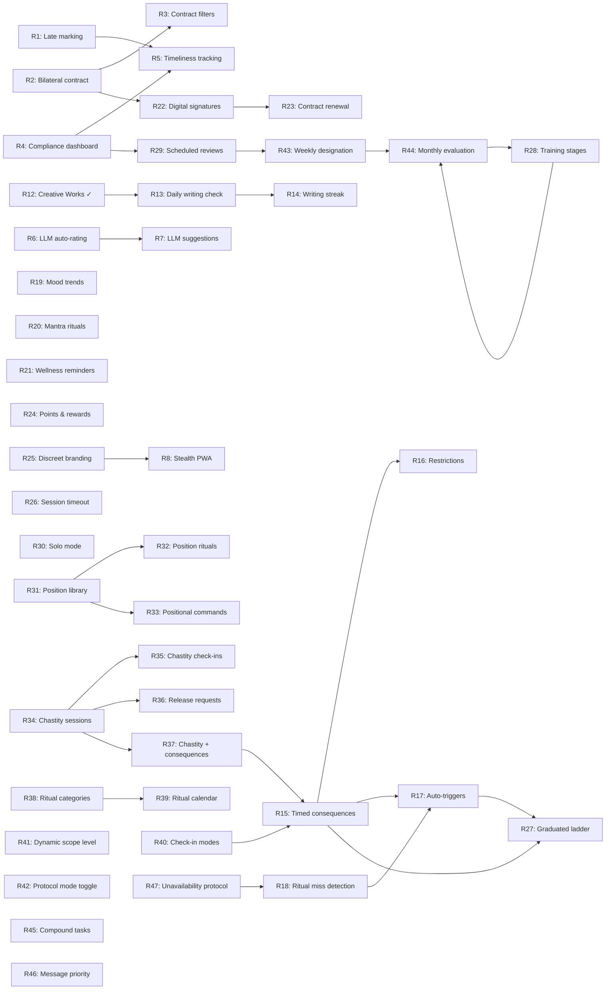

# DSCoaching — Roadmap

## Status Legend

- 🟢 Done
- 🟡 Partial (foundation exists, needs extension)
- 🔴 Not started

---

## Recently Shipped (2026-08-20)

### R12 — Creative Works Archive 🟢

| Item | Detail |
|------|--------|
| Tables | `creative_collection`, `creative_constraint`, `creative_work` |
| Feature flag | `writing` (✍️ Creative Writing) in FEATURES list |
| Coachee routes | `GET /me/writing`, `POST /me/writing/submit`, `GET /me/writing/<wid>` |
| Coach routes | `GET /coach/coachee/<cid>/writing`, `POST .../constraint`, `POST .../collection`, `POST .../<wid>/note`, `GET .../export` |
| Templates | `writing.html`, `writing_view.html`, `coach_writing.html` |
| Constraint types | subject, theme, word, constraint, emotion, style |
| Export | Full collection or selected-only as JSON (for milestone delivery after 365 days) |
| Integration | Tab in coachee dashboard, section in coach_view_coachee with link to management page |

### R9 — In-App Help & Navigation Guide 🟢

| Item | Detail |
|------|--------|
| Routes | `/coach/help`, `/me/help` |
| Templates | `coach_help.html`, `coachee_help.html` |
| Content | Full map of every feature, where to find it (path), and what it does |
| i18n | Fully translated EN/FR |

### R10 — Language Toggle (FR) 🟢

| Item | Detail |
|------|--------|
| Module | `src/i18n.py` — translation table (EN/FR), `t()` function, `get_lang()` |
| Route | `/lang/<lang>` (session-based, in `auth.py`) |
| Integration | `inject_helpers()` now provides `t` and `lang` to all templates |
| UI | EN/FR toggle button in both coach and coachee navigation bars |
| Scope | Navigation labels, help pages, photo validation settings page |

### R11 — LLM Photo Proof Validation 🟢

| Item | Detail |
|------|--------|
| Module | `src/photo_validation.py` — `should_validate_photo()`, `validate_photo_proof()`, `get_validation_status()` |
| Services | Cloudflare Workers AI (text-only), OpenAI GPT-4o-mini (full vision) |
| Schema | `task_template.photo_validate` (flag per template), `task_assignment.photo_validation_result` (JSON), `task_assignment.photo_validation_override` (JSON) |
| Coach settings | `/coach/photo-validation-settings` — enable/disable, choose service, API key |
| Per-coachee slider | In coachee view → "📷 AI Photo Validation" details: 0-100% of tasks to auto-validate |
| Task template | "📷 AI photo validation" checkbox in task creation/edit forms |
| Grading UI | AI assessment shown inline in bulk grading with approve/reject override buttons |
| Flow | On `complete_task()` with photo → random roll against pct → call AI → store result → coach reviews |
| Safety | Coach always has final say; AI result is advisory; override stored separately |

---

## Backlog — Community Feedback (severin, Roses Noires — 2026-08)

### Priority 1 — Protocol Enforcement

| # | Feature | Status | Description | Depends on |
|---|---------|--------|-------------|------------|
| R1 | Late check-in marking | 🔴 | Visual indicator (orange) when a check-in arrives after the configured `task_unveil_time`. Optional auto-reject mode configurable per coachee. | Existing `checkin` table, `task_unveil_time` field |
| R2 | Bilateral contract editing | 🔴 | Coachee can propose contract amendments. Coach reviews and accepts/rejects. Both parties must sign for a new version to be active. Versioned in `contract_history`. | Existing `contract_text`, `contract_history` table |
| R3 | Contract-based task filters | 🔴 | Define allowed task categories/tags in the contract. Assignment UI warns or blocks tasks outside the agreed scope. Optional contract expiration date with auto-pause. | R2 |

### Priority 2 — Compliance Visibility

| # | Feature | Status | Description | Depends on |
|---|---------|--------|-------------|------------|
| R4 | Historical compliance dashboard | 🟡 | Coach-facing view showing compliance rates over 1 week / 1 month / all-time. Heatmap calendar per coachee. Aggregate view across all coachees. Builds on existing `engagement_score` and task stats. | Existing `task_assignment`, `checkin` data |
| R5 | Check-in timeliness tracking | 🔴 | Store `created_at` vs expected time delta. Surface as a metric in the compliance dashboard (on-time %, average delay). | R1, R4 |

### Priority 3 — LLM Intelligence

| # | Feature | Status | Description | Depends on |
|---|---------|--------|-------------|------------|
| R6 | Automatic LLM rating of written responses | 🟡 | First-pass AI evaluation of task responses (effort, depth, honesty). Score shown to coach alongside the submission. Uses existing Cloudflare Workers AI integration (`_cf_ai_complete`). Coach can override. | Existing `auto_grade`, `_cf_ai_complete` |
| R7 | LLM task suggestion from theme | 🔴 | Coach inputs a theme (e.g. "vulnerability", "obedience", "body awareness"). LLM generates 3-5 concrete task suggestions. Coach picks/edits before assigning. | Existing `_cf_ai_complete`, `task_template` |

### Priority 4 — Client-Side Experience

| # | Feature | Status | Description | Depends on |
|---|---------|--------|-------------|------------|
| R8 | Stealth mode (PWA) | 🔴 | Progressive Web App with configurable app icon (neutral: calculator, weather), no explicit push notification text on lock screen, biometric/PIN lock on app open. Requires PWA manifest + service worker. | Frontend rewrite to PWA |

### Priority 5 — Daily Writing Accountability

| # | Feature | Status | Description | Depends on |
|---|---------|--------|-------------|------------|
| R13 | Daily writing compliance check | 🔴 | Automated detection of days without a creative work submission. If `writing` feature is enabled and a collection is active, the system checks daily whether a work was submitted. Missing days trigger a strike (configurable: auto-strike, or just visual warning). Optionally creates an auto-task "Write today's entry" each morning via `_auto_assign_reserves` pattern. | R12 (Creative Works Archive) |
| R14 | Writing streak tracking | 🔴 | Dedicated streak counter for consecutive days of creative submission. Separate from task streak. Milestone badges at 7, 30, 90, 180, 365 days. Coach can set a target duration (e.g. 365 days) and progress bar shows % completion. | R12, R13 |

### Priority 6 — Consequence & Accountability System (inspired by Kneel)

| # | Feature | Status | Description | Depends on |
|---|---------|--------|-------------|------------|
| R15 | Timed consequence system | 🔴 | Coach assigns timed consequences (e.g. "30 min corner time", "write 100 lines"). Timer runs on coachee dashboard with countdown. Coachee submits proof (text or photo) on completion. Auto-triggers from missed tasks/rituals via auto_rules. New table: `consequence` (coachee_id, type, description, duration_min, trigger_source, status, proof_text, proof_path, started_at, completed_at). | Existing `auto_rule` system |
| R16 | Restriction periods | 🔴 | Coach can temporarily restrict specific features/privileges for a coachee (e.g. "no journal sharing for 48h", "tasks only — no goals"). New table: `restriction` (coachee_id, restricted_feature, reason, starts_at, ends_at, active). Dashboard shows active restrictions. Checked in route decorators. | R15 |
| R17 | Automated consequence triggers | 🔴 | Extend `auto_rule` action types to include `assign_consequence`. When a rule fires (e.g. `task_missed`, `streak_broken`, `writing_missed`), it auto-assigns a pre-defined consequence. Coach configures in automation management UI. | R15, existing `auto_rule` |

### Priority 7 — Ritual Depth & Wellness (inspired by Kneel)

| # | Feature | Status | Description | Depends on |
|---|---------|--------|-------------|------------|
| R18 | Ritual miss detection (automatic) | 🟡 | Extend existing `ritual_log` system: if a ritual's schedule says "daily" and no log exists for yesterday, mark it missed. Surface missed rituals on coach dashboard. Optionally trigger auto-rules. Currently rituals are tracked but misses are not auto-detected. | Existing `ritual`, `ritual_log` |
| R19 | Mood trend visualization | 🔴 | Expand the existing `mood_sparkline` into a full weekly/monthly mood chart. Show trend line, average, notable dips. Coach sees emotional pattern alongside task compliance. Alert coach when mood drops 2+ points for 3+ consecutive days. | Existing `checkin.mood`, `_mood_sparkline` |
| R20 | Mantra / affirmation rituals | 🔴 | Coach writes affirmation text. Coachee receives it as a guided reading ritual — displayed one line at a time with pacing. Must read/type each line to complete. Stored as a ritual type with its own completion log. | Existing `ritual` system |
| R21 | Wellness check-in reminders | 🔴 | Configurable reminder system: if no check-in by X time, coachee gets a visual prompt on next page load. Coach can configure per-coachee. Not push notifications (no PWA yet) but in-app nudge with countdown. | Existing `checkin` system |

### Priority 8 — Dynamic Formalization (inspired by Kneel)

| # | Feature | Status | Description | Depends on |
|---|---------|--------|-------------|------------|
| R22 | Digital contract signatures | 🔴 | Both coach and coachee must "sign" (click + timestamp + IP) for a contract to become active. Visual signature block with date. Unsigned contracts shown as "draft". Builds on existing `contract_history`. | R2 (Bilateral contract editing) |
| R23 | Contract renewal & expiration | 🔴 | Contracts have an optional `expires_at` date. 7 days before expiry, both parties receive a notification (in-app). Coach can renew (creates new version) or let expire (coachee status → paused). | R2, R22 |
| R24 | Points & rewards redemption | 🟡 | Formalize the implicit grading system into explicit points. Tasks award points based on grade (A=10, B=8, C=6, D=4, F=0). Coach defines a reward catalog (custom rewards with point costs). Coachee can "redeem" — coach approves. New tables: `reward_catalog`, `reward_redemption`. **Note:** the *persisted daily score* half of this idea is now split out as R49 (see `plan-proof-and-scoring.md`); R24 should spend the R49 score as currency via R51. | Existing grading system; R49, R51 |

### Priority 9 — Privacy & Stealth (inspired by Kneel)

| # | Feature | Status | Description | Depends on |
|---|---------|--------|-------------|------------|
| R25 | Discreet app name & branding | 🔴 | Coach can configure a neutral display name for the app (shown in browser tab, PWA name). Default: "DSCoaching". Options: "Daily Planner", "Wellness Tracker", custom text. Stored per-coach in branding settings. | Existing `coach_branding` |
| R26 | Session timeout & auto-lock | 🔴 | Configurable session timeout (default: 30 min idle). On timeout, redirect to login. No sensitive data cached in browser. Add `Strict-Transport-Security` and `Clear-Site-Data` headers on logout. | Existing session system |

### Priority 10 — Training Progression & Structure

| # | Feature | Status | Description | Depends on |
|---|---------|--------|-------------|------------|
| R27 | Graduated consequence ladder | 🔴 | Per-coachee configurable escalation: define N levels of consequence for the same type of miss (e.g. level 1 = verbal note, level 2 = written reflection, level 3 = timed consequence, level 4 = renegotiation). System tracks miss count per category and auto-escalates. Coach can reset counter on good behavior. | R15 (Timed consequences), R17 (Auto-triggers) |
| R28 | Progression-based training plan | 🔴 | Replace rigid day-offset onboarding with a stage-based progression model. Coach defines stages (e.g. "Rituals Only" → "Tasks + Rituals" → "Full Accountability"). Coachee advances when milestones are met (e.g. 7-day ritual streak, 3 tasks graded B+). Stage gates unlock new features/task categories. Each stage has its own ritual/task/consequence config. New table: `training_stage` (coach_id, coachee_id, stage_number, name, description, unlock_condition_json, status [active/completed], started_at, completed_at). | Existing `onboarding_step` |
| R29 | Scheduled dynamic reviews | 🔴 | Coach sets a review cadence (weekly, biweekly, monthly). System auto-generates a "review due" note to both parties with pre-populated data: compliance %, streak, mood trend, recent misses. Coach marks review as completed with notes. Stored in a new `dynamic_review` table. Supports contract clause "review every N days". | R4 (Compliance dashboard), existing `note` system |
| R30 | Solo self-discipline mode | 🔴 | Allow a user to sign up without a coach and self-assign tasks, rituals, and consequences. They see a single-role dashboard combining assignment and compliance views. When ready, they can "invite a coach" who takes over the authority role. Useful for people training personal discipline before entering a dynamic. Requires refactoring auth to allow coachee-without-coach. | Auth system refactor |

### Priority 11 — Positions & Physical Protocols

| # | Feature | Status | Description | Depends on |
|---|---------|--------|-------------|------------|
| R31 | Position/posture library | 🔴 | Coach defines a library of positions per coachee: name, description, form instructions, physical safety notes, duration guidance, difficulty level, illustration (optional photo/sketch). Stored in `position` table (coach_id, coachee_id, name, description, instructions, safety_notes, difficulty, max_duration_min, image_path). Serves as reference for both parties. | — |
| R32 | Position practice as ritual type | 🔴 | Positions can be assigned as rituals (e.g. "2-min kneeling each morning"). Completion tracked with optional photo proof. Timer mode: coachee starts position, timer counts duration, logs completion. Builds on existing `ritual` system with a new `ritual_type = 'position'` and FK to `position` table. | R31, existing `ritual` system |
| R33 | Positional commands vocabulary | 🔴 | Coach configures a command→position mapping (e.g. "Kneel"→Nadu, "Attention"→Tower, "Present"→Display). Displayed as a quick-reference card on coachee dashboard. Can be used in task descriptions via mail-merge: `{{position:kneel}}` renders the full instructions inline. | R31 |

### Priority 12 — Chastity & Keyholding

| # | Feature | Status | Description | Depends on |
|---|---------|--------|-------------|------------|
| R34 | Chastity session tracking | 🔴 | Coach can start/end lock sessions for a coachee. Track: start_time, target_end, actual_end, status (locked/unlocked/hygiene_break). Session history with total locked days. New table: `chastity_session` (id, coachee_id, coach_id, status, started_at, target_end, ended_at, end_reason, notes, created_at). Dashboard shows current lock status and duration counter. | — |
| R35 | Chastity check-ins | 🔴 | Scheduled check-ins during a lock session. Coachee rates difficulty (1-5), adds optional notes. Coach reviews check-in history. Configurable frequency (1x/day, 2x/day). New table: `chastity_checkin` (id, session_id, coachee_id, difficulty_rating, notes, created_at). | R34 |
| R36 | Release request workflow | 🔴 | Coachee can submit a release request with a reason. Coach reviews: approve, deny (with note), or defer. Full history preserved. Status: pending → approved/denied. Approved triggers session end or hygiene break. New table: `release_request` (id, session_id, coachee_id, reason, status, coach_notes, created_at, resolved_at). | R34 |
| R37 | Chastity time adjustments as consequence/reward | 🔴 | Link chastity to the broader accountability system. Missed tasks/rituals can auto-extend lock duration (via auto_rule). Completed tasks/good streaks can earn time reductions. Coach can manually adjust with logged reason. Creates a feedback loop between compliance and lock duration. | R34, R15 (consequences), R17 (auto-triggers) |

### Priority 13 — Ritual Enrichment

| # | Feature | Status | Description | Depends on |
|---|---------|--------|-------------|------------|
| R38 | Ritual categories & scheduling depth | 🔴 | Categorize rituals by time-of-day (morning, midday, evening, bedtime) and type (greeting, reflection, physical, service, devotional). Add flexible scheduling: daily, specific weekdays, monthly on Nth day. Add `minimal_version` text field — what the ritual looks like on a hard day (e.g. "just send 'Good morning'" instead of full format). Show rituals grouped by time-of-day on dashboard. | Existing `ritual` system |
| R39 | Ritual completion calendar | 🔴 | Month-view calendar showing which rituals were completed each day (colored dots per ritual). Coach and coachee both see it. Highlights streaks visually. Gaps are immediately visible. Similar to GitHub contribution graph but for ritual adherence. | Existing `ritual_log` |
| R40 | Check-in modes (optional/rewarded/required) | 🔴 | Per-coachee configurable check-in enforcement level. Optional: coachee can check in when they want, no consequence for missing. Rewarded: check-ins earn points but no penalty for skipping. Required: daily check-in is mandatory, missing triggers the consequence/escalation system. Stored as `checkin_mode` on coachee record. | Existing `checkin`, R15 (for required mode consequences) |
| R41 | Dynamic scope level | 🔴 | Per-coachee setting defining the scope of the dynamic: scene-based (specific sessions only), contextual (certain life areas), lifestyle (daily structure), full-authority (near-total). Affects which features are shown, what time-of-day structure applies, and sets expectations. Informational + contract-linked. Stored as `dynamic_level` on coachee. | — |

### Priority 14 — High-Protocol Support (Madame V Protocol)

| # | Feature | Status | Description | Depends on |
|---|---------|--------|-------------|------------|
| R42 | Protocol mode toggle | 🔴 | Coach can set a real-time protocol mode for the coachee: `formal` (high protocol — structured communication expected) or `relaxed` (speak freely). Stored as `protocol_mode` on coachee. Coach toggles via quick action. Coachee sees current mode on dashboard. Notes/messages submitted during formal mode are tagged. Mode history logged for review. | — |
| R43 | Weekly status designation (GREEN/YELLOW/RED) | 🔴 | Each week, coach assigns a development status: GREEN (advance — increase difficulty/autonomy), YELLOW (develop — maintain level, correct weakness), RED (hold — reduce complexity, return to fundamentals). Stored in `weekly_summary` (new column `designation`). Coachee sees current week's color prominently on dashboard. History visible in compliance view. Affects R28 stage progression logic. | Existing `weekly_summary`, R29 (scheduled reviews) |
| R44 | Monthly scored evaluation rubric | 🔴 | Coach fills out a structured scorecard at month-end. Configurable categories (default 16: obedience, initiative, service, discipline, communication, etc.) each scored 1-5. Total computed automatically. Pass/fail threshold configurable (default 64/80). Result determines progression action: advance/maintain/repeat/regress. New table: `monthly_evaluation` (id, coachee_id, coach_id, month, scores_json, total, threshold, determination [advance/maintain/repeat/regress/fail], notes, created_at). Links to R28 training stages. | R28 (training stages), R29 (scheduled reviews) |
| R45 | Compound/multi-phase tasks | 🔴 | A task that requires multiple sequential steps to complete. Coach defines phases (e.g. Phase 1: Physical exercise with timer, Phase 2: Written reflection, Phase 3: Evidence of change). Coachee must complete each phase in order. Each phase can require different proof types (photo, video, text, timer completion). New table: `task_phase` (id, template_id, phase_number, title, description, proof_type [text/photo/video/timer], duration_min, required). "Breaking & Mending" is a compound task with 2 phases: physical discipline + structured reflection. | Existing `task_template`, `task_assignment` |
| R46 | Communication priority/category | 🔴 | Notes sent between coach and coachee carry a priority level: immediate (safety/consent), daily (check-ins/completions), weekly (patterns/reflection), monthly (evaluation/renegotiation). Add `priority` column to `note` table. Dashboard groups notes by priority. Coach can filter. Coachee trained to self-categorize when sending. Reduces noise and teaches communication discipline (directly implements §5 of the protocol). | Existing `note` system |
| R47 | Unavailability protocol | 🔴 | Coachee can declare unavailability with an expected return time. Status shown on coach dashboard. During unavailability: rituals are paused (no miss detection), tasks freeze, but the record shows the absence. Coach can also declare unavailability (async-first principle). New fields on coachee: `unavailable_since`, `unavailable_until`, `unavailable_note`. Route: `POST /me/unavailable` and `POST /me/available`. | Existing `coachee` status system |

### Priority 15 — Adaptive Proof & Scoring (2026-09-30 planning batch)

Full technical plan: [`plan-proof-and-scoring.md`](plan-proof-and-scoring.md).
Distinct from R11 (which decides whether to *AI-check* an already-submitted
photo) and from R24 (reward *redemption*).

| # | Feature | Status | Description | Depends on |
|---|---------|--------|-------------|------------|
| R48 | Probabilistic proof demand | 🔴 | Per-template `proof_pct` (0–100). At assignment time the system rolls once and persists `task_assignment.proof_required`. When required, the coachee must attach a photo; completion without one is rejected. Reduces coach review load and coachee friction on recurring tasks while keeping accountability credible (intermittent verification). Rolls on every assignment path (manual, recurring, reserve, week-plan, onboarding). | Existing `task_template`, `_auto_assign_reserves`, `complete_task`; composes with R11 |
| R49 | Points & persisted daily score | 🔴 | Per-template signed `points`. New append-only `score_log` table records every delta with a coachee-local `score_date`. Completing awards points; missing deducts a configurable penalty; a required-proof completion can add a `proof_bonus`. Rollups: today, per-week (Sun–Sat *and* Mon–Sun, per preference), per-month, all-time, best-week. All rollup SQL portable; week bucketing done in Python. Coachee sees score widget; coach sees line-item history. | Existing grading/streak patterns; feeds R24 later |
| R50 | FetLife-inspired `noir` theme | 🔴 | Opt-in `theme-noir` body class + branding preset: warm near-black surfaces, single crimson accent, calm grey text hierarchy, flatter elevation. Design **tokens** derived from public palette, not copied CSS (see [`plan-aesthetic-noir.md`](plan-aesthetic-noir.md) for legal position). Targets the FetLife user base without using their marks/assets. | Existing `style.css` token system, `font_pref` pattern, `coach_branding` |
| R51 | R24 ↔ R49 integration (reward currency) | 🔴 | Once R49 ships, R24's reward redemption spends the R49 running score as its point currency instead of a re-derived grade sum. Redemptions append a negative `score_log` row (`reason='reward_redeemed'`). **Balance rule:** redemption is balance-checked by default (cannot redeem below zero); "debt"/negative balance is explicitly out of scope. | R24, R49 |
| R52 | Section-based contract drafting | 🔴 | Coach drafts a contract by picking/arranging pre-written **contract sections** (library of clauses, system-default + per-coach), editing the assembled free text, which saves to `contract_text`/`contract_history` unchanged. Each section is associated with **sample task templates** (incl. R48 `proof_pct` / R49 `points` hints) the coach can create/assign on save — so the agreement and the operational tasks are authored together. New tables `contract_section`, `contract_section_task`. Full plan: [`plan-contract-drafting.md`](plan-contract-drafting.md). | Existing `contract_history`, `_merge_vars`, `task_template`; composes under R2/R22/R23 |

### Harvested items — ideas/bugs that had slipped off the roadmap (2026-09-30 audit)

These were found by re-reading all devdocs + BUGS.md and are re-surfaced here so
they are not lost. Bugs are tracked in `BUGS.md`; listed here for planning
visibility.

| # | Type | Status | Description | Source |
|---|------|--------|-------------|--------|
| H1 | data-integrity bug | 🔴 | **BUG-017** — `admin_delete_coach` cascade does not clean 11 newer tables (`badge`, `ritual`, `ritual_log`, `auto_rule`, `week_plan`, `onboarding_step`, `payment_plan`, `payment_log`, `creative_collection`, `creative_constraint`, `creative_work`); deleting a coach orphans rows. Should be fixed before shipping more coach-scoped features. | BUGS.md BUG-017 |
| H2 | correctness | 🔴 | Auto-grade heuristic produces only **A–D by response length**, but the documented scale is **A–F** and length rewards verbosity, not quality. Gameable. Candidate to fold into R6 (LLM auto-rating) or replace with a rubric. | routes_coachee.py `complete_task`; onboarding.md grading scale |
| H3 | observability | 🔴 | **BUG-005 / BUG-006 / BUG-015** — silent `except Exception: pass` in `_audit`, cascade delete, and `init_db`. At minimum log to stderr so failures are visible. | BUGS.md |
| H4 | config | 🔴 | **BUG-007** — hardcoded `papillon.severin@gmail.com` in `login.html` forgot-password. Make per-deployment configurable or remove. | BUGS.md, login.html:33 |
| H5 | robustness | 🔴 | **BUG-010** — no input length validation; oversized form values can exceed VARCHAR limits (truncation or DB error). Add length guards on write paths. | BUGS.md |
| H6 | performance | 🔴 | **BUG-011** — `_auto_assign_reserves` + freeze/streak all run on **every** `GET /me` (N+1). Acceptable now; revisit if multi-coachee scale grows. | BUGS.md, tasks.py |
| H7 | robustness | 🔴 | **BUG-009** — login flow can `fetchone()` a `None` coach if the coach is deleted mid-session (race). Guard the None. | BUGS.md |
| H8 | doc drift | 🔴 | `src/models.py` docstring says "20 tables" but 30 are defined (31 after R48/R49). Fix as part of Step 1. | models.py |
| H9 | video proof | 🟡 | Video-as-proof (MediaRecorder, 30 MB, webm, multipart upload, `/attachment/video/<id>`) is fully specified under **R32** but not built. Relevant to R48 (a required proof could be a short video for positions). | roadmap.md R32 notes |
| H10 | **security (safety-critical)** | 🟢 | **BUG-018** — `{{ csrf_field() }}` rendered outside `<form>` in 7 templates → token not submitted → POST 403 under server-side CSRF. Broke the coachee **safe-word / STOP** buttons among others. Found by maintainer review + 2 extra by the new generic test. **Fixed in this PR** (csrf_field moved inside each form; `tests/test_csrf_placement.py` added, scans all templates). | maintainer review; BUG-018 |
| H11 | security | 🔴 | **BUG-019** — `llm_key` and Telegram `tg_token` embedded in client-side JS (`coach_view_coachee.html`) and Telegram API called from the browser; secrets visible in page source. Move to a server-side proxy route. | maintainer review; BUG-019 |

---

## Already Implemented (confirmed present)

These features from the community feedback are already in the product:

| Feature | Implementation |
|---------|---------------|
| Shared submission journal | `journal` table, `visible_to_coach` flag |
| Contract registry (Dom-only edit) | `coachee.contract_text` + `contract_history` versioning |
| Photo/video proof on tasks | `task_assignment.attachment_path`, base64 upload, secure serving |
| Hybrid channel (Orders vs Discussion) | `task_assignment` (formal) / `note` (conversational) / `mental_conditioning` (prompts) |
| Emotional/physical state indicator | `tracking_log` (5 categories) + `checkin.mood` + mood sparkline |
| Digital safeword (Freeze mode) | `/me/pause` route, `safe_word` field, status → paused/stopped |
| Multi-sub management ("stable") | Native multi-coachee per coach |
| Mail-merge / publipostage | `_merge_vars()` engine with `{{name}}`, `{{streak}}`, `{{level}}`, etc. |
| Reserve tasks (protect the crown) | `task_template.is_reserve` + `_auto_assign_reserves()` |
| Recurring sentiment tasks | `recurrence` + `recur_days` + `recur_approx` (±25% fuzzy) |
| Tasks with photo proof | `attachment_path` + base64 upload + secure file serving |
| Private Dom notes (multi-day orientation) | `coachee.context_text` — coach-only, not visible to coachee |
| Goal proposal workflow | `goal` table with `proposed` → `approved` → `active` → `completed` |
| Psychological profile (AI) | `psychological_profile` + `_cf_ai_complete` generation |
| In-app help/navigation guide | `/coach/help`, `/me/help` — full feature map with paths (R9) |
| FR language support | `i18n.py`, `/lang/<lang>` toggle, session-based (R10) |
| LLM photo proof validation | `photo_validation.py`, per-task/per-coachee control, coach override (R11) |
| Creative works archive | `creative_work`, `creative_constraint`, `creative_collection` tables; coach assigns constraints (6 types); coachee submits daily; coach organizes/exports collection (R12) |

---

## Implementation Notes

### R1 — Late check-in marking

- Add `expected_time` comparison in `submit_checkin()`
- Store `delta_minutes` in `checkin` table (new column)
- Dashboard renders orange badge if `delta_minutes > 0`
- Optional `reject_late_checkins` flag on `coachee` table

### R2 — Bilateral contract editing

- New table: `contract_proposal` (coachee_id, proposed_text, status, coach_response, created_at)
- New route: `POST /me/contract-propose`
- Coach sees pending proposals in coachee view
- Accept → updates `contract_text` + archives old in `contract_history`

### R3 — Contract-based task filters

- Add `allowed_categories` (JSON) and `contract_expires` (Date) columns to `coachee`
- `manage_tasks` assignment validates against allowed categories
- Scheduler pauses coachee on contract expiration

### R4 — Historical compliance dashboard

- New route: `GET /coach/compliance` (global) + `GET /coach/coachee/<id>/compliance` (per-coachee)
- Query `task_assignment` grouped by week/month: completion rate, average grade, missed count
- Render as heatmap calendar (CSS grid, green/yellow/red cells)

### R6 — Automatic LLM rating

- On `complete_task()`, if template has `auto_grade` AND response length > threshold:
  - Call `_cf_ai_complete` with rating prompt
  - Store AI grade + AI comment in new columns (`ai_grade`, `ai_comment`)
  - Coach sees both AI suggestion and can override

### R7 — LLM task suggestion

- New route: `POST /coach/suggest-tasks`
- Input: theme text, target coachee (optional for context)
- Output: 3-5 task suggestions (title + description)
- Coach can "Use" → pre-fills the create-task form

### R13 — Daily writing compliance check

- In `_freeze_overdue()` or a new scheduler-style check: query `creative_work WHERE coachee_id=X AND DATE(created_at) = yesterday`
- If no row AND feature `writing` enabled AND coachee has an active collection → trigger
- Options (per-coachee setting on `coachee.features` JSON):
  - `writing_mode: "strict"` → auto-assign strike
  - `writing_mode: "gentle"` → coach gets a notification note, no strike
  - `writing_mode: "task"` → auto-create a daily task "Submit today's writing" via reserve pattern
- Could reuse `_auto_assign_reserves` pattern with a virtual writing template

### R14 — Writing streak tracking

- Add `writing_streak` and `best_writing_streak` columns to `coachee` table
- Increment logic similar to `_update_streak()` but checks `creative_work` instead of `task_assignment`
- Badge milestones: 7 (🔥 Week of Words), 30 (📖 Monthly Muse), 90 (🏆 Quarter Poet), 180 (✨ Half-Year Author), 365 (👑 Year of Creation)
- Progress bar in writing tab: `current_writing_streak / target_days * 100%`

### R15 — Timed consequence system

- New table: `consequence` (id, coachee_id, coach_id, title, description, consequence_type [timed/lines/essay/custom], duration_min, line_count, trigger_source, status [active/completed/expired], proof_text, proof_path, started_at, completed_at, created_at)
- Coach assigns via `POST /coach/coachee/<cid>/consequence`
- Coachee sees active consequences on dashboard with countdown timer (JS)
- Completion: `POST /me/consequence/<id>/complete` with optional proof
- Auto-expire if duration passes without completion (escalate to strike?)

### R18 — Ritual miss detection

- Extend `_ritual_status_today()` or add `_check_ritual_misses(coachee_id)`
- Query: rituals with `schedule='daily'` where no `ritual_log` entry exists for yesterday
- On miss: insert note to coach ("X missed ritual: Y"), optionally trigger auto_rule with trigger `ritual_missed`
- Run in `coachee_dashboard` load (like `_freeze_overdue`) or as separate scheduler check

### R24 — Points & rewards redemption

- New tables: `reward_catalog` (id, coach_id, title, description, point_cost, active, created_at), `reward_redemption` (id, coachee_id, reward_id, status [requested/approved/denied], coach_notes, created_at, resolved_at)
- Point calculation: sum of grades (A=10, B=8, C=6, D=4, F=0) minus redeemed points
- Coachee route: `GET /me/rewards`, `POST /me/rewards/<rid>/redeem`
- Coach route: `GET /coach/rewards`, `POST /coach/rewards/create`, `POST /coach/reward-request/<id>/review`

### R27 — Graduated consequence ladder

- New table: `consequence_ladder` (id, coach_id, coachee_id, miss_category [task_missed/ritual_missed/checkin_late/writing_missed], level, action_type [note/reflection/timed_consequence/renegotiation], action_config JSON, created_at)
- Per-coachee `miss_counter` JSON field (or new table) tracking consecutive misses by category
- On miss: lookup current level → execute corresponding action → increment counter
- On streak recovery (N consecutive days clean): coach can reset counter (or auto-reset after configurable threshold)
- Coach UI: visual ladder builder per category (drag levels, configure actions per level)
- Default ladder (configurable): 1st miss → auto-note, 2nd → reflection task assigned, 3rd → timed consequence, 4th+ → coach flagged for renegotiation

### R28 — Progression-based training plan

- New table: `training_stage` (id, coach_id, coachee_id, stage_number, name, description, unlock_condition JSON, features_enabled JSON, status [locked/active/completed], started_at, completed_at)
- `unlock_condition` examples: `{"min_ritual_streak": 7}`, `{"min_tasks_graded_B_or_above": 3}`, `{"min_days_active": 14}`
- On coachee dashboard load: check if current stage's unlock_condition for next stage is met → auto-advance (or require coach confirmation)
- Stage defines which features are visible: e.g. stage 1 = rituals only, stage 2 = rituals + tasks, stage 3 = full accountability
- Replaces/extends `onboarding_step` for long-term progression (onboarding = first 7 days, training stages = indefinite)
- Coach can manually advance/regress stages

### R29 — Scheduled dynamic reviews

- New table: `dynamic_review` (id, coach_id, coachee_id, review_date, review_cadence [weekly/biweekly/monthly], status [pending/completed/skipped], compliance_pct, mood_avg, notes, created_at, completed_at)
- `review_cadence` stored on `coachee` table (new column)
- Auto-generate: on dashboard load, if review is due (last review + cadence < today), insert pending review
- Pending review shown as banner on both coach and coachee dashboards
- Pre-populated data card: task completion %, average grade, streak status, mood trend, missed rituals, consequence count
- Coach completes review with notes → both parties see summary

### R30 — Solo self-discipline mode

- New role: `solo` (user is both coach and coachee to themselves)
- Auth refactor: allow `coachee` without `coach_id` (nullable FK) or separate `solo_user` table
- Solo dashboard: combined view — assign tasks to self, track rituals, self-grade, self-consequence
- "Invite coach" action: user enters coach's username → sends invitation → coach accepts → user's data transfers to coached relationship
- Alternatively: coach creates invite link → solo user joins → existing data preserved
- Privacy: solo mode data visible only to the user until a coach is linked

### R31 — Position/posture library

- New table: `position` (id, coach_id, coachee_id [nullable for shared], name, description, instructions, safety_notes, difficulty [easy/medium/hard], max_duration_min, image_path, created_at)
- Coach creates positions with detailed form: name (e.g. "Nadu"), step-by-step body instructions, safety notes (knee health, circulation), suggested max duration
- Optional image upload for reference (stored in ATTACHMENTS_DIR)
- Coach can share positions across coachees (coachee_id = NULL) or assign per-coachee
- Coachee sees position library as a reference page: `/me/positions`
- Coach manages at: `/coach/positions`
- Seed data: common positions (Nadu/Kneel, Tower/Attention, Present, Waiting, Inspection, Prostrate, Table) with descriptions and safety notes

### R32 — Position practice as ritual type

- Add `ritual_type` column to `ritual` table (values: standard, position, mantra)
- Add `position_id` FK (nullable) to `ritual` table
- When `ritual_type = 'position'`: ritual completion shows a timer (start → hold for N minutes → complete)
- Photo proof especially relevant for positions (verify form)
- **Video proof mode**: for complex/long positions, coachee records a video (start recording → assume position → hold for required duration → stop). Video uploaded as proof. Validates both form and duration in one artifact.
- Streak tracking works same as standard rituals
- Dashboard shows position name + duration in ritual list

#### Video proof implementation (applies to R32 + general task/ritual proofs):

- Frontend: use `MediaRecorder` API (WebRTC) to capture video from device camera
- Recording happens client-side; no streaming to server during capture
- On completion: video blob converted to base64 or uploaded as multipart form data
- **File size limit**: 30MB max (enforced client-side + server-side). At 720p/1Mbps, this allows ~3-4 minutes of video — sufficient for position practice
- **Storage**: same `ATTACHMENTS_DIR` as photos. Filename: `video_{user_id}_{ritual_id}_{timestamp}.webm`
- **Serving**: new route `/attachment/video/<id>` returns video with `Content-Type: video/webm`
- **Playback**: `<video>` tag in coach review UI (coach_view_coachee, bulk_grading)
- **Upload method**: switch from base64-in-form to multipart file upload (`enctype="multipart/form-data"`) for video. Keep base64 for photos (backward compat).
- **Schema**: add `attachment_type` column to distinguish photo/video (or infer from file extension)
- **Compression**: client-side recording at 720p, 1Mbps bitrate cap. No server-side transcoding (zero dependencies principle).
- **Concurrency note**: a large upload blocks other requests in the single-process Flask container. Acceptable for now since it's a single-user coaching app. If problematic later, add chunked upload or external storage.

### R33 — Positional commands vocabulary

- New table: `position_command` (id, coach_id, command_word, position_id FK, created_at)
- Coach maps short commands to positions (e.g. "Kneel" → Nadu position)
- Quick-reference card on coachee dashboard (collapsible, shows all commands)
- Mail-merge integration: `{{position:command_word}}` in task descriptions expands to full instructions
- Useful for standardizing communication vocabulary

### R34 — Chastity session tracking

- New table: `chastity_session` (id, coachee_id, coach_id, status [locked/unlocked/hygiene_break], started_at, target_end [nullable for indefinite], ended_at, end_reason [scheduled/early_release/hygiene/emergency], total_adjustments_min, notes, created_at)
- Coach routes: `POST /coach/coachee/<cid>/chastity/start`, `POST .../end`, `POST .../adjust`
- Coachee sees: current lock status, running duration counter (JS), target end (if set), session history
- Dashboard widget: 🔒 Locked (Day 3 / target: Day 7) or 🔓 Unlocked
- History page: all past sessions with duration, check-in count, adjustments

### R35 — Chastity check-ins

- New table: `chastity_checkin` (id, session_id FK, coachee_id, difficulty_rating 1-5, notes, created_at)
- Configurable frequency on session start: 1x/day, 2x/day, on-demand only
- Coachee prompted on dashboard when check-in is due
- Coach sees check-in history with difficulty trend (sparkline)
- Difficulty ratings over time help calibrate session lengths

### R36 — Release request workflow

- New table: `release_request` (id, session_id FK, coachee_id, reason, request_type [full_release/hygiene_break/temporary], status [pending/approved/denied/deferred], coach_notes, created_at, resolved_at)
- Coachee route: `POST /me/chastity/request-release`
- Coach route: `POST /coach/coachee/<cid>/chastity/review-request/<rid>`
- Approved full_release → ends session. Approved hygiene_break → pause + auto-resume timer.
- Denied → logged with reason, coachee sees denial note
- Deferred → "ask again tomorrow"

### R37 — Chastity + consequences integration

- Extend `auto_rule` system: new action_type `adjust_chastity` with params `{direction: 'extend'|'reduce', minutes: N}`
- On missed task/ritual → auto-extend lock by configured amount
- On streak milestone or high grade → auto-reduce lock
- Coach can also manually adjust: `POST /coach/coachee/<cid>/chastity/adjust` with reason + minutes
- All adjustments logged in `chastity_session.total_adjustments_min` and separate `chastity_adjustment` log table

### R38 — Ritual categories & scheduling depth

- Add columns to `ritual`: `time_of_day` (morning/midday/evening/bedtime), `ritual_category` (greeting/reflection/physical/service/devotional), `minimal_version` (Text — what the ritual looks like on a hard day)
- Dashboard groups rituals by time_of_day
- Schedule options: daily, specific_weekdays (stored as "1,3,5" for Mon/Wed/Fri), monthly_day (e.g. "1" for 1st of month)
- Minimal version shown if coachee taps "I'm having a hard day" — reduces expectations without breaking streak

### R39 — Ritual completion calendar

- New page: `/me/rituals/calendar` (coachee), `/coach/coachee/<cid>/rituals/calendar` (coach)
- Query `ritual_log` for the month, render as a grid (7 cols × 5 rows)
- Each day cell shows colored dots per ritual (green = done, red = missed, grey = not scheduled)
- Streak bars shown below calendar
- Similar to GitHub contribution graph aesthetic

### R40 — Check-in modes

- Add `checkin_mode` column to `coachee` table (values: optional, rewarded, required)
- Optional: no enforcement, check-in form always available
- Rewarded: check-in earns points (configurable, e.g. 2 pts per check-in)
- Required: if no check-in by end of day, triggers the consequence/escalation system (R15/R27)
- Coach configures per-coachee in edit form

### R41 — Dynamic scope level

- Add `dynamic_level` column to `coachee` table (values: scene, contextual, lifestyle, full_authority)
- Informational + affects default UI density:
  - Scene: only tasks/rituals during defined "sessions", lighter dashboard
  - Contextual: tasks in specific categories only, partial dashboard
  - Lifestyle: full daily structure, all features visible
  - Full authority: maximum density, all modules active by default
- Shown in coach view as a badge. Can be referenced in contract text.
- Optional: auto-suggest appropriate feature sets when level is set

### R42 — Protocol mode toggle

- Add `protocol_mode` column to `coachee` (values: formal, relaxed; default: formal)
- Coach quick-action: button in coachee view → toggles mode
- Coachee dashboard shows current mode as a subtle indicator (e.g. "🎩 Formal Protocol" vs "💬 Speak Freely")
- Notes submitted during formal mode: tagged with `protocol_mode = 'formal'` (new column on `note`)
- Mode change logged in `audit_log` (action: `protocol_mode_changed`)
- Coach can set per-coachee default on creation
- Protocol concept: formal mode means structured communication (courtesy, clarity, composure); relaxed mode permits casual exchange

### R43 — Weekly status designation

- Add `designation` column to `weekly_summary` (values: green, yellow, red)
- Coach assigns during weekly review (R29) or standalone
- If no `weekly_summary` exists for current week, create one when designation is set
- Coachee dashboard: prominent color badge showing current week's status
- GREEN = advance (more autonomy/difficulty next week)
- YELLOW = develop (maintain level, focus on specific weakness)
- RED = hold (reduce complexity, return to fundamentals)
- History: coach can see designation trend over time (list of colored dots)
- Links to R28: consecutive GREEN weeks may auto-suggest stage advancement

### R44 — Monthly scored evaluation rubric

- New table: `monthly_evaluation` (id, coachee_id, coach_id, eval_month DATE, scores JSON, total INT, max_score INT, threshold INT, determination VARCHAR(20), notes TEXT, created_at)
- Default categories (configurable per coach): obedience, competent_compliance, initiative, service, discipline, communication, mental_fortitude, physical_training, time_management, wife_service, family_responsibility, weekly_offerings, personal_growth, protocol, reliability, overall_conduct
- Each scored 1-5. Total = sum. Default threshold = 80% of max (64/80 for 16 categories)
- Determination: advance / maintain / repeat / regress / fail
- Coach route: `GET /coach/coachee/<cid>/evaluate` (form), `POST .../evaluate` (submit)
- Coachee sees result after coach publishes (flag: `published`)
- Links to R28: determination directly maps to stage progression
- Links to R20 probation: "fail" determination triggers probation status on coachee

### R45 — Compound/multi-phase tasks

- New table: `task_phase` (id, template_id FK, phase_number INT, title, description, proof_type [text/photo/video/timer/none], duration_min [for timer phases], required SMALLINT default 1, created_at)
- `task_template` gets `is_compound` flag (SMALLINT default 0)
- `task_assignment` completion logic: all required phases must be submitted before status = 'completed'
- New table: `phase_submission` (id, assignment_id FK, phase_id FK, content TEXT, attachment_path, duration_actual INT, submitted_at)
- Dashboard shows phases as a checklist within the task card
- Example "Breaking & Mending": Phase 1 (timer: 10min physical hold, proof: video), Phase 2 (text: structured reflection answering 5 questions), Phase 3 (text: "What will Madame V observe next week?")
- Coach can grade per-phase or overall

### R46 — Communication priority/category

- Add `priority` column to `note` table (values: immediate, daily, weekly, monthly; default: daily)
- Coachee selects priority when sending a note (dropdown)
- Coach dashboard: notes grouped/sorted by priority. "Immediate" flagged prominently.
- Filter: coach can filter notes by priority level
- Teach communication discipline: coachee learns to categorize appropriately
- "Immediate" reserved for: safety, consent, serious conflict, significant logistics
- "Monthly" for: evaluation, renegotiation, architecture discussion
- Optional: coach can set a "max daily messages" quota (soft limit with warning)

### R47 — Unavailability protocol

- Add columns to `coachee`: `unavailable_since` (DateTime), `unavailable_until` (DateTime nullable), `unavailable_note` (String)
- Coachee route: `POST /me/unavailable` (sets fields), `POST /me/available` (clears fields)
- During unavailability:
  - Ritual miss detection paused (no strikes)
  - Task freeze timers paused
  - Dashboard shows "⏸ Unavailable since X, returning Y"
  - Coach dashboard shows unavailability indicator on coachee card
- Coach can also declare unavailability (async-first principle): `POST /coach/unavailable`
- Return: `POST /me/available` clears status, resumes normal tracking
- Log: unavailability periods stored in `audit_log` for compliance history (excused absences)

---

## Sequence

Recommended build order:
1. **Quick wins**: R13 → R14 (writing accountability), R18 (ritual miss detection), R26 (session timeout), R40 (check-in modes), R41 (dynamic scope), R42 (protocol toggle), R47 (unavailability)
2. **High impact**: R15 → R17 → R27 (consequence system + escalation), R1 → R4 (compliance visibility), R38 → R39 (ritual depth), R43 (weekly designation)
3. **New modules**: R31 → R32 → R33 (positions/postures), R34 → R35 → R36 (chastity/keyholding), R45 (compound tasks), R46 (message priority)
4. **Depth**: R2 → R22 → R23 (contract formalization), R19 (mood trends), R24 (rewards), R29 (scheduled reviews)
5. **Integration**: R37 (chastity + consequences), R28 → R44 (training stages + monthly eval), R20 (mantras), R21 (wellness reminders)
6. **Polish**: R6 → R7 (LLM intelligence), R25 + R8 (PWA + stealth mode), R16 (restrictions)
7. **Major refactor**: R30 (solo mode — auth rework)
