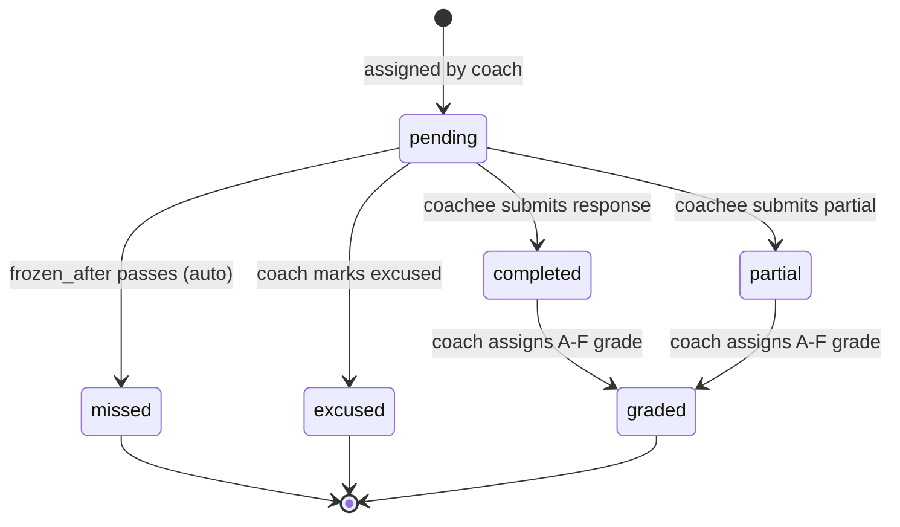

# task-system.md — Task Lifecycle (DSCoaching)

## Overview

Tasks are the core interaction loop: coach creates templates, assigns them to coachees, coachees complete them, coach grades them. Reserve tasks auto-assign when nothing manual is scheduled.

## Task States

## Template Properties

| Property | Effect |
|----------|--------|
| `is_reserve=1` | Auto-assigned when no manual task exists for the day |
| `recur_days=N` | Recurs every N days after last assignment |
| `recur_approx=1` | Fuzzy recurrence (±25% randomization) |
| `in_library=1` | Appears in task library search for other coaches |
| `category` | mental, physical, emotional, admin — used in breakdown charts |
| `difficulty` | easy, medium, hard — display only |

## Assignment Flow

1. Coach creates `task_template` (once, daily, weekly, or recurring)
2. Coach selects coachees and optional due date
3. System creates `task_assignment` per coachee with:
   - `visible_after` = coachee's `task_unveil_time` on due date
   - `frozen_after` = coachee's `task_freeze_time` on due date
4. Task appears on coachee dashboard after `visible_after`
5. Coachee submits response (text + optional photo + optional reflection)
6. If past `frozen_after` and still pending → auto-marked `missed`

## Reserve Task Logic (`_auto_assign_reserves`)

Triggered on coachee dashboard load (GET /me), if past unveil time:
1. Process recurring templates: if recur_days elapsed, assign today
2. Check if any task exists for today (including just-assigned recurring)
3. If no task today → pick one random reserve template (not yet used for this coachee)
4. Assign it with today's visible_after/frozen_after

**Tested:** `tests/test_reserves.py` — 4 tests covering assign, skip, no-duplicate, recurring-blocks-reserve

## Streak System (`_update_streak`)

Triggered on coachee dashboard load:
1. Check if already processed for yesterday → skip (idempotent)
2. Count total tasks due yesterday
3. If all completed → `current_streak += 1`, update `best_streak` if new high
4. If any not completed → `current_streak = 0`
5. Record `last_streak_date` to prevent double-counting

**Tested:** `tests/test_streaks.py` — 6 tests covering increment, reset, no-op, idempotent, best-streak

## Freeze System (`_freeze_overdue`)

Triggered on coachee dashboard load:
1. Find pending tasks with `frozen_after < now` (using coachee's timezone)
2. Mark them as `missed`
3. Add strike count = number of missed tasks
4. Reset `current_streak = 0`

**Tested:** `tests/test_freeze.py` — 4 tests covering miss, strikes, streak-reset, no-op-before-time

## Grading

- Coach grades completed/partial tasks with A-F letter + optional comment
- Bulk grading page shows all ungraded completed tasks
- Average grade computed per coachee on dashboard (numeric: A=1, F=6)
- Graded tasks appear in coachee's "Recent Grades & Feedback" section

## Task Visibility Rules

A task is visible to the coachee when ALL of:
- `status` IN ('pending', 'partial')
- `visible_after` IS NULL OR `visible_after` <= now
- `frozen_after` IS NULL OR `frozen_after` > now
- `depends_on` IS NULL OR depends_on task is completed
