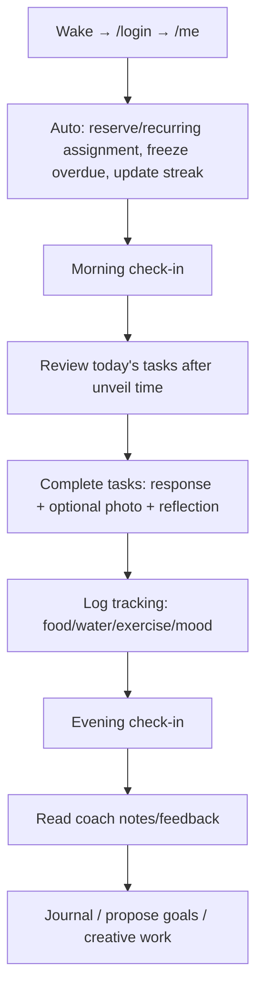
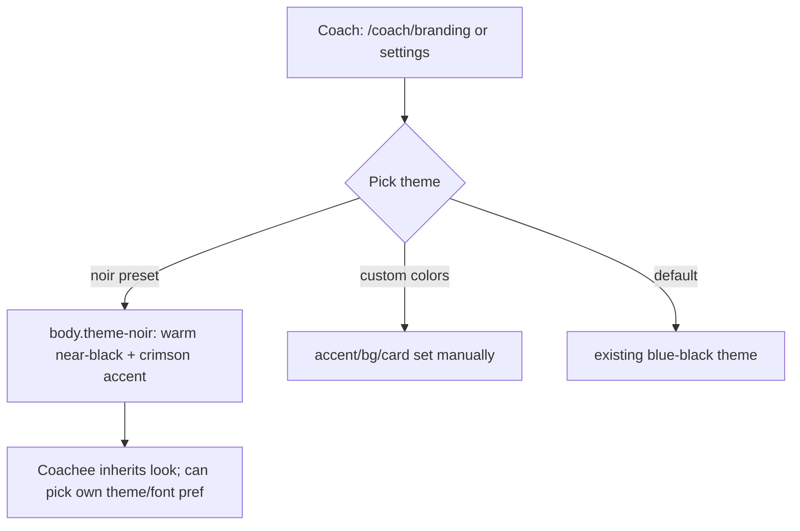

# user-journeys.md — DSCoaching User Journeys

End-to-end journeys for each role, plus the journeys introduced by the
2026-09-30 planning batch (R48 probabilistic proof, R49 points & daily score,
R50 noir theme). Complements `onboarding.md` (which is the reference guide);
this file is narrative and flow-focused. Every journey below maps to routes that
exist today unless explicitly marked **(planned)**.

## Cast

- **Admin** — a coach with elevated privileges (first `/setup` account).
- **Coach** — the authority figure; manages one or more coachees.
- **Coachee** — the person being coached.

---

## Journey 1 — Admin bootstraps the system

```mermaid
graph TD
    A[Visit app URL] --> B{Any coach exists?}
    B -->|No| C[/setup: create admin account]
    B -->|Yes| D[/login]
    C --> D
    D --> E[/coach dashboard]
    E --> F[/admin: add coaches, handle support]
    F --> G[Switch to /coach to manage own coachees]
```

Key points: the first account is admin; admins are also coaches; deleting a
coach cascades to all their data (see BUG-017 / H1 — cascade currently misses 11
newer tables, fix planned).

---

## Journey 2 — Coach sets up a coachee

```mermaid
graph TD
    A[/login → /coach] --> B[Add coachee: username, password, name, timezone]
    B --> C[Edit coachee: contract, safe word, unveil/freeze times, feature flags]
    C --> D[Create task templates: /coach/tasks]
    D --> E{Template options}
    E --> E1[recurrence / recur_days / recur_approx]
    E --> E2[is_reserve]
    E --> E3[category / difficulty]
    E --> E4[photo_validate — AI check R11]
    E --> E5[proof_pct — demand-proof chance R48 planned]
    E --> E6[points — signed score value R49 planned]
    D --> F[Assign to coachee with due date]
    F --> G[Optionally: week_plan, onboarding_step schedule]
```

The two new template options (E5, E6) sit next to the existing AI-validation
checkbox with helper text making the distinction explicit:
- **`photo_validate`** = *if a photo is submitted, spend an AI call checking it.*
- **`proof_pct`** = *chance this occurrence demands a photo at all.*

---

## Journey 3 — Coachee's day (current)



---

## Journey 4 — Coachee's day WITH probabilistic proof + score (planned R48+R49)

```mermaid
graph TD
    A[/me loads] --> B[Auto-assign rolls proof_required once per new task]
    B --> C[Task card shows '📷 Proof required' pill when proof_required=1]
    C --> D{Coachee completes task}
    D -->|proof required, no photo| E[Rejected: 'This task requires a photo as proof']
    E --> D
    D -->|proof required, photo attached| F[Completed]
    D -->|proof not required| F[Completed]
    F --> G[award_points: +template.points]
    F --> H{proof required & attached?}
    H -->|yes| I[award_points: +proof_bonus]
    F --> J[R11 AI validation may still run]
    K[Task missed at freeze time] --> L[award_points: -penalty]
    G --> M[Score widget updates: Today / Week / Month / Best week]
    I --> M
    L --> M
```

What the coachee feels: most days a recurring task is a quick text confirmation;
occasionally — unpredictably — it asks for a photo. Because they cannot predict
which day, they stay honest, but the daily burden drops. The running score turns
the routine into a visible, accumulating game.

---

## Journey 5 — Coachee views their score over time (planned R49)

```mermaid
graph TD
    A[/me score widget] --> B[Today: +12]
    A --> C[This week: +58]
    A --> D[This month: +205]
    A --> E[Best week: 71]
    C --> F{Week boundary preference}
    F -->|Mon–Sun default| G[Sum Mon..Sun]
    F -->|Sun–Sat| H[Sum Sun..Sat]
```

The week boundary (Sun–Sat vs Mon–Sun) is a preference stored in `features`
(`week_start`), toggleable by the coach in the coachee view.

---

## Journey 6 — Coach reviews compliance & score (planned R49)

```mermaid
graph TD
    A[/coach/coachee/<id>] --> B[Score section: line-item history]
    B --> C['+5 stretching · +3 proof bonus · -3 missed journaling']
    A --> D[Rollup: week/month totals, best week]
    D --> E[Toggle Sun–Sat / Mon–Sun]
    A --> F[Grade completed tasks A–F + comment]
    A --> G[Review AI photo assessments, override if needed]
```

Because `score_log` is append-only, the coach sees exactly how each point was
earned or lost — no opaque counter.

---

## Journey 7 — Choosing the noir look (planned R50)



Opt-in and additive: existing coaches/coachees are unaffected unless they choose
the theme.

---

## Journey 8 — Safe word / boundaries (current, always available)

```mermaid
graph TD
    A[/me → Boundaries tab] --> B{Action}
    B -->|Pause| C[All tasks/obligations suspended]
    B -->|Stop| D[Coaching relationship ends]
    B -->|Safe word 'RED'| C
    C --> E[Coach dashboard shows paused status]
```

No explanation required; this is a circuit-breaker and is never gated by proof
or score.

---

## Cross-cutting notes

- **Timezone**: task unveil/freeze and `score_date` use the coachee's timezone,
  so "today" means the coachee's day, not the server's.
- **Data ownership**: `/me/export` returns all personal data as JSON at any time;
  the score history is part of that export once R49 ships.
- **Feature flags**: every journey step is gated by the coach/coachee feature
  flags — a feature shows only if both enable it.
